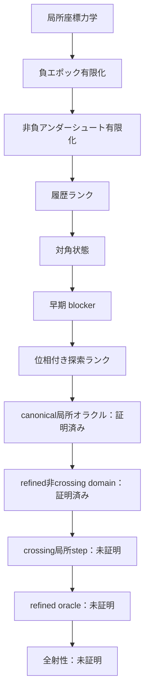

# Recamán sequence — Lean 4 research repository

レカマン数列がすべての非負整数を含むか、という未解決問題に向けた
Lean 4形式化プロジェクトです。

> [!IMPORTANT]
> 全射性そのものはまだ証明していません。本リポジトリは、証明済みの局所力学、
> well-foundedな大域証明骨格、そして残る証明義務を明確に分離しています。

## 現在地

- Lean 4.33.1で固定
- Lean標準ライブラリのみを使用
- Leanソース82モジュール
- 主要定理の公理監査を同梱
- `sorry`、`admit`、ユーザー定義公理、`native_decide`は不使用
- 実軌道上の多段借りを排除済み
- 負ポテンシャル領域から一段借りまでの有限到達を証明済み
- 非負アンダーシュート帯の有限降下を証明済み
- 対角状態から極大後方減算鎖と早期blockerを抽出済み
- 通常探索／対角負債を扱う四成分well-foundedランクを構成済み
- debt初出値の最終遷移分類と、合法減算・強制加算の初出時刻下降を証明済み
- 合法減算debtを極大後方鎖により単一のanchor等号境界まで縮約済み
- anchor等号境界をnormal下降へ接続し、負エポックを位相ランクへ無条件接続済み
- 任意の正目標について意味的に認証されたcanonical探索開始点を構成済み
- strict crossingの絶対時刻条件を有限catch-upで解消し、既存エポック解析へ接続済み
- canonical／normal／debt／crossing recoveryを統合する意味的探索domainを構成済み
- 負normalエポックの全分岐を、目標出現または意味的domainを保存するrank下降へ接続済み
- crossing catch-upの唯一の残余を、値とanchorの同時成長obstructionとして反例付きで特定済み
- crossing同時成長をfrontier下降または強いdebt証明のsemantic self-exitで閉包済み
- canonical開始点の全符号・低レベル分岐を、目標出現またはsemantic rank下降へ閉包済み
- quotient-oneの強制成長は即時rank下降しないが、二段先のCoverageStepで回収できることを証明済み
- ordinary normal証明書が現在horizonの軌道状態を保証しない境界を、具体反例付きで形式化済み
- orbit-ready ordinary normal nodeの全符号・低level分岐を、残余なしのsemantic stepへ閉包済み
- current／historicalを分離するprovenance-aware normal domainの基礎APIを構成済み
- current normalを生成する8系統のOrbitReady adapterを構成済み
- current parentのCoverageStepをhistorical normalではなくcurrent／debtへ完全分解済み
- historical normalを5種類のtyped provenanceへ分け、extended-history残余へ接続済み
- downcross／early representative／generic history-budget gapをcrossing recoveryへ接続済み
- horizon-ready extended-history normalの局所stepを残余なしで証明済み
- parent-dropと通常debt evolutionからhistorical self-exitを除去済み
- ready current／debt／extended-history／crossingからなるrefined child domainを構成済み
- orbit-ready normalとready debtの全生成分岐をclock情報を保ったrefined stepへ閉包済み
- crossing frontierの二時計middle residualをhorizon-ready extended-historyへ閉包済み
- extended-history normalをbroad semantic interfaceを経ずrefined domain内で完全閉包済み
- refined restricted oracleの残余をcrossing recovery自身の局所stepひとつへ縮約済み

child clock provenanceの直接伝搬は、orbit-ready normal、ready debt、crossing frontier、
extended-history normalについて完了しました。これら三種類の非crossing constructorはすべて
refined domainを保存する局所stepを持ちます。現在の核心は`CrossingSearchInvariant`自身の
局所stepです。この証明書はcrossingへの入口を保持しますが、元のstrong debtが持っていた
post-addition値のfirst occurrence、旧anchorとの比較、horizon readinessを保持していません。
全射性そのものは未証明です。



## 文書

- [研究結果レポート](docs/RESEARCH_REPORT.md) — 問題設定、方法、主要成果、結論
- [証明地図](docs/PROOF_MAP.md) — 証明済み／未証明の依存関係
- [normal provenance監査](docs/NORMAL_PROVENANCE_AUDIT.md) — current／historical生成箇所と次のconstructor設計
- [用語集](docs/GLOSSARY.md) — 標準用語と本研究独自の解析用語の区別
- [今後のロードマップ](docs/ROADMAP.md) — 次の証明エポックと完了条件
- [再現・検証手順](docs/REPRODUCIBILITY.md) — ビルド、公理監査、実験の再現
- [開発記録](docs/DEVELOPMENT_LOG.md) — 各エポックで得られた詳細な技術記録
- [コントリビューション方針](CONTRIBUTING.md)
- [変更履歴](CHANGELOG.md)

## クイックスタート

LeanとLakeが利用できる通常環境では、次を実行します。

```bash
lake build
lake env lean Recaman/Audit.lean
```

検証一式は次のスクリプトでも実行できます。

```bash
./scripts/check.sh
```

実験コードはLean証明から完全に分離されています。

```bash
c++ -O3 -std=c++20 experiments/recaman_empirical.cpp -o /tmp/recaman_empirical
/tmp/recaman_empirical 1000000
```

## リポジトリ構成

```text
Recaman/       Lean形式化本体
docs/          研究レポート、証明地図、ロードマップ
experiments/   仮説探索用C++コード
scripts/       ビルド・監査スクリプト
tools/         Work環境用の補助コード
```

主要モジュールの責務は[証明地図](docs/PROOF_MAP.md)にまとめています。
