# Recamán sequence — Lean 4 research repository

レカマン数列がすべての非負整数を含むか、という未解決問題に向けた
Lean 4形式化プロジェクトです。

> [!IMPORTANT]
> 全射性そのものはまだ証明していません。本リポジトリは、証明済みの局所力学、
> well-foundedな大域証明骨格、そして残る証明義務を明確に分離しています。

## 現在地

- Lean 4.33.1で固定
- Lean標準ライブラリのみを使用
- Leanソース173モジュール
- 主要定理の公理監査を同梱
- `sorry`、`admit`、ユーザー定義公理、`native_decide`は不使用
- 実軌道上の多段借りを排除済み
- 負ポテンシャル領域から一段借りまでの有限到達を証明済み
- 非負アンダーシュート帯の有限降下を証明済み
- 対角状態から極大後方減算鎖と早期blockerを抽出済み
- 通常探索／対角負債を扱う四成分well-foundedランクを構成済み
- debt初出値の最終遷移分類と、合法減算・強制加算の初出時刻下降を証明済み
- 合法減算debtを極大後方鎖により単一のanchor等号境界まで縮約済み
- anchor等号境界をnormal下降へ接続し、負エポックを位相ランクへ無条件接続済み
- 任意の正目標について意味的に認証されたcanonical探索開始点を構成済み
- strict crossingの絶対時刻条件を有限catch-upで解消し、既存エポック解析へ接続済み
- canonical／normal／debt／crossing recoveryを統合する意味的探索domainを構成済み
- 負normalエポックの全分岐を、目標出現または意味的domainを保存するrank下降へ接続済み
- crossing catch-upの唯一の残余を、値とanchorの同時成長obstructionとして反例付きで特定済み
- crossing同時成長をfrontier下降または強いdebt証明のsemantic self-exitで閉包済み
- canonical開始点の全符号・低レベル分岐を、目標出現またはsemantic rank下降へ閉包済み
- quotient-oneの強制成長は即時rank下降しないが、二段先のCoverageStepで回収できることを証明済み
- ordinary normal証明書が現在horizonの軌道状態を保証しない境界を、具体反例付きで形式化済み
- orbit-ready ordinary normal nodeの全符号・低level分岐を、残余なしのsemantic stepへ閉包済み
- current／historicalを分離するprovenance-aware normal domainの基礎APIを構成済み
- current normalを生成する8系統のOrbitReady adapterを構成済み
- current parentのCoverageStepをhistorical normalではなくcurrent／debtへ完全分解済み
- historical normalを5種類のtyped provenanceへ分け、extended-history残余へ接続済み
- downcross／early representative／generic history-budget gapをcrossing recoveryへ接続済み
- horizon-ready extended-history normalの局所stepを残余なしで証明済み
- parent-dropと通常debt evolutionからhistorical self-exitを除去済み
- ready current／debt／extended-history／crossingからなるrefined child domainを構成済み
- orbit-ready normalとready debtの全生成分岐をclock情報を保ったrefined stepへ閉包済み
- crossing frontierの二時計middle residualをhorizon-ready extended-historyへ閉包済み
- extended-history normalをbroad semantic interfaceを経ずrefined domain内で完全閉包済み
- refined restricted oracleの残余をcrossing recovery自身の局所stepひとつへ縮約済み
- crossingから非crossing childへのrank下降にはhistory budgetの厳密下降が必須と証明済み
- ready crossingの保存horizon以後のdowncrossをstrict budget下降でrefined childへ閉包済み
- horizon時点がbelowのready crossingを、進捗または厳密のjoint-growth残余へ完全分類済み
- no-future-downcrossがabove-target tailの永続と同値で、tail return仮説がready crossing局所stepを閉じると証明済み
- permanent above-target tailでは各状態が高々二遷移で値下降CoverageStepを持つことを証明済み
- 仮想反例からzero-budget ready crossingとtail最小値直下のhistorical blockerを抽出済み
- zero-budget crossingのrefined子はcrossingに留まりanchorを厳密に下げることを証明済み
- 二連続forced additionだけではpotentialが増減両方向に動くことを実軌道例で検証済み
- historical predecessor反復が有限回でfresh downcrossとstrict budget dropへ到達することを証明済み
- 一回のhistorical cycleはchild=parentの停留growth residualを持ち得ることを証明済み
- 最初のfuture upcrossingをcanonicalかつ一意に構成し、earliest選択でも停留が残ることを証明済み
- anchor／cycle phase／seen-below budget／minimum値の新しいwell-founded rankを構成済み
- cycle dischargeからcrossingへ戻れる条件がstrict anchor dropと同値であることを証明済み
- historical downcrossからcanonical returnまでを一つのtyped discharge証明書として構成済み
- anchorにcrossing time cursorを加えた五成分cycle rankのwell-foundednessを証明済み
- 非進捗をanchor growth／chronology mismatch／literal stationaryの三kernel residualへ完全分類済み
- canonical returnへのrebaseがtail・horizon・minimumを保存することを証明済み
- 任意のdischarge residualがrebase後にliteral stationary coreへ正規化されるno-goを証明済み
- stationary coreのdowncross endpointからcanonical returnまで全値がtarget未満と証明済み
- corridor内部stepをfresh budget dropまたはtarget-bounded clockへ完全分類済み
- delayed corridorをinternal budget dropまたはall-forced有限runへ完全分類済み
- all-forced runのreturn時刻上界・加算トレース・remaining-clock rankを証明済み
- first returnがlater below suffixでもcanonicalなままであることを証明済み
- legal endpoint移動をbudgetとreturn-distanceの同時下降へ接続済み
- return直前のlegal subtraction＋forced additionがexact targetを打つことを証明済み
- target-missing下でlegal suffix childがreturnへ着地できないことを証明済み
- terminal all-forced suffixを有限crossing-window証明書へ縮約済み
- target gapとovershootがreturn clock以下であることを証明済み
- suffix cursorの強帰納で、任意個のlegal endpoint後にall-forced terminalが存在すると証明済み
- 全dischargeをimmediate historical valleyまたはfinite crossing windowの二形へ正規化済み
- terminal二形に共通するgap＋overshoot＝final clockと各差のclock上界を証明済み
- final forced additionをdouble-clock数値境界またはstrictly earlier historical blockerへ分類済み
- historical blockerをfresh以前またはfresh以後のstrict history-budget dropへ分類済み
- terminal全分類をmaster residualへ統合し、progress除去後のouter residualを四形へ限定済み
- finite clock bandを長さtarget以下の明示候補リストとwell-founded return rankへ変換済み
- 全positive historical blockerを既存tail-cycle rankのstrict backtrack edgeへ接続済み
- blocker first occurrenceのlegal/forced生成遷移を完全分類し、normal/debt直結不能境界を証明済み
- blocker生成predecessorをnegative normal、readiness/sign残余、below-target履歴証明書の三形へ完全分類済み
- below-target predecessorを時刻0も含めready crossingへ接続し、残余をanchor非下降一条件へ縮約済み
- predecessor crossingのequal-anchor earlier-time枝を五成分cursor rankへ接続し、eligible残余をgrowth/stationaryへ縮約済み
- blocker初出restart cursorを加えた六成分well-founded rankでliteral stationary crossingをstrict edge化済み
- 残るstrict crossing-anchor growthを長さtargetの候補列とwell-founded remaining-gap rankへ有限化済み
- selected crossingをpermanent-tail combined parentへinstallし、同じold crossing時刻を持つ次dischargeを構成済み
- installed cycleのchronology mismatchをfresh downcross endpointによるstrict history-budget下降へ接続済み
- installed反復kernelのhistory/anchor/cursor/restart進捗を七成分master well-founded rankへ統合済み
- 全terminal dischargeをstrict history進捗・finite clock・immediate numeric・typed installed historical stepへ統合済み
- above-target blocker predecessorのearly/ready両clockを既存complete semantic stepへ接続しsign残余を除去済み
- immediate terminal valleyのexact +1 reboundからCoverageStepを構成しnumeric insufficient残余を除去済み
- finite return候補にremaining-list selection stateを追加しfresh選択をwell-founded visited rankへ接続済み
- finite returnの全crossing-window provenanceを上位まで保存し、`(return, endpoint)`候補選択を有限rank化済み
- dischargeのold crossingがparent horizonより前というprovenanceを全構築経路で保存済み
- `(window, anchor, old crossing)`を固定horizon内で有限列挙し、exact installed snapshot再訪まで縮約済み
- original down endpointの差をstrict history下降へ分類し、historical first/minimum provenanceも固定horizon内で有限化済み
- permanent/historical tail startを有限化し、tail minimum時刻を相対first occurrenceへcanonical化済み
- canonical visited stateをterminal全分岐へthreadし、finite枝をstrict state progress／exact revisitへ直接分解済み
- exact replayがvisited list単独では排除不能なno-goを証明し、残務を単一resolver interfaceへ集約済み
- finite insufficient windowを`endpoint=1, return=2, target∈{4,5}`へ縮約し、実軌道出現により完全排除済み
- terminal全枝をtarget occurrence／strict history／semantic phase／installed masterの四progress形へ完全統合済み
- installed master枝にselected crossing installと次terminal discharge存在を同梱し、反復provenanceを接続済み
- successor反復を三成分discharge rankの厳密下降またはexact replay固定点へ完全分類済み
- 整礎帰納でiteration枝を消去し、terminal解析をtarget／strict edge／exact replay固定点へ無条件閉包済み
- replay固定点をreturn=old crossingの閉cycleとnode-level self-mapへ数値固定済み
- 固定点の全cursorをtarget未満のbelow corridor帯へ有限化し、clock≥3・target≥5を強制済み
- 実軌道step検証でclock 3/4/5を排除しclock≥6・target≥8、上側をupperTri包絡で挟撃済み
- missing-target下のterminal interfaceをhistory edge／semantic child／replay固定点の三形へ確定済み
- history edgeからfresh below-target landingとrestart crossingを逆算し、全interface枝をsemantic素材付きへ強化済み
- landingとrestart crossingをparent history内（crossing+1≤start<horizon）へ束縛済み
- landingをready crossing nodeとしてsemantic domainへ搭載し、全interface枝を実objectへ統一済み
- combined certificateをmounted nodeへtransportし、terminal解析をlanding枝から再入可能化済み
- landing再入反復をanchor gap強帰納で閉包し、残余をsemantic・discharge replay・landing固定点の三形へ縮約済み
- 二固定点を共通核TailFixedPointCoreへ統合し、最終定理をsemanticまたはnode再生産固定点の二形へ確定済み
- 統合coreにblocker不要のkernel floor（clock≥6、target≤upperTri包絡）を証明済み
- replay floorをclock 17まで拡張し、深い遅延値19だけを例外に18≤clock∨target=19、無条件target≥19を証明済み
- core形状API（parent一意決定・同値crossing・異clock同値再帰）を整備済み
- first upcrossing一般all-below補題で両固定点のbelow corridorを統一済み
- 統合coreの床もclock 18・target 19へ拡張し、両固定点の床を完全一致させ済み
- 最小未出目標から頂点定理を合成：semantic progressまたは床付き固定点core（固定点枝はtarget≥19）
- `LeastMissingTarget 19 ↔ 19未出`を形式化し、床を守る最初の未検証instanceを一値（a‥=19の出現）へ確定済み
- 圧縮軌道検証の基盤としてcomb run閉形式（low/high rail・decidable区間検証）を証明済み
- comb stepのwitness構成を完了し、圧縮検証の大域義務をfreshness一条件へ限定済み
- replay床をclock 32へ拡張し、targetを`19∨61∨34以上`へ三分済み（次の壁は76）
- comb run値集合の表現定理とfreshness輸送を証明し、圧縮検証機構の核を完成済み
- target 19のreplay固定点をclock∈{6,8}へ完全特定し、anchor・blocker・初出時刻まで一意化済み
- downcross条件でclock 6を排除し、19-replayを唯一の完全明示cycle（7→8即時return、anchor 12）へ確定済み
- 19-反例のtail最小値を21・minimum predecessor初出を7へ固定し、残る自由をtail時刻のみへ縮約済み
- `a 131 = 4`によりtailStart>131・horizon>132を強制し、19-反例を固定歴史と未知tailへ二分済み
- 19未出⟹21がt>131で再訪、という将来イベント強制を証明済み（prefixでは21はt=9の一度きり）
- 既出値の遅い再訪不可能性（一般力学補題）により**target 19のreplayを完全排除**、無条件18≤clock・target≥20
- 同機構でtarget 61のreplayも完全排除し、clock 32までの掃過について例外リストを空に：無条件32≤clock・target≥34（床を112まで上げた段階では新たな深部残留値371が例外として現れる）
- 排除機構を一般テンプレート化：生存replayのpredecessor直後は即add or 二連subに制限済み
- follow-up二分法をwitness付きへ強化：即addは既出witness必須、二連subはfresh landing必須
- replay crossingは軌道recordであり得ないことを証明：record更新clockは帯検証なしで一括排除可能
- 三種道具の反復でclock 32..111を全消去し、**discharge replay枝の**床を無条件112≤clock・114≤targetへ引き上げ済み（landing固定点枝の床は依然18≤clock∨target=19・19≤target）
- prefix-successor coverageを一般定理化し、clock 112の残余をminimum=371・predecessor初出108・downcross 109・target∈[153,261]へ完全pin済み
- blocked枝から`(値, 初出)`のearlier-smaller下降辺をclock非依存に抽出したが、整礎性の発火に必要な再生成条件が輸送されず一段で停止するno-goを確定済み。残余義務二本を条件付き排除定理へ固定し、副産物としてblocked枝で`target + 2 < tail最小値`を証明済み
- **頂点定理のsemantic枝が`0 < target`だけから導出可能である（＝現在の型では無情報）ことを形式的に確定**。`stepParent`が存在量化のみでlex順の親を捏造できることが原因で、固定点解析側の欠陥ではない
- semantic枝の閉包はそのtargetの出現と論理的に同値と証明済み（constructor局所の補題では原理的に閉じない）
- semantic childのrefined domain昇格をhorizon readiness仮定つきで4 constructor完全に構成し、その仮定が落とせないことを具体反例で確定済み
- 大域組み立ての残余を「semantic枝の型強化」「ready crossing局所step」「unready crossing漏れ」の三つへ分解済み
- **三種道具のうち再訪排除をlanding固定点側へ無条件移植済み**（`minimum_revisit_absurd`はcrossing clockを参照せずcombined証明書のみに依存）
- record排除を共有核レベルへ汎用化し、landing側ではpredecessor初出が窓の前にある場合に発火することを証明済み
- landing側に欠けているのはdowncross前置界ただ一つと確定：`[landingTime, crossingTime]`は全区間target未満なのでpredecessor初出は窓の外の二択に縮約され、landing分岐にはその二択を決める情報が含まれていない
- 前置界を仮定すればlanding床が即座に例外なし`32 ≤ clock`へ上がることを証明し、統合outcomeを「semantic ∨ 32≤clock ∨ landing gap」の三択へ精密化済み
- 二連減算枝を構造化し、`f`・`f+1`・`f+2`が相異なるfresh初出であること、全てtail開始前にあること、`a (f+2) + (2f+4) = tail最小値`という厳密な等式を証明済み
- 二連減算枝の排除は**pre-tail領域への下界なしには原理的に不可能**と確定（証明書が軌道に下界を課すのはtail開始以降だけで、この枝が語る時刻は全てtail開始前）
- corridorデータ経由で無条件に`f + 2 < target`・`f + 3 < a f`・`f + 4 < tail最小値`を証明済み（既存境界の真の強化。床上げ側の探索範囲を直接削る）
- **床上げ機構（prefix-successor coverage）に構造的天井 clock ≈ 5.4×10⁴ が存在することを数値的に確定**。kernel射程を無限に伸ばしてもclock 10⁶までの65%はこの機構では消せない（実験、Lean証明には未使用）
- kernel射程→clock床の換算式を測定：`射程 ≈ 0.049 · 床^2.01`（フロンティア付近の局所指数は6.29まで悪化）。深部検証への投資は正当化されないと判断
- **semantic枝のpayloadを捏造不能な形へ強化済み**（`PermanentTailRefinedSuccessorOutcome`）。子はrefined domain所属を要求され、親は証明書自身のclockから決まる名前付きノードに固定される
- 非捏造性を三本の定理で形式化：anchor bumpはrefined domainを必ず外れる／「どの親にも子がある」は偽／crossing枝は実軌道のstrict upcrossing証明書しか受け付けない
- discharge証明書の四つのsemantic生成枝すべてを精密版で構成済み（immediate枝はcurrent-state経路からextended-history表現へ経路変更して解決）
- **pre-tail領域への初の一般的下界 `target < tailStart` を無条件に証明**（`coveredBelowCount`による鳩の巣。kernel計算ゼロ・条件なし・全replayで成立。既存のtailStart下界はすべて条件付きkernel計算だった）
- `target + 2 < tail最小値`が破れる可能性を単一の完全に釘付けされた配置へ縮約済み
- **忘却形`RefinedDomainEdge`も捏造可能であることを形式的に確定**（`LeastMissingTarget.refinedDomainEdge`が無条件に証明できる）。伝播ペイロードは生成証明書を保持する形へ設計変更済み
- 頂点へ至る実チェーンが8段であることを確定（`terminalProgressOutcome`と`terminalSuccessorOutcome`は`Audit.lean`からしか参照されない形状監査用の袋小路）。先頭2段の精密化を完了
- landing側に必要な最小情報が`predecessorFirstTime < landingTime`ではなく`downTime < parentTime`であると特定し、一次消失点を`InstalledStep.lean`の`history_progress`に確定。3生成箇所すべてで供給可能と確認済み
- 新しい無条件カーネル道具（prefix最大値バンド消去）により、共有核レベルで`32 ≤ clock ∨ (clock=6 ∧ target=19) ∨ (clock=18 ∧ target=61) ∨ prefix above`へ分解済み

child clock provenanceの直接伝搬は、orbit-ready normal、ready debt、crossing frontier、
extended-history normalについて完了しました。これら三種類の非crossing constructorはすべて
refined domainを保存する局所stepを持ちます。現在の核心は`CrossingSearchInvariant`自身の
局所stepです。この証明書はcrossingへの入口を保持しますが、元のstrong debtが持っていた
post-addition値のfirst occurrence、旧anchorとの比較、horizon readinessを保持していません。
さらにcrossing nodeのanchorはtarget未満なので、同じhistory budgetのままtarget以上の
normal／debtへ退出することはrank上不可能です。
一方、保存horizon以後にdowncrossが起きる枝はfreshなbelow-target着地点を持つため閉じました。
horizonが既にbelowな枝も次のcrossingまで完全分類し、現行rankが下がらない実例
`target=19, horizon=31, anchor 13→14`をLeanで検証しました。この残余は必ずabove-sideへ戻るため、
無条件の核心は「目標が未出ならabove-target tailが将来belowへ戻る」という長期再帰命題です。
さらに、仮想的な最小未出目標は逆にeventually-strictly-above tailを強制します。
`all_targetTailReturn_iff_surjective`により、全targetのtail returnは元の全射性予想と同値です。
さらにpermanent tailを直接解析すると、その履歴予算はすでに0で、ready crossingから
noncrossing子へは退出不能です。許されるrefined子はzero-budget crossingかつstrict anchor dropに
限られます。一方、tail最小値は`a n - 1`の最初の出現がtail開始前にあることと、二段の
forced additionを与えます。このhistorical blockerからcrossing anchor下降を作れるかを追加解析しました。
blockerを反復すると、downcrossがなければtail最小値が厳密下降するため、有限回でfreshな
below-target downcrossとhistory-budget下降に到達します。しかし、その後のupcrossingを同じ
zero-budget horizonへ載せるだけでは、親と同一のcrossingを再選択でき、anchorが等しい停留 residualに
なります。次の核心はcrossing選択をcanonicalに拘束するか、cycleを跨ぐ新rankを与えることです。
earliest upcrossingはcanonicalかつ一意に構成できましたが、同じdowncross endpointからの再選択は
同じ時刻を返すため停留を解消しません。そこでzero-budget領域専用に、anchorを最外層、
`crossing → backtrack → discharge`を一方向phase、`seenBelowCount`とtail minimumを内層に置く
well-founded rankを追加しました。historical探索はすべてこのrankで厳密下降します。さらに
crossing時刻を第二cursorとして加えると、同anchorでもより早いreturn crossingはstrict exitになります。
typed discharge証明書による完全分類の結果、残るのはanchor growth、旧crossingがdowncross endpointより
前にあるchronology mismatch、anchor・時刻とも同じliteral stationaryの三ケースだけです。
未解決点はこの三kernel residualの排除または、さらに狭い反例構造への縮約です。
canonical return自体を新しい親にするrebaseも検証しました。この操作は三残余のgrowth／chronology差を
正規化しますが、同じdowncrossを再生するとanchor・時刻とも同一のstationary coreになります。
従って現在の未解決点は、同じendpoint／crossing対の再訪を破る新しい履歴情報の構成です。
finite return選択ではreturn clockだけでは別endpointを同一視してしまうため、terminal window証明書を上位まで
保持し、`(returnTime, terminalEndpoint)`を有限キーにしました。これで同じclockの異なるwindowは別々のfresh
選択として数えられます。残る再訪は同じwindow区間に限られ、そのinstalled parent anchorとold crossing cursorを
過去の選択と比較するprovenanceが次の境界です。この比較もtyped snapshot stateとして実装し、master rankのforward下降、
reverse下降、prefix一致へ完全分類しました。さらに生成時に既知だった`oldCrossingTime + 1 < parent.horizon`をdischarge証明書へ
保存したため、固定horizonでは`(window, anchor, oldCrossingTime)`全体が有限候補になります。full keyのfresh選択はremaining-listを
厳密に減らし、残るのはwindow・anchor・crossing timeがすべて同じexact installed snapshot revisitだけです。
exact installed revisitではready crossing証明がparentのphaseとlocal measureを一意に固定するため、同horizon/anchorならparent node自体が
一致します。元のdown endpointが違えばfirst-occurrence history下降になり、同じ場合でもhistorical first timeはhorizon未満、tail minimum
valueは`upperTri horizon`以下です。これらを拡張有限keyへ加えたため、残る再訪はwindow、parent cursor、down endpoint、historical first、
minimum valueまで一致する場合に限定されました。
残るminimum witness timeはhorizonで有界とは限りませんが、`tailStart`以後で同じminimum valueを取る最初の時刻へcanonical化できます。
このrelative first occurrenceは任意の元witness以下に存在し、同じtailStart/valueに対して一意です。permanent startとhistorical tailStartは
いずれもparent horizon未満なので有限keyへ追加済みです。従ってminimum timeの選択依存は新しい無限rankではなくcanonical identityで
除去されました。
最終canonical selection stateはfinite枝だけの補助APIではなく、terminal total outcomeへ統合済みです。任意のdischarge/stateはstrict
history progress、immediate semantic closure、historical complete step、fresh canonical-key progress、exact canonical revisitのいずれかを
返します。fresh枝はerase後のnext stateとwell-founded length下降を命題的に保持するため、そのまま再帰的証明へ利用できます。
ただしvisited listは意味的なno-replay証明ではありません。同じfinite certificateのkeyをstateから全除去して再投入すると、exact revisit
constructorをLean上で直接構成できます。従って残る数学はlist操作ではなく、exact replayからtarget出現、strict history下降、semantic
phase下降、installed master下降のいずれかを導く`TerminalExactCanonicalReplayResolver`です。このresolverを仮定すればraw residualのない
terminal total outcomeが得られることも証明済みです。
さらにresolverの算術本体を解くと、finite insufficient windowは実は存在できません。最後のforced stepとpredecessor≤clockから
直前値≤1、fresh first-occurrenceとall-forced traceから`terminalEndpoint=1`かつ`returnTime=2`が強制されます。strict crossingは
`3<target<6`なのでtargetは4または5ですが、Lean kernel計算で`a 131=4`、`a 129=5`です。missing-targetと矛盾するため、finite branchと
exact replay branchはともにterminal classificationから完全に除去されました。
残ったimmediate/historical枝も内側の既存定理を展開し、最終的な`terminalProgressOutcome`へ平坦化しました。これはtargetの実出現、
`TerminalChronologyHistoryProgress`、`PhaseSearchProgress`を伴うsemantic child、`TailInstalledCycleProgress`の四constructorだけを持ちます。
early/ready/immediate/selected-crossingで比較対象が違うため、semantic枝は実際のlocal parentを明示的に保存しています。
さらにinstalled master枝はgeneric rank nodeだけで終わらず、選択されたcrossing証明書、そのpermanent-tail semantic install、
`TerminalSelectedCrossingDischargeCertificate`の存在を同じconstructorに保持します。したがってstrict master edgeのchildをparentとする
次のterminal解析を証明オブジェクトから再開できます。
この反復自体も解析しました。master rankの内側cursorはblocker first timeに依存して二解析間で比較できませんが、
installationは共有horizon・installed anchor・old crossing cursorの三成分を正確に輸送します。この三成分lexを
discharge-level rankとすると、installed successorはanchor growthまたはearlier equal-anchor crossingで厳密に下降し、
残る非進捗はanchorとcursorがともに一致するexact replayだけで、そこではrankが等式として不動です。
このrankの整礎性により反復constructor自体を再帰で消去しました。任意のdischargeとcombined certificateは、
有限回のinstalled successorの後、target出現・strict history・semantic phase・descendant上のexact replay固定点の
いずれかへ必ず到達します。未解決の数学は無限反復ではなく単一のtyped固定点構造に集約されました。
さらにこの固定点を数値的に固定しました。replayではreturn crossingがold crossingと文字通り一致し、dischargeは
fresh downcross endpointからold crossingへ閉じるcycleです。ready crossing nodeはhorizonとanchorで決まるため
installed nodeはparentそのものになり、successor dischargeは同じparent・同じold crossing cursorへtransportできます。
残る核心は、この単一nodeの自己再帰dischargeを破る新しい大域情報の構成です。
固定点の全cursor（downcross endpoint、return、old crossing、blocker初出、fresh endpoint）はtarget未満の
初期帯に収まり、endpointからcrossingまでの軌道値もすべてtarget未満です。kernel計算によりclockは3以上、
targetは5以上に限られます。自己再帰cycleは軌道の最初のtargetステップ以内の情報だけで構成されています。
floorはclock 17まで拡張されました。障害は値19の初出が時刻99734と深いことだけで、これはclock 6と8の
またぎ帯の双方に含まれます。従って`18 ≤ clock ∨ target = 19`、無条件で`target ≥ 19`です。次の壁は
clock 18帯の61（初出t=181653）で、二つの深い遅延値はkernel計算の射程外です。
さらにreplay crossingは実軌道のイベントなので、小さいclockはkernel計算で直接排除できます。clock 3は実stepが
減算であること、clock 4は値境界、clock 5はまたぐtarget 8..13の実出現と矛盾し、replayはclock 6以上・target 8以上、
かつtarget ≤ upperTri(clock+1)の帯に挟まれます。
仮想反例内ではtarget出現枝が矛盾するため、permanent tail解析が外側探索へ渡す情報はhistory edge・
semantic child・replay固定点の三形に確定し、replayが閉じるcycleはdischargeごとに一意です。
セッション後半の突破として、既出値の遅い再訪不可能性（`a_succ_ne_of_seen`の力学補題）を発見しました。
replay固定点はtail最小値の遅い再訪を強制しますが、その値が検証済みprefixで既出だと力学的に矛盾します。
これにより深い初出（`a 99734 = 19`、`a 181653 = 61`）のkernel検証を一切使わずに、19と61の両replayが
完全排除され、床は無条件に`32 ≤ clock`・`34 ≤ target`へ確定しました。
history edgeについては、missing-count下降の不等式単独からwindow内に初出するbelow-target landingを逆算でき、
そこからcanonical first upcrossingが再開します。上流の定理を書き換えずに、全interface枝が外側再帰の
continuation素材を携えるようになりました。
さらに反例のbelow coverageと初出最小性から、landingはtail startより前、restart crossingは
`crossing+1 ≤ start < parent.horizon`を満たします。これはinstalled crossing nodeの形状条件と一致します。
この境界付きlandingは実際にready crossing nodeとして搭載できました。missing-target性からendpointは
strict crossingになり、crossing-recovery certificateの全フィールドがlandingデータから構成されます。
閉じたterminal解析の三枝すべてが、外側探索のsemantic domainの実objectを渡すようになりました。
さらにcombined certificate自体がmounted nodeへtransportでき、terminal解析はlanding枝から再入できます。
landing枝は葉ではなく再帰点であり、旧parentとの比較はinstalled successor反復と同じanchor二分法に従います。
この再入反復も整礎に閉じました。anchor dropはsemantic child、anchor growthはanchor gapの強帰納で消去され、
equal anchorはmounted node = parentの文字通りの固定点です。permanent-tail解析全体の終端は
semantic phase child・exact discharge replay・node不動landing固定点の三形になりました。
二つの固定点は共通の数値核を持ちます。値がparent anchorに一致し、missing targetをまたぐforced additionで、
mounted nodeがparentを再生産するcanonical crossingです。最終統合定理により、仮想反例の解析はsemantic child
またはこの単一core構造で必ず終端し、今後の焦点はcoreを破る大域情報の構成に完全に絞られました。
最終的に、最小未出目標からの頂点定理`LeastMissingTarget.semantic_or_flooredCore`が全解析を一本に合成します。
仮想的な最小未出目標はsemantic phase childを渡すか、`18 ≤ clock ∨ target = 19`かつ`19 ≤ target`を満たす
床付き固定点coreで終端します。固定点で終端する反例のtargetは無条件に19以上です。ただしこの二分岐は現時点ではtargetに対する
制約を与えません。統合outcomeのsemantic枝は`stepParent`が自由変数なので、任意の正のtargetについて
無条件に居住可能だからです（`semantic_or_flooredCore_of_pos`）。semantic枝を実質的な制約にするには、
`stepParent`を外側再帰の現parentへ束縛する主張型の再設計が必要です。
stationary core内部も解析し、fresh downcross endpointから最初のreturn predecessorまでの全値がtarget未満で
あることを証明しました。即時returnは`above x → fresh e → x+1`という厳密な谷形です。遅延returnの
各内部stepは、legal subtractionなら新しいbelow値によるbudget下降、forced additionなら絶対時刻が
`target`未満という有限境界を持ちます。次の焦点は、この有限corridor情報をvisited rankへ統合することです。
all-forcedの場合はさらにreturn時刻自体が`target`未満で、値はclock和に従って厳密増加します。
`target - time`のwell-founded rankでcorridor traversalは有限化できました。ただしreturn後は同じcanonical
crossingへ戻るため、これは外側cycle exitではありません。残る核心は次のhistorical dischargeを変えることです。
同じreturnを保ったsuffix解析では、legal subtractionが作るlater fresh endpointへ移るたび
`returnTime - endpointTime`が厳密下降します。従ってlegal endpoint列は有限で、return自身またはall-forced
suffixへ到達します。残る外側の核心は、このterminal suffixから別のhistorical dischargeを選ぶことです。
さらにlegal endpointがreturn時刻そのものなら、直前のbelow値へのsubtractionとreturnのforced additionが
相殺し、crossing endpointは直前値`+1`になります。これはexact targetを強制するため仮想反例では不可能です。
強帰納によりlegal endpoint列全体を実際に消費でき、delayed corridorは必ずall-forced terminalへ到達します。
従って全dischargeのterminalはall-forced suffixか、original immediate historical valleyの二形に限られます。
terminal all-forced枝はさらに`endpoint < return < target`、strict crossing、全加算traceを持ちます。
crossing直前のtarget gapと直後のovershootはいずれもreturn clock以下です。現在のouter residualは、
この有限crossing windowとoriginal immediate historical valleyの型付き直和へ縮まりました。
両枝はさらに共通のstrict crossing balanceを持ち、gapとovershootはfinal addition clockを正に分割します。
final subtractionの失敗理由は、`target < 2·(return+1)`の有限数値帯か、`return`より前に初出する
正のbelow-target subtraction candidateへ縮約されました。
さらにcandidateのfirst timeがfinal fresh endpointより後ならhistory budgetが厳密下降し、以前ならouter historyとして
明示されます。immediate valleyではfresh endpointがreturnなので、常に後者です。
全case splitを統合すると、strict budget progressまたは四つのouter residual
（immediate×2、finite clock band、finite outer blocker）だけが残ります。
finite clock bandは`List.range target`のfilterとして列挙され、後のreturn候補へ進むと`target-return`が厳密下降します。
non-clock history枝はblocker初出直前へのbacktrackで既存seen-rankを下げますが、その時刻を意味的nodeとして
選択するprovenanceが次の境界です。
blocker landing自体はtarget未満なのでordinary normal/debtには入れません。legal生成はlarger predecessor履歴を、
forced生成はtarget-bounded predecessor/clockを返し、below-target専用semantic adapterの必要性を明示します。
全射性そのものは未証明です。

```mermaid
flowchart TD
    A["局所座標力学"] --> B["負エポック有限化"]
    B --> C["非負アンダーシュート有限化"]
    C --> D["履歴ランク"]
    D --> E["対角状態"]
    E --> F["早期 blocker"]
    F --> G["位相付き探索ランク"]
    G --> H["canonical局所オラクル：証明済み"]
    H --> I["refined非crossing domain：証明済み"]
    I --> J["ready crossing局所step：tail returnまで縮約"]
    J --> K["permanent tail：zero-budget crossing + historical blocker"]
    K --> L["historical反復：finite budget drop"]
    L --> M["one-way cycle rank：証明済み"]
    M --> N["crossing-time cursor：証明済み"]
    N --> O["canonical rebase：証明済み"]
    O --> P["stationary below corridor：分類済み"]
    P --> Q["corridor finite rank：証明済み"]
    Q --> R["legal suffix cursor：証明済み"]
    R --> S["legal-at-return排除：証明済み"]
    S --> T["finite crossing window：証明済み"]
    T --> U["terminal二形への強正規化：証明済み"]
    U --> V["共通crossing balance：証明済み"]
    V --> W["final blocker二分：証明済み"]
    W --> X["blocker位置／budget下降：証明済み"]
    X --> Y["master outer residual四形：証明済み"]
    Y --> Z["finite return候補rank：証明済み"]
    Z --> AA["historical blocker rank edge：証明済み"]
    AA --> AB["blocker生成遷移／semantic境界：証明済み"]
    AB --> AC["below-target semantic adapter：未解決"]
    AC --> AD["全射性：未証明"]
```



## 文書

- [研究結果レポート](docs/RESEARCH_REPORT.md) — 問題設定、方法、主要成果、結論
- [証明地図](docs/PROOF_MAP.md) — 証明済み／未証明の依存関係
- [normal provenance監査](docs/NORMAL_PROVENANCE_AUDIT.md) — current／historical生成箇所と次のconstructor設計
- [健全性監査](docs/SOUNDNESS_AUDIT.md) — 定義の正しさ・ギャップ地図・空虚性検査・過大主張の洗い出しと対応状況
- [用語集](docs/GLOSSARY.md) — 標準用語と本研究独自の解析用語の区別
- [今後のロードマップ](docs/ROADMAP.md) — 次の証明エポックと完了条件
- [再現・検証手順](docs/REPRODUCIBILITY.md) — ビルド、公理監査、実験の再現
- [開発記録](docs/DEVELOPMENT_LOG.md) — 各エポックで得られた詳細な技術記録
- [コントリビューション方針](CONTRIBUTING.md)
- [変更履歴](CHANGELOG.md)

## クイックスタート

LeanとLakeが利用できる通常環境では、次を実行します。

```bash
lake build
lake env lean Recaman/Audit.lean
```

検証一式は次のスクリプトでも実行できます。

```bash
./scripts/check.sh
```

実験コードはLean証明から完全に分離されています。

```bash
c++ -O3 -std=c++20 experiments/recaman_empirical.cpp -o /tmp/recaman_empirical
/tmp/recaman_empirical 1000000
```

## リポジトリ構成

```text
Recaman/       Lean形式化本体
docs/          研究レポート、証明地図、ロードマップ
experiments/   仮説探索用C++コード
scripts/       ビルド・監査スクリプト
tools/         Work環境用の補助コード
```

主要モジュールの責務は[証明地図](docs/PROOF_MAP.md)にまとめています。
