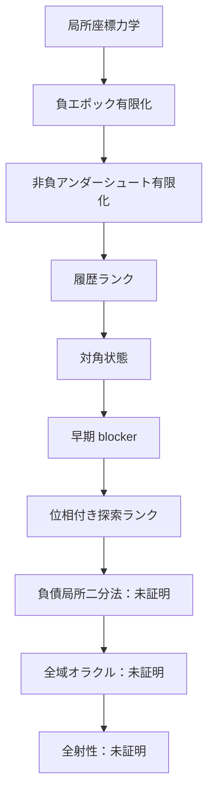

# Recamán sequence — Lean 4 research repository

レカマン数列がすべての非負整数を含むか、という未解決問題に向けた
Lean 4形式化プロジェクトです。

> [!IMPORTANT]
> 全射性そのものはまだ証明していません。本リポジトリは、証明済みの局所力学、
> well-foundedな大域証明骨格、そして残る証明義務を明確に分離しています。

## 現在地

- Lean 4.33.1で固定
- Lean標準ライブラリのみを使用
- Leanソース29モジュール、約6,000行
- 主要定理の公理監査を同梱
- `sorry`、`admit`、ユーザー定義公理、`native_decide`は不使用
- 実軌道上の多段借りを排除済み
- 負ポテンシャル領域から一段借りまでの有限到達を証明済み
- 非負アンダーシュート帯の有限降下を証明済み
- 対角状態から極大後方減算鎖と早期blockerを抽出済み
- 通常探索／対角負債を扱う四成分well-foundedランクを構成済み

現在の核心は、対角負債フェーズで得られる早期初出値を解析し、目標出現、
さらなる時間下降、またはanchor parent下降へ変換する局所二分法です。



## 文書

- [研究結果レポート](docs/RESEARCH_REPORT.md) — 問題設定、方法、主要成果、結論
- [証明地図](docs/PROOF_MAP.md) — 証明済み／未証明の依存関係
- [今後のロードマップ](docs/ROADMAP.md) — 次の証明エポックと完了条件
- [再現・検証手順](docs/REPRODUCIBILITY.md) — ビルド、公理監査、実験の再現
- [開発記録](docs/DEVELOPMENT_LOG.md) — 各エポックで得られた詳細な技術記録
- [コントリビューション方針](CONTRIBUTING.md)
- [変更履歴](CHANGELOG.md)

## クイックスタート

LeanとLakeが利用できる通常環境では、次を実行します。

```bash
lake build
lake env lean Recaman/Audit.lean
```

検証一式は次のスクリプトでも実行できます。

```bash
./scripts/check.sh
```

実験コードはLean証明から完全に分離されています。

```bash
c++ -O3 -std=c++20 experiments/recaman_empirical.cpp -o /tmp/recaman_empirical
/tmp/recaman_empirical 1000000
```

## リポジトリ構成

```text
Recaman/       Lean形式化本体
docs/          研究レポート、証明地図、ロードマップ
experiments/   仮説探索用C++コード
scripts/       ビルド・監査スクリプト
tools/         Work環境用の補助コード
```

主要モジュールの責務は[証明地図](docs/PROOF_MAP.md)にまとめています。

