# Recamán sequence — Lean 4 research repository

レカマン数列がすべての非負整数を含むか、という未解決問題に向けた
Lean 4形式化プロジェクトです。

> [!IMPORTANT]
> 全射性そのものはまだ証明していません。本リポジトリは、証明済みの局所力学、
> well-foundedな大域証明骨格、そして残る証明義務を明確に分離しています。

## 現在地

- Lean 4.33.1で固定
- Lean標準ライブラリのみを使用
- Leanソース109モジュール
- 主要定理の公理監査を同梱
- `sorry`、`admit`、ユーザー定義公理、`native_decide`は不使用
- 実軌道上の多段借りを排除済み
- 負ポテンシャル領域から一段借りまでの有限到達を証明済み
- 非負アンダーシュート帯の有限降下を証明済み
- 対角状態から極大後方減算鎖と早期blockerを抽出済み
- 通常探索／対角負債を扱う四成分well-foundedランクを構成済み
- debt初出値の最終遷移分類と、合法減算・強制加算の初出時刻下降を証明済み
- 合法減算debtを極大後方鎖により単一のanchor等号境界まで縮約済み
- anchor等号境界をnormal下降へ接続し、負エポックを位相ランクへ無条件接続済み
- 任意の正目標について意味的に認証されたcanonical探索開始点を構成済み
- strict crossingの絶対時刻条件を有限catch-upで解消し、既存エポック解析へ接続済み
- canonical／normal／debt／crossing recoveryを統合する意味的探索domainを構成済み
- 負normalエポックの全分岐を、目標出現または意味的domainを保存するrank下降へ接続済み
- crossing catch-upの唯一の残余を、値とanchorの同時成長obstructionとして反例付きで特定済み
- crossing同時成長をfrontier下降または強いdebt証明のsemantic self-exitで閉包済み
- canonical開始点の全符号・低レベル分岐を、目標出現またはsemantic rank下降へ閉包済み
- quotient-oneの強制成長は即時rank下降しないが、二段先のCoverageStepで回収できることを証明済み
- ordinary normal証明書が現在horizonの軌道状態を保証しない境界を、具体反例付きで形式化済み
- orbit-ready ordinary normal nodeの全符号・低level分岐を、残余なしのsemantic stepへ閉包済み
- current／historicalを分離するprovenance-aware normal domainの基礎APIを構成済み
- current normalを生成する8系統のOrbitReady adapterを構成済み
- current parentのCoverageStepをhistorical normalではなくcurrent／debtへ完全分解済み
- historical normalを5種類のtyped provenanceへ分け、extended-history残余へ接続済み
- downcross／early representative／generic history-budget gapをcrossing recoveryへ接続済み
- horizon-ready extended-history normalの局所stepを残余なしで証明済み
- parent-dropと通常debt evolutionからhistorical self-exitを除去済み
- ready current／debt／extended-history／crossingからなるrefined child domainを構成済み
- orbit-ready normalとready debtの全生成分岐をclock情報を保ったrefined stepへ閉包済み
- crossing frontierの二時計middle residualをhorizon-ready extended-historyへ閉包済み
- extended-history normalをbroad semantic interfaceを経ずrefined domain内で完全閉包済み
- refined restricted oracleの残余をcrossing recovery自身の局所stepひとつへ縮約済み
- crossingから非crossing childへのrank下降にはhistory budgetの厳密下降が必須と証明済み
- ready crossingの保存horizon以後のdowncrossをstrict budget下降でrefined childへ閉包済み
- horizon時点がbelowのready crossingを、進捗または厳密のjoint-growth残余へ完全分類済み
- no-future-downcrossがabove-target tailの永続と同値で、tail return仮説がready crossing局所stepを閉じると証明済み
- permanent above-target tailでは各状態が高々二遷移で値下降CoverageStepを持つことを証明済み
- 仮想反例からzero-budget ready crossingとtail最小値直下のhistorical blockerを抽出済み
- zero-budget crossingのrefined子はcrossingに留まりanchorを厳密に下げることを証明済み
- 二連続forced additionだけではpotentialが増減両方向に動くことを実軌道例で検証済み
- historical predecessor反復が有限回でfresh downcrossとstrict budget dropへ到達することを証明済み
- 一回のhistorical cycleはchild=parentの停留growth residualを持ち得ることを証明済み
- 最初のfuture upcrossingをcanonicalかつ一意に構成し、earliest選択でも停留が残ることを証明済み
- anchor／cycle phase／seen-below budget／minimum値の新しいwell-founded rankを構成済み
- cycle dischargeからcrossingへ戻れる条件がstrict anchor dropと同値であることを証明済み
- historical downcrossからcanonical returnまでを一つのtyped discharge証明書として構成済み
- anchorにcrossing time cursorを加えた五成分cycle rankのwell-foundednessを証明済み
- 非進捗をanchor growth／chronology mismatch／literal stationaryの三kernel residualへ完全分類済み
- canonical returnへのrebaseがtail・horizon・minimumを保存することを証明済み
- 任意のdischarge residualがrebase後にliteral stationary coreへ正規化されるno-goを証明済み
- stationary coreのdowncross endpointからcanonical returnまで全値がtarget未満と証明済み
- corridor内部stepをfresh budget dropまたはtarget-bounded clockへ完全分類済み
- delayed corridorをinternal budget dropまたはall-forced有限runへ完全分類済み
- all-forced runのreturn時刻上界・加算トレース・remaining-clock rankを証明済み
- first returnがlater below suffixでもcanonicalなままであることを証明済み
- legal endpoint移動をbudgetとreturn-distanceの同時下降へ接続済み
- return直前のlegal subtraction＋forced additionがexact targetを打つことを証明済み
- target-missing下でlegal suffix childがreturnへ着地できないことを証明済み
- terminal all-forced suffixを有限crossing-window証明書へ縮約済み
- target gapとovershootがreturn clock以下であることを証明済み
- suffix cursorの強帰納で、任意個のlegal endpoint後にall-forced terminalが存在すると証明済み
- 全dischargeをimmediate historical valleyまたはfinite crossing windowの二形へ正規化済み
- terminal二形に共通するgap＋overshoot＝final clockと各差のclock上界を証明済み
- final forced additionをdouble-clock数値境界またはstrictly earlier historical blockerへ分類済み
- historical blockerをfresh以前またはfresh以後のstrict history-budget dropへ分類済み
- terminal全分類をmaster residualへ統合し、progress除去後のouter residualを四形へ限定済み
- finite clock bandを長さtarget以下の明示候補リストとwell-founded return rankへ変換済み
- 全positive historical blockerを既存tail-cycle rankのstrict backtrack edgeへ接続済み
- blocker first occurrenceのlegal/forced生成遷移を完全分類し、normal/debt直結不能境界を証明済み
- blocker生成predecessorをnegative normal、readiness/sign残余、below-target履歴証明書の三形へ完全分類済み
- below-target predecessorを時刻0も含めready crossingへ接続し、残余をanchor非下降一条件へ縮約済み

child clock provenanceの直接伝搬は、orbit-ready normal、ready debt、crossing frontier、
extended-history normalについて完了しました。これら三種類の非crossing constructorはすべて
refined domainを保存する局所stepを持ちます。現在の核心は`CrossingSearchInvariant`自身の
局所stepです。この証明書はcrossingへの入口を保持しますが、元のstrong debtが持っていた
post-addition値のfirst occurrence、旧anchorとの比較、horizon readinessを保持していません。
さらにcrossing nodeのanchorはtarget未満なので、同じhistory budgetのままtarget以上の
normal／debtへ退出することはrank上不可能です。
一方、保存horizon以後にdowncrossが起きる枝はfreshなbelow-target着地点を持つため閉じました。
horizonが既にbelowな枝も次のcrossingまで完全分類し、現行rankが下がらない実例
`target=19, horizon=31, anchor 13→14`をLeanで検証しました。この残余は必ずabove-sideへ戻るため、
無条件の核心は「目標が未出ならabove-target tailが将来belowへ戻る」という長期再帰命題です。
さらに、仮想的な最小未出目標は逆にeventually-strictly-above tailを強制します。
`all_targetTailReturn_iff_surjective`により、全targetのtail returnは元の全射性予想と同値です。
さらにpermanent tailを直接解析すると、その履歴予算はすでに0で、ready crossingから
noncrossing子へは退出不能です。許されるrefined子はzero-budget crossingかつstrict anchor dropに
限られます。一方、tail最小値は`a n - 1`の最初の出現がtail開始前にあることと、二段の
forced additionを与えます。このhistorical blockerからcrossing anchor下降を作れるかを追加解析しました。
blockerを反復すると、downcrossがなければtail最小値が厳密下降するため、有限回でfreshな
below-target downcrossとhistory-budget下降に到達します。しかし、その後のupcrossingを同じ
zero-budget horizonへ載せるだけでは、親と同一のcrossingを再選択でき、anchorが等しい停留 residualに
なります。次の核心はcrossing選択をcanonicalに拘束するか、cycleを跨ぐ新rankを与えることです。
earliest upcrossingはcanonicalかつ一意に構成できましたが、同じdowncross endpointからの再選択は
同じ時刻を返すため停留を解消しません。そこでzero-budget領域専用に、anchorを最外層、
`crossing → backtrack → discharge`を一方向phase、`seenBelowCount`とtail minimumを内層に置く
well-founded rankを追加しました。historical探索はすべてこのrankで厳密下降します。さらに
crossing時刻を第二cursorとして加えると、同anchorでもより早いreturn crossingはstrict exitになります。
typed discharge証明書による完全分類の結果、残るのはanchor growth、旧crossingがdowncross endpointより
前にあるchronology mismatch、anchor・時刻とも同じliteral stationaryの三ケースだけです。
未解決点はこの三kernel residualの排除または、さらに狭い反例構造への縮約です。
canonical return自体を新しい親にするrebaseも検証しました。この操作は三残余のgrowth／chronology差を
正規化しますが、同じdowncrossを再生するとanchor・時刻とも同一のstationary coreになります。
従って現在の未解決点は、同じendpoint／crossing対の再訪を破る新しい履歴情報の構成です。
stationary core内部も解析し、fresh downcross endpointから最初のreturn predecessorまでの全値がtarget未満で
あることを証明しました。即時returnは`above x → fresh e → x+1`という厳密な谷形です。遅延returnの
各内部stepは、legal subtractionなら新しいbelow値によるbudget下降、forced additionなら絶対時刻が
`target`未満という有限境界を持ちます。次の焦点は、この有限corridor情報をvisited rankへ統合することです。
all-forcedの場合はさらにreturn時刻自体が`target`未満で、値はclock和に従って厳密増加します。
`target - time`のwell-founded rankでcorridor traversalは有限化できました。ただしreturn後は同じcanonical
crossingへ戻るため、これは外側cycle exitではありません。残る核心は次のhistorical dischargeを変えることです。
同じreturnを保ったsuffix解析では、legal subtractionが作るlater fresh endpointへ移るたび
`returnTime - endpointTime`が厳密下降します。従ってlegal endpoint列は有限で、return自身またはall-forced
suffixへ到達します。残る外側の核心は、このterminal suffixから別のhistorical dischargeを選ぶことです。
さらにlegal endpointがreturn時刻そのものなら、直前のbelow値へのsubtractionとreturnのforced additionが
相殺し、crossing endpointは直前値`+1`になります。これはexact targetを強制するため仮想反例では不可能です。
強帰納によりlegal endpoint列全体を実際に消費でき、delayed corridorは必ずall-forced terminalへ到達します。
従って全dischargeのterminalはall-forced suffixか、original immediate historical valleyの二形に限られます。
terminal all-forced枝はさらに`endpoint < return < target`、strict crossing、全加算traceを持ちます。
crossing直前のtarget gapと直後のovershootはいずれもreturn clock以下です。現在のouter residualは、
この有限crossing windowとoriginal immediate historical valleyの型付き直和へ縮まりました。
両枝はさらに共通のstrict crossing balanceを持ち、gapとovershootはfinal addition clockを正に分割します。
final subtractionの失敗理由は、`target < 2·(return+1)`の有限数値帯か、`return`より前に初出する
正のbelow-target subtraction candidateへ縮約されました。
さらにcandidateのfirst timeがfinal fresh endpointより後ならhistory budgetが厳密下降し、以前ならouter historyとして
明示されます。immediate valleyではfresh endpointがreturnなので、常に後者です。
全case splitを統合すると、strict budget progressまたは四つのouter residual
（immediate×2、finite clock band、finite outer blocker）だけが残ります。
finite clock bandは`List.range target`のfilterとして列挙され、後のreturn候補へ進むと`target-return`が厳密下降します。
non-clock history枝はblocker初出直前へのbacktrackで既存seen-rankを下げますが、その時刻を意味的nodeとして
選択するprovenanceが次の境界です。
blocker landing自体はtarget未満なのでordinary normal/debtには入れません。legal生成はlarger predecessor履歴を、
forced生成はtarget-bounded predecessor/clockを返し、below-target専用semantic adapterの必要性を明示します。
全射性そのものは未証明です。

```mermaid
flowchart TD
    A["局所座標力学"] --> B["負エポック有限化"]
    B --> C["非負アンダーシュート有限化"]
    C --> D["履歴ランク"]
    D --> E["対角状態"]
    E --> F["早期 blocker"]
    F --> G["位相付き探索ランク"]
    G --> H["canonical局所オラクル：証明済み"]
    H --> I["refined非crossing domain：証明済み"]
    I --> J["ready crossing局所step：tail returnまで縮約"]
    J --> K["permanent tail：zero-budget crossing + historical blocker"]
    K --> L["historical反復：finite budget drop"]
    L --> M["one-way cycle rank：証明済み"]
    M --> N["crossing-time cursor：証明済み"]
    N --> O["canonical rebase：証明済み"]
    O --> P["stationary below corridor：分類済み"]
    P --> Q["corridor finite rank：証明済み"]
    Q --> R["legal suffix cursor：証明済み"]
    R --> S["legal-at-return排除：証明済み"]
    S --> T["finite crossing window：証明済み"]
    T --> U["terminal二形への強正規化：証明済み"]
    U --> V["共通crossing balance：証明済み"]
    V --> W["final blocker二分：証明済み"]
    W --> X["blocker位置／budget下降：証明済み"]
    X --> Y["master outer residual四形：証明済み"]
    Y --> Z["finite return候補rank：証明済み"]
    Z --> AA["historical blocker rank edge：証明済み"]
    AA --> AB["blocker生成遷移／semantic境界：証明済み"]
    AB --> AC["below-target semantic adapter：未解決"]
    AC --> AD["全射性：未証明"]
```



## 文書

- [研究結果レポート](docs/RESEARCH_REPORT.md) — 問題設定、方法、主要成果、結論
- [証明地図](docs/PROOF_MAP.md) — 証明済み／未証明の依存関係
- [normal provenance監査](docs/NORMAL_PROVENANCE_AUDIT.md) — current／historical生成箇所と次のconstructor設計
- [用語集](docs/GLOSSARY.md) — 標準用語と本研究独自の解析用語の区別
- [今後のロードマップ](docs/ROADMAP.md) — 次の証明エポックと完了条件
- [再現・検証手順](docs/REPRODUCIBILITY.md) — ビルド、公理監査、実験の再現
- [開発記録](docs/DEVELOPMENT_LOG.md) — 各エポックで得られた詳細な技術記録
- [コントリビューション方針](CONTRIBUTING.md)
- [変更履歴](CHANGELOG.md)

## クイックスタート

LeanとLakeが利用できる通常環境では、次を実行します。

```bash
lake build
lake env lean Recaman/Audit.lean
```

検証一式は次のスクリプトでも実行できます。

```bash
./scripts/check.sh
```

実験コードはLean証明から完全に分離されています。

```bash
c++ -O3 -std=c++20 experiments/recaman_empirical.cpp -o /tmp/recaman_empirical
/tmp/recaman_empirical 1000000
```

## リポジトリ構成

```text
Recaman/       Lean形式化本体
docs/          研究レポート、証明地図、ロードマップ
experiments/   仮説探索用C++コード
scripts/       ビルド・監査スクリプト
tools/         Work環境用の補助コード
```

主要モジュールの責務は[証明地図](docs/PROOF_MAP.md)にまとめています。
