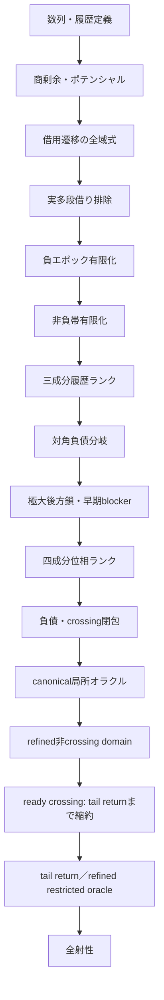
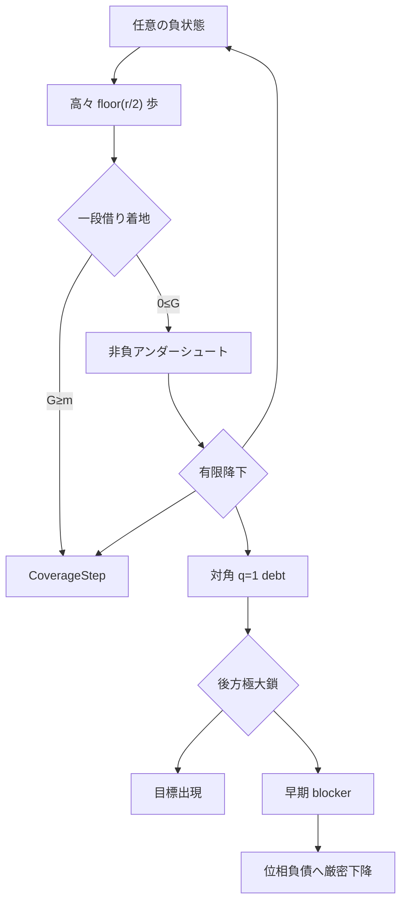

# 証明地図

本書で使う`potential`、`borrow`、`blocker`、`epoch`、`oracle`、`debt`などの意味と、
標準用語／研究固有用語の区別は[用語集](GLOSSARY.md)を参照。
ordinary normal constructorの生成箇所と精密化方針は
[normal provenance監査](NORMAL_PROVENANCE_AUDIT.md)にまとめる。

## 全体依存関係



上図の`数列・履歴定義`から`refined非crossing domain`までは証明済みである。
ready crossingの局所stepは`TargetTailReturnHypothesis`まで縮約済みである。
この長期再帰命題とrefined oracleへのclocked domain統合以降が未証明である。

## 状況一覧

| 領域 | 状態 | 内容 | 主モジュール |
|---|---|---|---|
| 数列定義 | 証明済み | 再帰、履歴、減算可能性 | `Basic`, `History` |
| 座標力学 | 証明済み | 通常・借用・全域遷移 | `Coordinates`, `CoordinateDynamics`, `MultiBorrow` |
| 実軌道上界 | 証明済み | `aₙ≤U(n)`、`2q≤n+1` | `OrbitBounds` |
| 多段借り | 解消済み | 実軌道では`b=0,1`のみ | `OrbitBounds` |
| 目標面 | 証明済み | `G=m`と目標方程式の接続 | `LandingSurfaces`, `PrestateCoverage` |
| 負領域 | 証明済み | 有限時間で一段借り | `Recovery`, `RecoveryBudget` |
| 高商障壁 | 証明済み | 高商失敗をblockerへ変換 | `RecoveryFrontier`, `OneBorrowFrontier` |
| 非負帯 | 証明済み | 負領域復帰・Coverage・レベル下降 | `Undershoot` |
| 大域値帰納 | 証明済み | `CoverageOracle`から全射性 | `Coverage` |
| 履歴探索帰納 | 証明済み | 三成分ランクと抽象オラクル | `HistoryBudget`, `HistoryFrontier` |
| 対角後方履歴 | 証明済み | 極大減算鎖と早期blocker | `Diagonal` |
| 位相探索 | 骨格証明済み | 四成分ランクと抽象オラクル | `PhaseSearch` |
| 負債局所解析 | semantic閉包済み | 同時成長は実在するが、frontier下降またはstrong debt self-exitで閉包 | `DebtInvariant`, `DebtSubtraction`, `DebtAddition`, `DebtStep`, `DebtBackward`, `DebtCrossing`, `AnchorBoundary`, `CrossingRecovery`, `CrossingGap`, `CrossingGrowth`, `CrossingHorizon`, `CrossingIteration`, `CrossingFrontier` |
| 負エポック位相接続 | ランク証明済み | 対角仮定なしで目標出現またはPhaseSearchProgress | `PhaseEpoch` |
| canonical開始 | 局所閉包済み | 全符号とlevel 0/1/2を分類し、強制成長も二段先のCoverageStepへ回収 | `CanonicalOracle`, `CanonicalLevelZero`, `CanonicalLevelOne`, `CanonicalLevelTwo`, `CanonicalComplete`, `CanonicalForcedGrowth`, `CanonicalGrowthRecovery` |
| 意味的探索domain | extended-history局所閉包済み | current normalとhorizon-ready historical normalは全分岐閉包。generic budget gapとearly representativeもcrossing recoveryへ接続 | `NormalProvenance`, `ExtendedHistoryNormal`, `ExtendedHistoryBudgetClosure`, `ExtendedHistoryComplete`, `EarlyRepresentativeComplete`, `DowncrossBudgetGap` |
| Coverage blocker | ready current/debt閉包済み | current親からのCoverageStepは未来初出ならorbit-ready、過去初出ならhorizon-ready strong debtへ送る | `CoverageDebtBridge`, `ReadyDebtInvariant`, `ReadyCurrentDebt` |
| historical回避 | refined閉包済み | parent-dropはfuture current／earlier ready debtへ分解。通常debtはtyped extended-history境界だけを使い、crossing frontierの二時計区間もhorizon-ready extended-historyへ収容 | `HistoricalDebtBridge`, `ReadyDebtRefined`, `CrossingFrontierRefined` |
| refined child | 非crossing閉包済み | orbit-ready normal、ready debt、extended-historyは生成分岐から直接refined stepを返す | `OrbitReadyDirectRefined`, `ReadyDebtRefined`, `ExtendedHistoryDirectRefined` |
| refined oracle境界 | crossingだけ未証明 | constructor監査とcanonical接続を完了し、残余を`CrossingRefinedStepHypothesis`ひとつへ縮約 | `RefinedOracleBoundary` |
| crossing rank境界 | 証明済み | 非crossing successorはstrict budget dropが必須。同一horizonのrefined successorはcrossingに限る | `CrossingRefinedBoundary` |
| crossing future downcross | 条件付き閉包済み | 保存horizon以後のdowncross endpointはfresh below-targetであり、budget下降からextended-historyへ退出 | `CrossingDowncrossRefined` |
| crossing horizon-below | 完全分類済み | 次のupcrossingが進捗するかstable-budget/anchor-growth残余。target 19に残余の実例 | `CrossingBelowRefined` |
| crossing above tail | 長期仮説まで縮約 | no future downcrossはpermanent above tailと同値。tail returnでready crossing局所totality | `CrossingTailRefined` |
| tail returnの強さ | 同値性証明済み | 最小未出目標はeventually strictly above。全targetのtail returnは全射性と同値 | `CrossingTailRefined` |
| permanent tail局所構造 | 証明済み | 高々二遷移のCoverage、zero-budget ready crossing、tail最小値直下のhistorical blockerを抽出 | `PermanentAboveTail` |
| zero-budget crossing境界 | 証明済み | refined子はcrossingに留まり、budget 0を保ってanchorを厳密下降 | `PermanentAboveTail` |
| tail potential監査 | 局所候補棄却 | 二連続forced additionだけではpotentialは増減両方向。実軌道例をkernel検証 | `PermanentAbovePotential` |
| historical tail反復 | 有限化済み | downcrossならbudget下降、なければtail minimum下降。強帰納で必ずfresh historical downcrossへ到達 | `PermanentAboveHistory` |
| historical cycle接続 | 残余まで分類 | anchor dropならrefined crossing子。任意crossing選択ではchild=parentのstationary residualが必ず構成可能 | `PermanentAboveHistory` |
| canonical upcrossing | 存在・一意性証明済み | 最初のfuture weak upcrossingを強帰納で構成。再選択は同時刻なのでearliest規則単独では停留 | `PermanentAboveCanonical` |
| dual history budget | 証明済み | `seenBelowCount = target - missingBelowCount`。過去のpositive-missing点へ戻るとstrict下降 | `PermanentAboveCanonical` |
| permanent-tail cycle rank | 骨格証明済み | anchor／one-way phase／seen budget／minimumの四成分rank。全historical内部stepを閉包 | `PermanentAboveCycleRank` |
| cycle discharge exit | 必要十分条件まで縮約 | dischargeからcrossingへ戻るrank edgeはstrict anchor dropと同値。growth residualは退出不能 | `PermanentAboveCycleRank` |
| typed discharge return | 証明済み | combined obstructionからhistorical downcross、最初のreturn upcrossing、旧crossing provenanceを一証明書へ統合 | `PermanentAboveCycleExit` |
| crossing-time cursor | 骨格証明済み | `(anchor, crossingTime, phase, seen, minimum)`の五成分well-founded rank。同anchorの早いreturnもstrict exit | `PermanentAboveCycleExit` |
| discharge kernel | 三残余まで分類 | 非進捗はstrict anchor growth、旧crossingのendpoint以前、同anchor・同時刻stationaryのみ | `PermanentAboveCycleExit` |
| canonical return rebase | no-goまで証明済み | return crossingを同horizonの親へ型付き再構成可能。tail/minimumを保存するが再生は必ずliteral stationary | `PermanentAboveCycleRebase` |
| canonical below corridor | 局所完全分類済み | fresh endpointからfirst return predecessorまで全値below。内部stepはbudget dropまたはtarget-bounded clock | `PermanentAboveCorridor` |
| all-forced corridor rank | 有限化済み | delayed corridorはinternal subtractionまたはall-forced。後者はreturn<target、加算trace、remaining-clock下降 | `PermanentAboveCorridorRank` |
| corridor suffix cursor | 有限化済み | later below startでも同returnがcanonical。legal endpoint移動はbudgetとreturn-distanceを同時下降 | `PermanentAboveCorridorSuffix` |
| legal return boundary | exact targetで排除済み | below sourceのsubtraction直後のforced upcrossはsource+1。return着地ならtargetを実現 | `PermanentAboveCorridorBoundary` |
| terminal crossing window | 有限算術へ縮約済み | all-forced suffixはendpoint<return<target、strict crossing、trace、gap/overshoot≤returnを保持 | `PermanentAboveCorridorWindow` |
| corridor terminal normalization | 二形へ縮約済み | suffix距離の強帰納でlegal endpoint列を消費。全dischargeはimmediate valleyまたはfinite crossing window | `PermanentAboveCorridorTerminal` |
| terminal crossing balance | 共通算術へ統一済み | 二形ともgap+overshoot=return+1。両差は正かつreturn以下。final fresh endpointも保持 | `PermanentAboveCorridorBalance` |
| terminal forced blocker | 二残余へ分類済み | final subtraction失敗はtarget<2(return+1)の数値帯、またはreturnより前の正のbelow-target履歴値 | `PermanentAboveCorridorBlocker` |
| blocker position | budget枝まで分類済み | historical blockerがfreshより後ならstrict missing-budget drop。fresh以前ならouter history。immediate枝は常に後者 | `PermanentAboveCorridorBlockerPosition` |
| master terminal residual | 四outer residualへ縮約済み | strict budget progressを分離。残るのはimmediate二形、finite clock band、finite outer blocker | `PermanentAboveCorridorResidual` |
| finite return candidates | 有限列挙・rank済み | band membership同値、候補数≤target、later returnでtarget-return下降。非clock residualは三形 | `PermanentAboveCorridorCandidates` |
| outer historical blocker | 数値rank edgeまで接続済み | 初出直前でmissing drop／seen gain。predecessor選択なら既存tail-cycle backtrack下降 | `PermanentAboveCorridorOuterHistory` |
| blocker generation boundary | 生成分類・no-go済み | legalならlarger predecessor、forcedならtarget-bounded。landingはbelowなのでnormal/debtへ直結不能 | `PermanentAboveCorridorBlockerGeneration` |
| blocker predecessor adapter | 三semantic outcomeへ分類済み | aboveでready/negativeならnormal、不成立ならclock/sign残余、belowならfirst provenanceとfuture returnを保持 | `PermanentAboveCorridorPredecessorAdapter` |
| blocker predecessor crossing | refined crossingへ接続済み | predecessorからfirst upcrossを選びreturn以下・parent horizon内を証明。時刻0も閉じ、残余はanchor非下降のみ | `PermanentAboveCorridorPredecessorCrossing` |
| blocker predecessor cursor | 二rank統合・kernel縮約済み | equal-anchor earlier-timeは五成分cursor下降。一般残余はgrowth/chronology、eligibleならgrowth/literal stationary | `PermanentAboveCorridorPredecessorCursor` |
| stationary restart rank | stationaryをstrict化済み | cycle固定のrestart cursorを追加。blocker初出直前へのseen dropがphase resetを上書きし、eligible非進捗はanchor growthのみ | `PermanentAboveCorridorRestartRank` |
| crossing anchor candidates | growthを有限rank化済み | 全anchorはList.range target。strict growthごとにtarget-anchorが下降しwell-founded。反復残務は次parent選択のみ | `PermanentAboveCorridorAnchorCandidates` |
| selected crossing install | semantic反復parentを構成済み | same horizonのtail/zero-budget/minimumを保存し、selected timeをoldCrossingTimeに固定した次dischargeを構成 | `PermanentAboveCorridorSelectedInstall` |
| installed chronology rank | mismatchをhistory下降化済み | selected timeより後のdowncross endpointはfresh below-target初出値。missing budgetがstrict下降しwell-founded | `PermanentAboveCorridorChronologyRank` |
| installed master rank | 反復kernelを一relationへ統合済み | missing budget、anchor gap、crossing time、restart seen、phase、local seen、minimumの七成分。anchor dropはglobal exit | `PermanentAboveCorridorMasterRank` |
| terminal installed step | discharge全枝を統合済み | history progress、finite return、immediate insufficient、normal/above/below-master historical stepのtotal outcome | `PermanentAboveCorridorInstalledStep` |
| above predecessor closure | clock/sign残余を除去済み | readyならorbit-ready total step、earlyならcomplete early representative step。targetまたはsemantic rank下降 | `PermanentAboveCorridorAboveClosure` |
| immediate valley closure | numeric残余をsemantic閉包済み | exact二歩reboundでsource値がpost値より1小さいCoverageStep。targetまたはglobal phase-rank下降 | `PermanentAboveCorridorImmediateClosure` |
| finite return selection | fresh選択を有限rank化済み | remaining candidate listからeraseごとにlength下降。laterならtarget-returnも下降。残余はliteral revisitのみ | `PermanentAboveCorridorReturnSelection` |
| finite window selection | endpoint込みで有限rank化済み | `(returnTime, terminalEndpoint)`を有限列挙し、eraseごとにlength下降。同clock別endpointの偽revisitを除去 | `PermanentAboveCorridorWindowSelection` |
| installed window snapshot | master prefix比較済み | history budget、parent anchor、old crossingを保存。二snapshotをforward／reverse master下降またはprefix一致へ全分類 | `PermanentAboveCorridorWindowSnapshot` |
| installed window selection | full snapshotを有限rank化済み | old crossing<horizonを保存し、固定horizonの`(window, anchor, crossing)`を有限列挙。残余はexact full-key revisit | `PermanentAboveCorridorInstalledWindowSelection` |
| exact revisit history | historical数値provenanceまで有限化済み | parent node一意性、down endpoint差のhistory下降、first<horizon、minimum≤upperTri horizon。残余は拡張key一致 | `PermanentAboveCorridorExactRevisit` |
| canonical tail minimum | start差を有限化・minimum時刻を一意化済み | start/tailStart<horizon。tailStart以後のminimum value相対first occurrenceは元witness以下に存在し一意 | `PermanentAboveCorridorCanonicalMinimum` |
| canonical terminal state step | total outcomeへstate統合済み | semantic/history枝を保持し、finite枝をfresh erase-length下降またはexact canonical revisitへ直接分類 | `PermanentAboveCorridorCanonicalStateStep` |
| exact replay boundary | list-only no-go・条件付き閉包済み | key全除去後も同certificateがexact revisitを構成。残務をtarget/history/phase/master resolver一命題へ限定 | `PermanentAboveCorridorReplayBoundary` |
| finite window closure | finite numeric枝を完全排除済み | last predecessor≤1からendpoint=1, return=2, target=4/5。`a₁₃₁=4`, `a₁₂₉=5`でmissing仮定に矛盾 | `PermanentAboveCorridorFiniteClosure` |
| terminal progress flattening | 四progress形へ完全統合済み | target occurrence、strict history、local-parent semantic phase、installed master。terminal residualなし | `PermanentAboveCorridorTerminalProgress` |
| terminal successor provenance | master反復sourceを接続済み | installed master枝にselected crossing、semantic install、child parent上のnext discharge `Nonempty`を同梱 | `PermanentAboveCorridorTerminalSuccessor` |
| discharge iteration rank | successor反復を三成分rankへ縮約済み | 共有horizon budget・anchor gap・old crossing cursorのlex。successorはstrict下降またはexact replay固定点 | `PermanentAboveCorridorSuccessorRank` |
| successor iteration closure | 反復constructorを整礎帰納で消去済み | 有限回のinstalled successor後、target・strict edge・descendant上のexact replayのみ残る | `PermanentAboveCorridorIterationClosure` |
| exact replay pinning | 固定点をnode-level cycleへ固定済み | replayではreturn=old crossing=selected crossing。installed node=parentで、successorは同parent同cursorへのself-map | `PermanentAboveCorridorReplayPinning` |
| replay corridor band | 固定点cursorをtarget未満帯へ有限化済み | clock+1<値<targetから全cursor<target。endpoint→crossingは全below corridor。kernel計算でclock≥3、target≥5 | `PermanentAboveCorridorReplayCorridor` |
| replay kernel floor | clock/targetを両側から挟撃済み | 実軌道step検証でclock 3,4,5を排除しclock≥6・target≥8。上側はtarget≤upperTri(clock+1) | `PermanentAboveCorridorReplayFloor` |
| 非負normal | 通常域閉包済み | `3≤potential<target`をsemantic rankへ接続し、残余をlevel 0/1/2に限定 | `NonnegativeSemantic` |
| 全域局所被覆 | 未証明 | provenance付きreachable normal domain上の機構適用 | 将来エポック |
| 全射性 | 未証明 | `∀m, ∃t, a t=m` | 最終目標 |

## 証明済みの縮約



## 現在の一点

canonical開始点からの最初の局所stepは全分岐で閉じた。level 1/2の強制加算直後は
値とanchorが増え、履歴予算も不変なので即時の`PhaseSearchProgress`にはならない。
しかし、もう一段先の候補が元のcanonical値より厳密に小さいため、合法減算ならfresh、
blockなら既出値として、どちらも`CoverageStep`へ変換できる。

残る境界はordinary normal constructorの強さである。現行`NormalSearchInvariant`は概念的に
次だけを保持する。

```text
history horizon
FirstAt a value firstTime
firstTime ≤ horizon
target ≤ value ≤ anchor
```

この証明書では`value = a horizon`も`target ≤ horizon+1`も従わない。実際、過去の初出値と
後のhorizonを組み合わせた反例を`NormalSemanticBoundary`で証明した。したがって、任意の
weak normal nodeに座標を選んで局所epoch定理を適用することはできない。

次のdomainには少なくとも以下をproof-carrying dataとして保持させる必要がある。

```text
node = ⟨time, anchor, normal, a time⟩
target ≤ time+1
target ≤ a time ≤ anchor
CoordinatesAt time q r
または、parent-drop／coverageから生成されたことを示すprovenance
```

`OrbitReadyNormalCertificate`は前者を実装し、負potentialの場合のsemantic stepまで接続済みである。
さらに`OrbitReadyNormalInvariant.phaseSemanticStep`は、負、高potential、非負undershoot、
level 0/1/2をすべて閉じ、current-state normalの局所totalityを与える。

`ProvenancedNormalInvariant`はcurrent nodeとrank edge付きhistorical nodeを分離する基礎APIを
与える。`TypedHistoricalNormalProvenance`はparent-drop、coverage anchor、downcross restart、
debt exit、crossing frontierの5種類を実装した。またcurrent親のCoverageStepは、candidateの
初出時刻で分けるとfuture currentまたはstrong debtへ送れるため、generic historical normalを
回避できる。

extended-history stepの当初の残余は次の二つであり、それぞれ独立な実例がある。

```text
representativeTime + 1 < target
missingBelowCount target historyHorizon
  < missingBelowCount target representativeTime
```

両方とも既存rankのまま閉じた。early representativeでは次遷移または既出の減算候補から
below-target実出現を得る。budget gapでは、countのstrict dropそのものから代表時刻では未出で
後のhorizonまでに出現したbelow-target値を抽出する。いずれもそこからfuture upcrossingを取り、
history horizonを拡張した`crossing_recovery` childへ移る。pre-crossing値はtarget未満なので、
旧representative anchorより厳密に小さく、四成分rankのanchorが下降する。

refined child domainは次を保持する。

```text
OrbitReady current
ReadyDebtInvariant
ExtendedHistoryNormalInvariant
CrossingSearchInvariant
```

orbit-ready normal、ready debt、extended-history normalについては、broad
`PhaseSemanticInvariant`を経由せず生成分岐から直接refined resultを構成した。crossing frontierの
二時計middle区間もready debt sourceのhorizon readinessを継承するextended-history childへ入る。
したがってconstructor監査で残るのは`CrossingSearchInvariant`自身だけである。

このcrossing証明書はpredecessor、forced addition、strict crossing、post-state coordinatesを持つが、
元のstrong debtにあったpost値の`FirstAt`、post値が旧anchor未満であること、target-ready horizonを
保持しない。既存debt-crossing closureを再利用する前に、このprovenance消失を修復する必要がある。

さらに`CrossingRefinedBoundary`は、crossing nodeのanchorがtarget未満、非crossing refined nodeの
anchorがtarget以上であることから、両者のrank edgeが必ずstrict history-budget dropを伴うと証明する。
同じhorizonのrefined successorはcrossingに留まる。このためsource provenanceの追加だけでは足りず、
新しいbelow-target履歴またはcrossing-to-crossingの下降を実際に構成する必要がある。

`ReadyCrossingSearchInvariant.refinedStep_of_futureDowncross`は、このうち保存horizon以後にdowncrossが
存在する枝を閉じる。downcross endpointはlegal subtractionによりfreshで、元crossingのpost-stateを
representativeとするextended-history childへstrict budget edgeで移れる。

horizonがbelow-targetである場合、次のweak upcrossingは必ず存在する。
`refinedStep_or_continuationGrowth_of_horizonBelow`は、それがbudgetまたはanchorを下げる枝と、
どちらも下げない`CrossingContinuationGrowthResidual`を完全に分ける。後者は
target 19、horizon 31、anchor 13→14の実軌道で実在する。ただしそのchild horizonは必ず
at-or-above targetで、その後のdowncrossは元の親に対するstrict budget edgeを作る。

`no_futureDowncross_iff_tail_atOrAbove`により、最後に残る枝は「以後ずっとtarget以上」
という真の長期軌道命題である。`refinedStep_of_tailDowncross`は、このtail returnを仮定すれば
ready crossingの両枝が共に閉じることを証明する。
ただしこの長期命題は局所的な残余ではない。最小未出目標を仮定すると、それ未満の値はすべて
ある有限history horizonで既出になるためfuture downcrossが不可能となり、軌道はeventually strictly above
targetになる。`all_targetTailReturn_iff_surjective`は、全targetのtail returnが元の全射性と同値であることを証明する。

`PermanentAboveTail`は、この同値性を仮定として使わず、仮想的な最小未出targetが強制する
tail内部をさらに解析する。tailの任意の状態は、合法減算なら直ちに、強制加算なら次の候補
`a n - 1`のfresh／既出分岐により、高々二遷移で`CoverageStep`を与える。tail最小値では
両遷移が強制加算となり、`a n - 1`はtail開始前に初出したhistorical blockerである。

同時に、below-target値はすべて既出なので`missingBelowCount=0`である。仮想反例からは実際に
tail内部のready crossingを構成でき、その将来downcrossは存在しない。zero-budget crossingから
非crossing refined子へは進めず、refined子があればbudget 0のcrossingに留まってpre-crossing
anchorを厳密に下げる。したがって次の未証明接続は、tail最小値が返すhistorical blockerを
このcrossing anchor下降へ変換する一歩である。

`PermanentAbovePotential`は、最小値で現れる二連続forced additionの座標候補を監査する。
実軌道の`2→7→13`ではpotentialが`2→-2`へ下がり、重なる`7→13→20`では`1→3`へ上がる。
よって二連続forced additionだけを根拠とするpotential単独ランクは使えず、履歴証明書との結合が必要である。

`PermanentAboveHistory`は、この履歴証明書を反復可能にした。直下値の初出時刻以後にdowncrossが
あれば、そのendpointはfreshで`missingBelowCount`を厳密に下げる。downcrossがなければ初出時刻から
新しいstrict-above tailを作れ、その最小値は旧最小値より厳密に小さい。自然数最小値に対する
強帰納により、後者だけを無限反復することはできず、必ず有限回でhistorical downcrossへ到達する。

そのdowncross後のupcrossingをcombined zero-budget crossingと同じhorizonへ置くと、anchor dropなら
正当なrefined crossing子になる。しかし親crossingをそのupcrossing自身として選べばchild=parentとなり、
同budget・同anchorで進捗しない`HistoricalCycleGrowthResidual`を必ず構成できる。
したがって任意のcrossing証明書を許す現行domainではhistorical cycle一回の再生はrankにならない。
次の未証明点は、earliest/latest/minimum-anchorなどのcanonical crossing provenance、または複数cycleを
同時に測る新しいwell-founded量でこの停留選択を排除することである。

`PermanentAboveCanonical`は最初のfuture weak upcrossingを、既知witness時刻を上界とする強帰納で
canonicalに構成し一意性を示す。しかし同じdowncross endpointから再選択すれば一意性により同時刻へ
戻るため、earliest規則だけではstationary residualを解消しない。同モジュールは
`seenBelowCount = target - missingBelowCount`を導入し、zero-budget tail horizonからpositive-missingな
historical first occurrenceへ戻る向きで厳密下降するdual budgetを証明する。

`PermanentAboveCycleRank`はこのdual budgetを統合する。rankは
`(anchor, phase, seenBelowCount, tailMinimum)`の辞書式順序で、phaseは
`crossing > backtrack > discharge`の一方向である。combined obstructionは同anchorのbacktrackへ入り、
renewed tailはseen/minimumを下げ、historical downcrossはdischargeへ入る。すべてstrict stepであり、
rankはwell-foundedである。dischargeからcrossingへ戻るstepはstrict anchor dropと同値なので、
stationary cycleは進捗として排除される。ただしanchor非減少のgrowth residualはexit obstructionとして残る。

`PermanentAboveCycleExit`はhistorical downcrossから最初のreturn upcrossingまでの全時刻・値provenanceを
`PermanentTailDischargeReturnCertificate`へまとめる。外側cursorを`(anchor, crossingTime)`へ精密化した
五成分cycle rankもwell-foundedである。これにより同anchorでもreturn時刻が早ければcycleを退出できる。
完全分類`cycleExit_or_kernelResidual`の非進捗側は、strict anchor growth、旧crossingがdowncross endpointより
前にあるchronology mismatch、anchorと時刻がともに同一のliteral stationaryの三constructorだけである。
同じendpointですでにcanonicalな旧crossingを再選択すると、最後のconstructorが実際に生じる。

`PermanentAboveCycleRebase`は、return crossing自体を次のzero-budget parentにする自然な修正を監査する。
旧horizon上でready crossingを再構成でき、同じpermanent tailとminimum certificateを持つcombined obstructionに
戻せる。しかし同じhistorical downcrossを再生したdischarge certificateでは、returnが旧crossingそのものであり、
anchor・時刻とも等しい`stationary` kernelになる。従ってcanonical rebaseは三残余を一つのstationary coreへ
正規化するが、progressを作らない。次のrankにはendpoint再訪の禁止または別のhistorical choiceが必要である。

`PermanentAboveCorridor`はstationary core内部の有限区間を抽出する。first weak upcrossingの最小性から、
fresh downcross endpointとreturn predecessorの間にある全状態がtarget未満である。returnが即時なら、downcrossの
合法減算と次のforced additionは`a (d+2) = a d + 1`という谷形を作る。遅延returnでは任意の内部transitionを
分類でき、legal subtractionはfirst occurrenceを作ってhistory budgetを厳密下降させる。forced additionは
次状態もbelowなので`time+1 < target`を強制する。従ってbudgetを下げない内部区間は有限なtarget-bounded clockに限られる。

`PermanentAboveCorridorRank`はbudget下降がない補集合を`AllForcedAdditionCorridor`として型付けする。
遅延runの最後の内部stepへclock boundを適用すると`returnTime < target`となり、gapもtarget-relativeに有限である。
値は`forcedClockSum`によるtelescoping式を満たし、run内で厳密増加する。`target - time`を使う
`CorridorClockProgress`はwell-foundedで全forward stepを受け入れる。任意の遅延corridorはinternal legal subtraction
とall-forced有限runへ完全分類される。ただしこのrankはreturn到達までを測るだけで、rebased stationary crossingへの
復帰を下降にはしない。

`PermanentAboveCorridorSuffix`はreturn crossingを固定したsuffixを導入する。first weak upcrossingは区間内の
later below startへ制限しても同時刻のままcanonicalである。内部legal subtractionのfresh endpointを新suffixに
すると、`missingBelowCount`と`returnTime - endpointTime`がともに厳密下降する。後者のcursorはwell-foundedで、
suffixはendpoint=return、later legal endpoint、all-forced target-bounded suffixへ完全分類される。
従って同じreturnに属するlegal endpointの消費は有限だが、return crossing自体は変わらない。

`PermanentAboveCorridorBoundary`はlegal endpoint列の終端を精密化する。below-target sourceでのlegal subtractionと
直後のforced additionは既存の二歩式によりsource値`+1`へ着地する。これがweak upcrossならendpointはtarget以上、
sourceはtarget未満なのでexact targetになる。従ってmissing-target provenanceの下ではlegal subtraction endpointが
return predecessorと一致できず、全legal childはreturnより厳密に前にある。後続legal endpointがなければ、残りは
all-forced suffixに限られる。

`PermanentAboveCorridorWindow`はterminal all-forced suffixを有限算術証明書へ変換する。final forced upcrossまで
`forcedClockSum` traceを延長し、target missingから`a return < target < a (return+1)`を得る。
nonempty suffixでは`return < target`であり、crossing前の`target - a return`とcrossing後の
`a (return+1) - target`はともにreturn clock以下で正である。従ってpost-legal terminal residualは
有限な`TerminalAllForcedCrossingWindow`へ縮約される。

`PermanentAboveCorridorTerminal`はsuffix cursorに対する強帰納を実行する。legal endpointがあればmissing-target
boundaryによりreturnより厳密に前のchildへ移り、cursorを下げる。なければall-forcedで停止する。
従って任意のdelayed historical corridorは有限回でterminal crossing windowへ到達し、全dischargeは型付きで
`ImmediateHistoricalValleyCertificate`または`TerminalAllForcedCrossingWindow`の二形へ正規化される。

`PermanentAboveCorridorBalance`は両terminal shapeに共通するstrict crossing算術を抽出する。forced final stepにより
target gapとovershootの和は`returnTime + 1`に等しい。両者が正なので各々`returnTime`以下であり、この上界は
all-forced枝だけでなくimmediate valleyにも成立する。共通interfaceは最終fresh endpointとcanonical returnも保持する。

`PermanentAboveCorridorBlocker`はfinal forced additionの理由を定義まで戻す。predecessor値がclock以下なら
crossing endpointは`2 * (return+1)`以下、従ってtargetもこれより小さい。正のsubtraction candidateがあるなら、
その値は既出であり、first occurrenceを`return`より厳密に前へ抽出できる。candidateはpredecessorおよびtargetより小さい。

`PermanentAboveCorridorBlockerPosition`はblocker first timeをnormalized fresh endpointと比較する。first timeが後なら
candidateのbelow-target性とfirst occurrenceから`missingBelowCount`が厳密下降する。前または同時ならblockerを
outer history側へ保持する。immediate valleyではfresh endpoint=returnであり、blocker first time<returnなので後者に限る。

`PermanentAboveCorridorResidual`は以上のcase splitを一つのmaster theoremへ集約する。finite insufficient枝は
`return < target < 2*(return+1)`のtarget-indexed finite clock bandを持つ。finite blockerがfreshより後ならstrict
budget progressとして分離される。従って真のouter residualはimmediate insufficient、immediate historical、
finite insufficient、finite outer blockerの四constructorだけである。

`PermanentAboveCorridorCandidates`はfinite clock bandを`List.range target`のfilterへ変換する。membershipは
`return < target ∧ target < 2*(return+1)`と同値で、list長はtarget以下である。候補上のlater return moveは
`target-return`を厳密に下げ、このrelationはwell-foundedである。finite candidate枝を分離すると残るnon-clock
outer residualはimmediate insufficient、immediate historical、finite outer blockerの三形になる。

`PermanentAboveCorridorOuterHistory`はpositive historical blockerのfirst timeが非零であることを使う。その直前時刻から
first timeへmissing budgetがstrict dropし、dual seen countがstrict gainする。従って時刻を逆向きにfirst-time predecessorへ
選べば既存`TailCycleProgress`のbacktrack edgeになる。またblockerがoriginal down endpointより後ならforward missing-budget
dropも得られる。未証明なのは、この数値predecessorを次の意味的historical search nodeとして選ぶprovenanceである。

`PermanentAboveCorridorBlockerGeneration`はblocker first occurrenceのinitial枝を排除し、actual transitionを完全分類する。
legal subtraction枝はlarger predecessorとそのearlier first occurrenceを保持する。forced addition枝はpredecessorとclockが
ともにtarget未満で、failure reasonも保持する。一方、landing candidate自体はtarget未満なので`NormalPhaseInvariantAt`と
`DebtInvariant`のtarget lower boundに矛盾し、両domainへ直接載らない。必要な最小追加物はbelow-target historical/crossing adapterである。

`PermanentAboveCorridorPredecessorAdapter`は両生成枝から共通predecessor証明書を取り出す。predecessorがtarget以上なら
その時刻は正で座標を持ち、clock readyかつnegative potentialのとき既存`NormalPhaseInvariantAt`へ入る。失敗時は
`firstTime < target`または非負potentialをliteralに返す。predecessorがtarget未満なら、earlier first occurrence、将来のcanonical
return crossing、および時刻0と正時刻座標の分離を保持する最小historical certificateに入る。

`PermanentAboveCorridorPredecessorCrossing`はbelow-target predecessor時刻からfirst weak upcrossingを再選択する。
このcrossingは既存discharge return以下なのでparent horizonより前にあり、target-missingによりstrictである。post-crossing
時刻は常に正なのでpredecessor時刻0も同じ座標構成に入り、ready crossingとしてrefined domainを保存する。旧parentと同じ
history horizonを使うため、rank下降はcrossing predecessor anchorのstrict dropと同値で、残余はanchor非下降だけである。

`PermanentAboveCorridorPredecessorCursor`は同じanchorのearlier crossing timeを既存`TailCrossingCursorProgress`へ接続し、
discharge-to-crossing edgeを五成分cycle rank上で下降させる。一般のcombined outcomeはphase下降、cursor下降、strict anchor
growth、equal-anchor chronology residualの四形である。旧crossingがoriginal down endpoint以後なら、新crossing≤canonical
return≤旧crossingなので最後のresidualは同一anchor・同一timeのliteral stationaryへ縮む。

`PermanentAboveCorridorRestartRank`は通常history clockとは別にcycle固定のrestart cursorを追加する。通常historyをphaseより
外側へ移すだけではbacktrackから実downcrossへ入る際の時刻前進でrankが壊れるためである。六成分rankでは既存anchor/time cursor
下降を保存し、stationary再開時だけblockerの`seenBelowCount(firstTime-1) < seenBelowCount(firstTime)`を使う。このstrict dropが
upward phase resetを上書きするので、eligible predecessor kernelの非進捗はstrict anchor growth一形だけになる。

`PermanentAboveCorridorAnchorCandidates`は最後のgrowth anchorがstrict crossing直前値なのでtarget未満であることを使う。
旧anchorも保存済みold crossingの直前値なのでtarget未満であり、両者は長さtargetの`List.range target`に属する。strict growthは
`target - newAnchor < target - oldAnchor`を与え、このremaining-gap relationはwell-foundedである。数値反復の無限性は除かれ、
残る境界はnew anchorを次cycle parentへinstallするsemantic selection provenanceだけである。

`PermanentAboveCorridorSelectedInstall`はselected nodeが旧parentと同じhorizonを持つことを使い、permanent tail、zero budget、
horizon strict-above、no-future-downcross、historical minimumをすべて移送してcombined parentを再構成する。既存combined型は
crossing timeをexistentialに隠すため、次dischargeは別途構成し、`oldCrossingTime=selected crossingTime`を型に保持する。
anchor-gap progressはinstalled parent間へ持ち上がる。次反復の残余はselected timeと次downcross endpointのchronologyだけである。

`PermanentAboveCorridorChronologyRank`はそのmismatchが`selectedTime < downTime+1`を意味し、next discharge endpointが
below-target値のfirst occurrenceであることを使う。従ってselected timeからendpointへ`missingBelowCount`がstrict下降し、
dual `seenBelowCount`がstrict増加する。このmissing-budget pullback relationはwell-foundedであり、installed iterationは
eligibleまたはstrict history progressの二形になる。chronology kernelは残らない。

`PermanentAboveCorridorMasterRank`は反復kernelを七成分rankへ統合する。順序はmissing history budget、remaining anchor gap、
crossing time、restart seen-budget、cycle phase、local seen-budget、minimumである。chronology mismatchは第一成分、strict
anchor growthは第二、equal-anchor earlier crossingは第三、stationary restartは第四成分を下げる。反対向きのstrict anchor
decreaseは反復ではなく既存global `PhaseSearchProgress`へのexitとして分離する。master relation自体はwell-foundedである。

`PermanentAboveCorridorInstalledStep`はterminal residual tree全体を上記pipelineへ接続する。fresh-after blockerとold-crossing
chronology mismatchはstrict history progress、finite insufficientはexplicit return candidate、immediate insufficientは数値証明書を
返す。eligible outer blockerはnormal-ready、above-target clock/sign residual、below-target master stepへ完全分解される。below
master stepはselected crossingとpermanent-tail installed parentを必ず再構成できるため、semantic反復データを失わない。

`PermanentAboveCorridorAboveClosure`はabove-target predecessorのclock/sign残余を除去する。predecessor時刻がtarget-readyなら
actual current nodeに`OrbitReadyNormalCertificate`を構成し、全potentialをtarget出現またはsemantic phase-rank childへ閉じる。
readyでなければold history horizon上の`EarlyRepresentativeCertificate`を構成し、そのcomplete theoremを使う。従って
historical blockerのcomplete outcomeはtarget、early/ready semantic step、below installed master stepの四形である。

`PermanentAboveCorridorImmediateClosure`はimmediate valleyのexact equation
`a(downTime+2)=a(downTime)+1`を利用する。source値はtargetより大きく、そのfirst occurrenceを取ればpost-valley値よりstrictに
小さいtarget-valid値になるため`CoverageStep target (a(downTime+2))`が得られる。canonical coverage adapterによりtarget出現または
global semantic phase-rank下降となり、immediate insufficientはnumeric residualではなくなる。

`PermanentAboveCorridorReturnSelection`はfinite return candidate listをremaining stateとして保持する。初期lengthはtarget以下で、
remaining candidateを選ぶと`List.erase`によりlengthがstrict下降し、このselection relationはwell-foundedである。さらにlater
candidateなら既存`target-return` rankも下降する。唯一のselection residualは、global candidate membershipを持つがremaining
listには無いliteral revisitであり、semantic再訪排除と有限fresh-selectionを分離する。

`PermanentAboveCorridorWindowSelection`はfinite branchで失われていたterminal endpointとall-forced window証明をdischarge-level
outcomeからselectionまで保存する。`endpoint < return < target`によりinterval key `(return, endpoint)`は明示的な二重rangeへ
有限列挙でき、fresh keyのeraseはremaining lengthをstrictに下げる。同じreturnでendpointだけ異なる枝は別keyになり、再訪残余は
同一window区間に限定される。有限keyに含まれないinstalled parent anchorとold crossing cursorの同一性が次のprovenance境界である。

`PermanentAboveCorridorWindowSnapshot`は各window occurrenceへhistory-budget cursor、parent anchor、old crossing timeを付与する。
二snapshotのmaster-rank prefixはcurrent下降、stored下降、三座標一致へ全分類され、visited情報だけでは反復方向を決められないことも
型として露出する。同時に`PermanentTailDischargeReturnCertificate`の全三構築経路へ、生成時に既知だった
`oldCrossingTime + 1 < parent.horizon`を保存した。

`PermanentAboveCorridorInstalledWindowSelection`はこの上界を使い、固定horizonでwindow key、target未満anchor、horizon未満old crossingを
一つの明示有限listへ直積化する。master prefixが逆向きでもfull keyがfreshならerase-length rankがstrict下降する。従って同一windowの
parent/cursor変化は有限回しか起こらず、selection residualは同じwindow・anchor・old crossing timeのexact revisitに限定される。

`PermanentAboveCorridorExactRevisit`はready crossingの`node_eq`からparentが
`(horizon, anchor, normal, anchor)`に一意であることを証明する。二dischargeのoriginal down endpointが異なれば、後側endpointの
first occurrenceにより片方向のstrict missing-budget下降が得られる。さらにdown endpointとhistorical first timeはいずれもparent
horizon未満であり、tail minimum値はtail開始値以下なので`a_le_upperTri`と単調性から`upperTri horizon`以下である。これらをfull keyへ
追加した有限selectionにより、残るのは全historical数値provenanceまで一致するexact revisitだけである。

`PermanentAboveCorridorCanonicalMinimum`はpermanent startとhistorical tailStartもparent horizon未満であることを使い、両cursorを
有限keyへ追加する。unboundedなminimum witness timeは列挙せず、shifted sequence `n ↦ a(tailStart+n)`のglobal first occurrenceから
`FirstAtOrAfter`を構成する。このcanonical timeは任意の供給witness以下で、同じtailStart/minimum valueなら一意である。従って
minimum-time選択依存は有限rankではなくcanonical identityで除去される。

`PermanentAboveCorridorCanonicalStateStep`は最終canonical selection stateをterminal constructor treeへthreadする。finite branchの
fresh selectionはeraseされたnext stateの存在とstrict length progressを返し、消費済みkeyならexact canonical revisitを返す。
それ以外のstrict history、immediate semantic closure、historical complete stepは情報を失わず同じtotal outcomeへ入る。これにより
visited rankは局所補助ではなくterminal反復に直接使える命題的step relationになった。

`PermanentAboveCorridorReplayBoundary`はvisited listの限界を形式化する。任意の有効finite certificateは、そのkeyをstateからfilterで
全除去した後にもexact revisit residualとterminal constructorを構成できる。従ってmembershipだけから矛盾は出ない。残る局所命題を
`TerminalExactCanonicalReplayResolver`として、target occurrence、strict history progress、semantic phase progress、installed master
progressの四結果へ限定した。このresolver仮定下ではraw replay constructorを持たないterminal total outcomeが得られる。

`PermanentAboveCorridorFiniteClosure`はこのresolverを算術的に無条件証明する。all-forced suffixの最終一歩とinsufficient boundから
`a(return-1)≤1`を得て、加算traceでfresh endpoint値も1以下に戻す。endpointは正時刻のfirst occurrenceなので`endpoint=1`、さらに
suffixが長ければ最初のclock 2だけで上界に反するため`return=2`である。strict crossingは実値`a 2=3`, `a 3=6`の間なのでtargetは
4または5に限るが、それぞれ`a 131`, `a 129`として出現する。従ってfinite certificateはFalseであり、terminal outcomeから数値枝が消える。

`PermanentAboveCorridorTerminalProgress`はfinite-free outcomeの内側constructorを全展開する。immediate branchはtargetまたはcanonical
coverage由来semantic edge、early/ready blockerは対応するhistorical/current predecessor parentからのsemantic edge、below blockerは
global phase exitまたはinstalled master edgeになる。結果はtarget、strict history、semantic phase、installed masterの四形だけである。
semantic constructorは比較元local parentを保持し、異なるrank contextを不正に同一視しない。

`PermanentAboveCorridorTerminalSuccessor`はinstalled master constructorをsemantic反復可能に強化する。selected crossing certificateから
`TerminalSelectedCrossingInstallCertificate`を構成し、その`exists_nextDischarge`を同じoutcomeへ保持する。next dischargeのparentは
definitionally selected crossing nodeであるため、master child上の次terminal analysisへproof provenanceを失わず進める。

`PermanentAboveCorridorSuccessorRank`は反復に実際に輸送される座標だけを取り出す。七成分master nodeの内側cursorはblocker first time
に依存し、successor dischargeへは持ち越せない。installationで固定されるのは共有horizon、installed crossing anchor、old crossing
cursorの三成分であり、これをdischarge-levelの`terminalDischargeIterationRank`とする。installed successorはanchor growthまたは
earlier equal-anchor crossingでこのrankを厳密に下げ、残る唯一の非進捗はanchorとcursorがともに一致するexact replayである。
replayではrankが文字通り不動になることも等式として保持する。

`PermanentAboveCorridorIterationClosure`はこのrankの整礎性で反復そのものを閉じる。三成分lexは`natTripleLex_wellFounded`により
well-foundedなので、strict successor edgeに沿った再帰でiteration constructorは消去できる。任意のdischargeは有限回の
installed successorの後、target出現、strict chronology history、local semantic phase、またはあるdescendant discharge上の
exact replay固定点のいずれかへ到達する。combined permanent-tail certificateからも初期dischargeを経て同じ四形が従う。

`PermanentAboveCorridorReplayPinning`はこの固定点を数値的に固定する。replayが保持するeligibilityとselection上界から
`returnTime = oldCrossingTime = crossingTime`が従い、dischargeはfresh downcross endpointからold crossingへ文字通り
閉じるcycleになる。crossing clockはcrossing値より厳密に小さく、blocker候補はexact subtraction defect
`a C - (C+1)`で初出はC未満、crossing自体はtargetをまたぐ明示的forced additionである。ready crossing nodeは
horizonとanchorで決まるため、installed nodeはparentそのものであり、successor dischargeは同じparent・同じold
crossing cursorへtransportされる。replayはrankだけでなくnode-levelのself-map固定点である。

`PermanentAboveCorridorReplayCorridor`は固定点全体を軌道の初期帯へ押し込む。`clock+1 < a clock < target`から
crossing clockはtarget未満であり、return・old crossing・downcross endpoint・blocker first time・fresh endpointの
全cursorがtarget未満に収まる。endpointからcrossingまでの区間は全値target未満のbelow corridorで、target以上の値が
現れれば中間weak upcrossingがfirst returnのcanonicalityに反する。さらに`a 0=0`, `a 1=1`, `a 2=3`のkernel計算により
crossing clockは3以上、従ってtargetは5以上でなければreplay固定点は存在できない。

`PermanentAboveCorridorReplayFloor`はこのkernel排除を実軌道stepの検証まで拡張する。replay crossingは実軌道の
イベントなので、clock 3は実際のstepが減算であること（`a 4 = 2 ≠ a 3 + 4`）、clock 4は値境界（`a 4 = 2`）、clock 5は
またぐtarget `8..13`がすべて時刻16までに実出現することと矛盾する。従ってclockは6以上、targetは8以上である。
上側は`target ≤ upperTri (clock+1)`の三角包絡で押さえられ、固定点の二parameterは両側から挟まれる。

## モジュール層

| 層 | モジュール |
|---|---|
| 基礎 | `Basic`, `History`, `Coordinates` |
| 局所遷移 | `CoordinateDynamics`, `MultiBorrow`, `OrbitBounds` |
| 下降・blocker | `ActualDescent`, `Blocker`, `TargetDescent` |
| 目標面 | `Gate`, `Mechanisms`, `LandingSurfaces`, `PrestateCoverage` |
| 回復 | `NegativeRegion`, `Recovery`, `RecoveryBudget`, `RecoveryFrontier`, `RecoveryWindows` |
| エポック | `OneBorrowFrontier`, `NegativeEpoch`, `Undershoot` |
| 大域探索 | `Coverage`, `HistoryBudget`, `HistoryFrontier`, `Diagonal`, `PhaseSearch` |
| 負債局所解析 | `DebtInvariant`, `DebtSubtraction`, `DebtAddition`, `DebtStep`, `DebtBackward`, `DebtCrossing`, `AnchorBoundary`, `CrossingRecovery`, `CrossingGap`, `CrossingGrowth`, `CrossingHorizon`, `CrossingIteration`, `CrossingFrontier` |
| 位相統合 | `PhaseProgress`, `PhaseEpoch`, `PhaseSearchStart`, `NormalPhase`, `PhaseSemantic`, `NormalClosure`, `BoundaryAudit`, `NormalComplete`, `NormalSemanticBoundary`, `NormalProvenance`, `ExtendedHistoryNormal`, `TypedNormalProvenance`, `NonnegativeSemantic`, `OrbitReadyComplete`, `OrbitReadyAdapters`, `CoverageDebtBridge`, `DowncrossBudgetGap`, `EarlyRepresentative`, `EarlyRepresentativeClosure`, `EarlyForcedCandidateClosure`, `EarlyRepresentativeComplete`, `ExtendedHistoryBudgetClosure`, `ExtendedHistoryComplete`, `HistoricalDebtBridge`, `ReadyDebtInvariant`, `ReadyCurrentDebt`, `OrbitReadyRefinedStep`, `OrbitReadyDirectRefined`, `ReadyDebtRefined`, `CrossingFrontierRefined`, `ExtendedHistoryDirectRefined`, `RefinedOracleBoundary`, `CrossingRefinedBoundary`, `CrossingDowncrossRefined`, `CrossingBelowRefined`, `CrossingTailRefined`, `PermanentAboveTail`, `PermanentAbovePotential`, `PermanentAboveHistory`, `PermanentAboveCanonical`, `PermanentAboveCycleRank`, `PermanentAboveCycleExit`, `PermanentAboveCycleRebase`, `PermanentAboveCorridor`, `PermanentAboveCorridorRank`, `PermanentAboveCorridorSuffix`, `PermanentAboveCorridorBoundary`, `PermanentAboveCorridorWindow`, `PermanentAboveCorridorTerminal`, `PermanentAboveCorridorBalance`, `PermanentAboveCorridorBlocker`, `PermanentAboveCorridorBlockerPosition`, `PermanentAboveCorridorResidual`, `PermanentAboveCorridorCandidates`, `PermanentAboveCorridorOuterHistory`, `PermanentAboveCorridorBlockerGeneration`, `PermanentAboveCorridorPredecessorAdapter`, `PermanentAboveCorridorPredecessorCrossing`, `PermanentAboveCorridorPredecessorCursor`, `PermanentAboveCorridorRestartRank`, `PermanentAboveCorridorAnchorCandidates`, `PermanentAboveCorridorSelectedInstall`, `PermanentAboveCorridorChronologyRank`, `PermanentAboveCorridorMasterRank`, `PermanentAboveCorridorInstalledStep`, `PermanentAboveCorridorAboveClosure`, `PermanentAboveCorridorImmediateClosure`, `PermanentAboveCorridorReturnSelection`, `PermanentAboveCorridorWindowSelection`, `PermanentAboveCorridorWindowSnapshot`, `PermanentAboveCorridorInstalledWindowSelection`, `PermanentAboveCorridorExactRevisit`, `PermanentAboveCorridorCanonicalMinimum`, `PermanentAboveCorridorCanonicalStateStep`, `PermanentAboveCorridorReplayBoundary`, `PermanentAboveCorridorFiniteClosure`, `PermanentAboveCorridorTerminalProgress`, `PermanentAboveCorridorTerminalSuccessor`, `PermanentAboveCorridorSuccessorRank`, `PermanentAboveCorridorIterationClosure`, `PermanentAboveCorridorReplayPinning`, `PermanentAboveCorridorReplayCorridor`, `PermanentAboveCorridorReplayFloor` |
| 初期領域・canonical閉包 | `InitialRegion`, `CanonicalOracle`, `CanonicalLevelZero`, `CanonicalLevelOne`, `CanonicalLevelTwo`, `CanonicalComplete`, `CanonicalForcedGrowth`, `CanonicalGrowthRecovery` |
| 検証 | `Examples`, `Audit` |

## 証明と計算実験の境界

- `Recaman/`以下のみがLean証明本体である。
- `experiments/`のC++結果は仮説選択にのみ使用する。
- 計算実験の結果を証明の仮定として利用していない。
- 具体例の小規模計算はLeanカーネルの`decide`で検証する。
