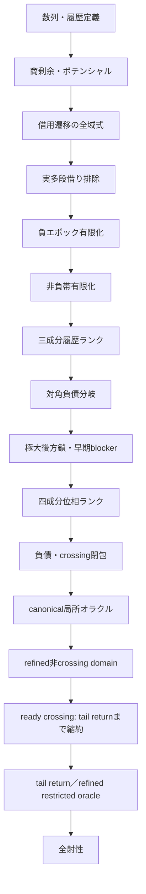
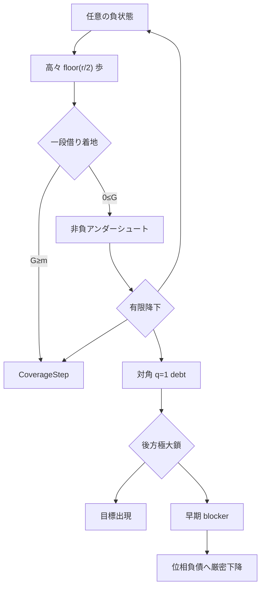

# 証明地図

本書で使う`potential`、`borrow`、`blocker`、`epoch`、`oracle`、`debt`などの意味と、
標準用語／研究固有用語の区別は[用語集](GLOSSARY.md)を参照。
ordinary normal constructorの生成箇所と精密化方針は
[normal provenance監査](NORMAL_PROVENANCE_AUDIT.md)にまとめる。

## 全体依存関係



上図の`数列・履歴定義`から`refined非crossing domain`までは証明済みである。
ready crossingの局所stepは`TargetTailReturnHypothesis`まで縮約済みである。
この長期再帰命題とrefined oracleへのclocked domain統合以降が未証明である。

## 状況一覧

| 領域 | 状態 | 内容 | 主モジュール |
|---|---|---|---|
| 数列定義 | 証明済み | 再帰、履歴、減算可能性 | `Basic`, `History` |
| 座標力学 | 証明済み | 通常・借用・全域遷移 | `Coordinates`, `CoordinateDynamics`, `MultiBorrow` |
| 実軌道上界 | 証明済み | `aₙ≤U(n)`、`2q≤n+1` | `OrbitBounds` |
| 多段借り | 解消済み | 実軌道では`b=0,1`のみ | `OrbitBounds` |
| 目標面 | 証明済み | `G=m`と目標方程式の接続 | `LandingSurfaces`, `PrestateCoverage` |
| 負領域 | 証明済み | 有限時間で一段借り | `Recovery`, `RecoveryBudget` |
| 高商障壁 | 証明済み | 高商失敗をblockerへ変換 | `RecoveryFrontier`, `OneBorrowFrontier` |
| 非負帯 | 証明済み | 負領域復帰・Coverage・レベル下降 | `Undershoot` |
| 大域値帰納 | 証明済み | `CoverageOracle`から全射性 | `Coverage` |
| 履歴探索帰納 | 証明済み | 三成分ランクと抽象オラクル | `HistoryBudget`, `HistoryFrontier` |
| 対角後方履歴 | 証明済み | 極大減算鎖と早期blocker | `Diagonal` |
| 位相探索 | 骨格証明済み | 四成分ランクと抽象オラクル | `PhaseSearch` |
| 負債局所解析 | semantic閉包済み | 同時成長は実在するが、frontier下降またはstrong debt self-exitで閉包 | `DebtInvariant`, `DebtSubtraction`, `DebtAddition`, `DebtStep`, `DebtBackward`, `DebtCrossing`, `AnchorBoundary`, `CrossingRecovery`, `CrossingGap`, `CrossingGrowth`, `CrossingHorizon`, `CrossingIteration`, `CrossingFrontier` |
| 負エポック位相接続 | ランク証明済み | 対角仮定なしで目標出現またはPhaseSearchProgress | `PhaseEpoch` |
| canonical開始 | 局所閉包済み | 全符号とlevel 0/1/2を分類し、強制成長も二段先のCoverageStepへ回収 | `CanonicalOracle`, `CanonicalLevelZero`, `CanonicalLevelOne`, `CanonicalLevelTwo`, `CanonicalComplete`, `CanonicalForcedGrowth`, `CanonicalGrowthRecovery` |
| 意味的探索domain | extended-history局所閉包済み | current normalとhorizon-ready historical normalは全分岐閉包。generic budget gapとearly representativeもcrossing recoveryへ接続 | `NormalProvenance`, `ExtendedHistoryNormal`, `ExtendedHistoryBudgetClosure`, `ExtendedHistoryComplete`, `EarlyRepresentativeComplete`, `DowncrossBudgetGap` |
| Coverage blocker | ready current/debt閉包済み | current親からのCoverageStepは未来初出ならorbit-ready、過去初出ならhorizon-ready strong debtへ送る | `CoverageDebtBridge`, `ReadyDebtInvariant`, `ReadyCurrentDebt` |
| historical回避 | refined閉包済み | parent-dropはfuture current／earlier ready debtへ分解。通常debtはtyped extended-history境界だけを使い、crossing frontierの二時計区間もhorizon-ready extended-historyへ収容 | `HistoricalDebtBridge`, `ReadyDebtRefined`, `CrossingFrontierRefined` |
| refined child | 非crossing閉包済み | orbit-ready normal、ready debt、extended-historyは生成分岐から直接refined stepを返す | `OrbitReadyDirectRefined`, `ReadyDebtRefined`, `ExtendedHistoryDirectRefined` |
| refined oracle境界 | crossingだけ未証明 | constructor監査とcanonical接続を完了し、残余を`CrossingRefinedStepHypothesis`ひとつへ縮約 | `RefinedOracleBoundary` |
| crossing rank境界 | 証明済み | 非crossing successorはstrict budget dropが必須。同一horizonのrefined successorはcrossingに限る | `CrossingRefinedBoundary` |
| crossing future downcross | 条件付き閉包済み | 保存horizon以後のdowncross endpointはfresh below-targetであり、budget下降からextended-historyへ退出 | `CrossingDowncrossRefined` |
| crossing horizon-below | 完全分類済み | 次のupcrossingが進捗するかstable-budget/anchor-growth残余。target 19に残余の実例 | `CrossingBelowRefined` |
| crossing above tail | 長期仮説まで縮約 | no future downcrossはpermanent above tailと同値。tail returnでready crossing局所totality | `CrossingTailRefined` |
| tail returnの強さ | 同値性証明済み | 最小未出目標はeventually strictly above。全targetのtail returnは全射性と同値 | `CrossingTailRefined` |
| 非負normal | 通常域閉包済み | `3≤potential<target`をsemantic rankへ接続し、残余をlevel 0/1/2に限定 | `NonnegativeSemantic` |
| 全域局所被覆 | 未証明 | provenance付きreachable normal domain上の機構適用 | 将来エポック |
| 全射性 | 未証明 | `∀m, ∃t, a t=m` | 最終目標 |

## 証明済みの縮約



## 現在の一点

canonical開始点からの最初の局所stepは全分岐で閉じた。level 1/2の強制加算直後は
値とanchorが増え、履歴予算も不変なので即時の`PhaseSearchProgress`にはならない。
しかし、もう一段先の候補が元のcanonical値より厳密に小さいため、合法減算ならfresh、
blockなら既出値として、どちらも`CoverageStep`へ変換できる。

残る境界はordinary normal constructorの強さである。現行`NormalSearchInvariant`は概念的に
次だけを保持する。

```text
history horizon
FirstAt a value firstTime
firstTime ≤ horizon
target ≤ value ≤ anchor
```

この証明書では`value = a horizon`も`target ≤ horizon+1`も従わない。実際、過去の初出値と
後のhorizonを組み合わせた反例を`NormalSemanticBoundary`で証明した。したがって、任意の
weak normal nodeに座標を選んで局所epoch定理を適用することはできない。

次のdomainには少なくとも以下をproof-carrying dataとして保持させる必要がある。

```text
node = ⟨time, anchor, normal, a time⟩
target ≤ time+1
target ≤ a time ≤ anchor
CoordinatesAt time q r
または、parent-drop／coverageから生成されたことを示すprovenance
```

`OrbitReadyNormalCertificate`は前者を実装し、負potentialの場合のsemantic stepまで接続済みである。
さらに`OrbitReadyNormalInvariant.phaseSemanticStep`は、負、高potential、非負undershoot、
level 0/1/2をすべて閉じ、current-state normalの局所totalityを与える。

`ProvenancedNormalInvariant`はcurrent nodeとrank edge付きhistorical nodeを分離する基礎APIを
与える。`TypedHistoricalNormalProvenance`はparent-drop、coverage anchor、downcross restart、
debt exit、crossing frontierの5種類を実装した。またcurrent親のCoverageStepは、candidateの
初出時刻で分けるとfuture currentまたはstrong debtへ送れるため、generic historical normalを
回避できる。

extended-history stepの当初の残余は次の二つであり、それぞれ独立な実例がある。

```text
representativeTime + 1 < target
missingBelowCount target historyHorizon
  < missingBelowCount target representativeTime
```

両方とも既存rankのまま閉じた。early representativeでは次遷移または既出の減算候補から
below-target実出現を得る。budget gapでは、countのstrict dropそのものから代表時刻では未出で
後のhorizonまでに出現したbelow-target値を抽出する。いずれもそこからfuture upcrossingを取り、
history horizonを拡張した`crossing_recovery` childへ移る。pre-crossing値はtarget未満なので、
旧representative anchorより厳密に小さく、四成分rankのanchorが下降する。

refined child domainは次を保持する。

```text
OrbitReady current
ReadyDebtInvariant
ExtendedHistoryNormalInvariant
CrossingSearchInvariant
```

orbit-ready normal、ready debt、extended-history normalについては、broad
`PhaseSemanticInvariant`を経由せず生成分岐から直接refined resultを構成した。crossing frontierの
二時計middle区間もready debt sourceのhorizon readinessを継承するextended-history childへ入る。
したがってconstructor監査で残るのは`CrossingSearchInvariant`自身だけである。

このcrossing証明書はpredecessor、forced addition、strict crossing、post-state coordinatesを持つが、
元のstrong debtにあったpost値の`FirstAt`、post値が旧anchor未満であること、target-ready horizonを
保持しない。既存debt-crossing closureを再利用する前に、このprovenance消失を修復する必要がある。

さらに`CrossingRefinedBoundary`は、crossing nodeのanchorがtarget未満、非crossing refined nodeの
anchorがtarget以上であることから、両者のrank edgeが必ずstrict history-budget dropを伴うと証明する。
同じhorizonのrefined successorはcrossingに留まる。このためsource provenanceの追加だけでは足りず、
新しいbelow-target履歴またはcrossing-to-crossingの下降を実際に構成する必要がある。

`ReadyCrossingSearchInvariant.refinedStep_of_futureDowncross`は、このうち保存horizon以後にdowncrossが
存在する枝を閉じる。downcross endpointはlegal subtractionによりfreshで、元crossingのpost-stateを
representativeとするextended-history childへstrict budget edgeで移れる。

horizonがbelow-targetである場合、次のweak upcrossingは必ず存在する。
`refinedStep_or_continuationGrowth_of_horizonBelow`は、それがbudgetまたはanchorを下げる枝と、
どちらも下げない`CrossingContinuationGrowthResidual`を完全に分ける。後者は
target 19、horizon 31、anchor 13→14の実軌道で実在する。ただしそのchild horizonは必ず
at-or-above targetで、その後のdowncrossは元の親に対するstrict budget edgeを作る。

`no_futureDowncross_iff_tail_atOrAbove`により、最後に残る枝は「以後ずっとtarget以上」
という真の長期軌道命題である。`refinedStep_of_tailDowncross`は、このtail returnを仮定すれば
ready crossingの両枝が共に閉じることを証明する。
ただしこの長期命題は局所的な残余ではない。最小未出目標を仮定すると、それ未満の値はすべて
ある有限history horizonで既出になるためfuture downcrossが不可能となり、軌道はeventually strictly above
targetになる。`all_targetTailReturn_iff_surjective`は、全targetのtail returnが元の全射性と同値であることを証明する。

## モジュール層

| 層 | モジュール |
|---|---|
| 基礎 | `Basic`, `History`, `Coordinates` |
| 局所遷移 | `CoordinateDynamics`, `MultiBorrow`, `OrbitBounds` |
| 下降・blocker | `ActualDescent`, `Blocker`, `TargetDescent` |
| 目標面 | `Gate`, `Mechanisms`, `LandingSurfaces`, `PrestateCoverage` |
| 回復 | `NegativeRegion`, `Recovery`, `RecoveryBudget`, `RecoveryFrontier`, `RecoveryWindows` |
| エポック | `OneBorrowFrontier`, `NegativeEpoch`, `Undershoot` |
| 大域探索 | `Coverage`, `HistoryBudget`, `HistoryFrontier`, `Diagonal`, `PhaseSearch` |
| 負債局所解析 | `DebtInvariant`, `DebtSubtraction`, `DebtAddition`, `DebtStep`, `DebtBackward`, `DebtCrossing`, `AnchorBoundary`, `CrossingRecovery`, `CrossingGap`, `CrossingGrowth`, `CrossingHorizon`, `CrossingIteration`, `CrossingFrontier` |
| 位相統合 | `PhaseProgress`, `PhaseEpoch`, `PhaseSearchStart`, `NormalPhase`, `PhaseSemantic`, `NormalClosure`, `BoundaryAudit`, `NormalComplete`, `NormalSemanticBoundary`, `NormalProvenance`, `ExtendedHistoryNormal`, `TypedNormalProvenance`, `NonnegativeSemantic`, `OrbitReadyComplete`, `OrbitReadyAdapters`, `CoverageDebtBridge`, `DowncrossBudgetGap`, `EarlyRepresentative`, `EarlyRepresentativeClosure`, `EarlyForcedCandidateClosure`, `EarlyRepresentativeComplete`, `ExtendedHistoryBudgetClosure`, `ExtendedHistoryComplete`, `HistoricalDebtBridge`, `ReadyDebtInvariant`, `ReadyCurrentDebt`, `OrbitReadyRefinedStep`, `OrbitReadyDirectRefined`, `ReadyDebtRefined`, `CrossingFrontierRefined`, `ExtendedHistoryDirectRefined`, `RefinedOracleBoundary`, `CrossingRefinedBoundary`, `CrossingDowncrossRefined`, `CrossingBelowRefined`, `CrossingTailRefined` |
| 初期領域・canonical閉包 | `InitialRegion`, `CanonicalOracle`, `CanonicalLevelZero`, `CanonicalLevelOne`, `CanonicalLevelTwo`, `CanonicalComplete`, `CanonicalForcedGrowth`, `CanonicalGrowthRecovery` |
| 検証 | `Examples`, `Audit` |

## 証明と計算実験の境界

- `Recaman/`以下のみがLean証明本体である。
- `experiments/`のC++結果は仮説選択にのみ使用する。
- 計算実験の結果を証明の仮定として利用していない。
- 具体例の小規模計算はLeanカーネルの`decide`で検証する。
