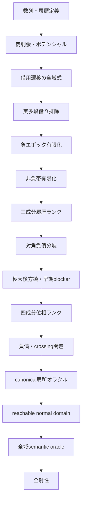
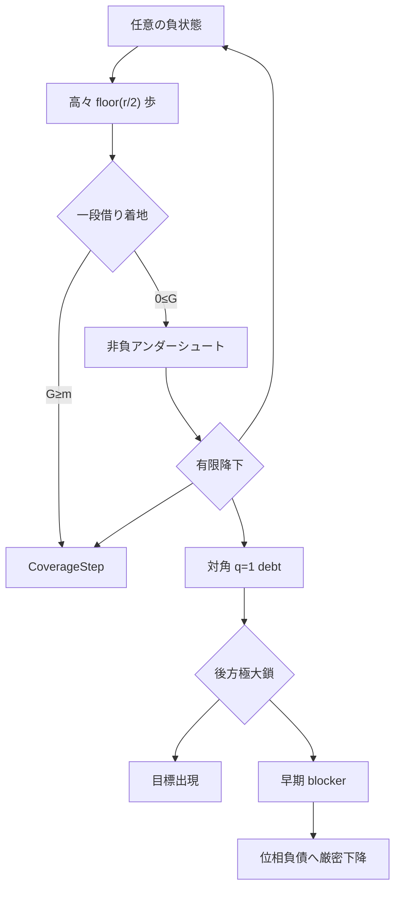

# 証明地図

本書で使う`potential`、`borrow`、`blocker`、`epoch`、`oracle`、`debt`などの意味と、
標準用語／研究固有用語の区別は[用語集](GLOSSARY.md)を参照。

## 全体依存関係



上図の`数列・履歴定義`から`canonical局所オラクル`までは証明済みである。
`reachable normal domain`以降が未証明である。

## 状況一覧

| 領域 | 状態 | 内容 | 主モジュール |
|---|---|---|---|
| 数列定義 | 証明済み | 再帰、履歴、減算可能性 | `Basic`, `History` |
| 座標力学 | 証明済み | 通常・借用・全域遷移 | `Coordinates`, `CoordinateDynamics`, `MultiBorrow` |
| 実軌道上界 | 証明済み | `aₙ≤U(n)`、`2q≤n+1` | `OrbitBounds` |
| 多段借り | 解消済み | 実軌道では`b=0,1`のみ | `OrbitBounds` |
| 目標面 | 証明済み | `G=m`と目標方程式の接続 | `LandingSurfaces`, `PrestateCoverage` |
| 負領域 | 証明済み | 有限時間で一段借り | `Recovery`, `RecoveryBudget` |
| 高商障壁 | 証明済み | 高商失敗をblockerへ変換 | `RecoveryFrontier`, `OneBorrowFrontier` |
| 非負帯 | 証明済み | 負領域復帰・Coverage・レベル下降 | `Undershoot` |
| 大域値帰納 | 証明済み | `CoverageOracle`から全射性 | `Coverage` |
| 履歴探索帰納 | 証明済み | 三成分ランクと抽象オラクル | `HistoryBudget`, `HistoryFrontier` |
| 対角後方履歴 | 証明済み | 極大減算鎖と早期blocker | `Diagonal` |
| 位相探索 | 骨格証明済み | 四成分ランクと抽象オラクル | `PhaseSearch` |
| 負債局所解析 | semantic閉包済み | 同時成長は実在するが、frontier下降またはstrong debt self-exitで閉包 | `DebtInvariant`, `DebtSubtraction`, `DebtAddition`, `DebtStep`, `DebtBackward`, `DebtCrossing`, `AnchorBoundary`, `CrossingRecovery`, `CrossingGap`, `CrossingGrowth`, `CrossingHorizon`, `CrossingIteration`, `CrossingFrontier` |
| 負エポック位相接続 | ランク証明済み | 対角仮定なしで目標出現またはPhaseSearchProgress | `PhaseEpoch` |
| canonical開始 | 局所閉包済み | 全符号とlevel 0/1/2を分類し、強制成長も二段先のCoverageStepへ回収 | `CanonicalOracle`, `CanonicalLevelZero`, `CanonicalLevelOne`, `CanonicalLevelTwo`, `CanonicalComplete`, `CanonicalForcedGrowth`, `CanonicalGrowthRecovery` |
| 意味的探索domain | 要精密化 | 負normal／debt／crossingは閉包済みだが、弱いordinary normal constructorは現在horizonとの整合性を保証しない | `NormalPhase`, `PhaseSemantic`, `NormalClosure`, `BoundaryAudit`, `NormalComplete`, `NormalSemanticBoundary` |
| 非負normal | 通常域閉包済み | `3≤potential<target`をsemantic rankへ接続し、残余をlevel 0/1/2に限定 | `NonnegativeSemantic` |
| 全域局所被覆 | 未証明 | provenance付きreachable normal domain上の機構適用 | 将来エポック |
| 全射性 | 未証明 | `∀m, ∃t, a t=m` | 最終目標 |

## 証明済みの縮約



## 現在の一点

canonical開始点からの最初の局所stepは全分岐で閉じた。level 1/2の強制加算直後は
値とanchorが増え、履歴予算も不変なので即時の`PhaseSearchProgress`にはならない。
しかし、もう一段先の候補が元のcanonical値より厳密に小さいため、合法減算ならfresh、
blockなら既出値として、どちらも`CoverageStep`へ変換できる。

残る境界はordinary normal constructorの強さである。現行`NormalSearchInvariant`は概念的に
次だけを保持する。

```text
history horizon
FirstAt a value firstTime
firstTime ≤ horizon
target ≤ value ≤ anchor
```

この証明書では`value = a horizon`も`target ≤ horizon+1`も従わない。実際、過去の初出値と
後のhorizonを組み合わせた反例を`NormalSemanticBoundary`で証明した。したがって、任意の
weak normal nodeに座標を選んで局所epoch定理を適用することはできない。

次のdomainには少なくとも以下をproof-carrying dataとして保持させる必要がある。

```text
node = ⟨time, anchor, normal, a time⟩
target ≤ time+1
target ≤ a time ≤ anchor
CoordinatesAt time q r
または、parent-drop／coverageから生成されたことを示すprovenance
```

`OrbitReadyNormalCertificate`は前者を実装し、負potentialの場合のsemantic stepまで接続済みである。
残作業は、全ての生成済みnormal childを失わずにこの精密domainへ移し、constructorごとの
局所stepを閉じることである。

## モジュール層

| 層 | モジュール |
|---|---|
| 基礎 | `Basic`, `History`, `Coordinates` |
| 局所遷移 | `CoordinateDynamics`, `MultiBorrow`, `OrbitBounds` |
| 下降・blocker | `ActualDescent`, `Blocker`, `TargetDescent` |
| 目標面 | `Gate`, `Mechanisms`, `LandingSurfaces`, `PrestateCoverage` |
| 回復 | `NegativeRegion`, `Recovery`, `RecoveryBudget`, `RecoveryFrontier`, `RecoveryWindows` |
| エポック | `OneBorrowFrontier`, `NegativeEpoch`, `Undershoot` |
| 大域探索 | `Coverage`, `HistoryBudget`, `HistoryFrontier`, `Diagonal`, `PhaseSearch` |
| 負債局所解析 | `DebtInvariant`, `DebtSubtraction`, `DebtAddition`, `DebtStep`, `DebtBackward`, `DebtCrossing`, `AnchorBoundary`, `CrossingRecovery`, `CrossingGap`, `CrossingGrowth`, `CrossingHorizon`, `CrossingIteration`, `CrossingFrontier` |
| 位相統合 | `PhaseProgress`, `PhaseEpoch`, `PhaseSearchStart`, `NormalPhase`, `PhaseSemantic`, `NormalClosure`, `BoundaryAudit`, `NormalComplete`, `NormalSemanticBoundary`, `NonnegativeSemantic` |
| 初期領域・canonical閉包 | `InitialRegion`, `CanonicalOracle`, `CanonicalLevelZero`, `CanonicalLevelOne`, `CanonicalLevelTwo`, `CanonicalComplete`, `CanonicalForcedGrowth`, `CanonicalGrowthRecovery` |
| 検証 | `Examples`, `Audit` |

## 証明と計算実験の境界

- `Recaman/`以下のみがLean証明本体である。
- `experiments/`のC++結果は仮説選択にのみ使用する。
- 計算実験の結果を証明の仮定として利用していない。
- 具体例の小規模計算はLeanカーネルの`decide`で検証する。
