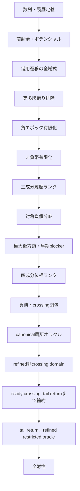
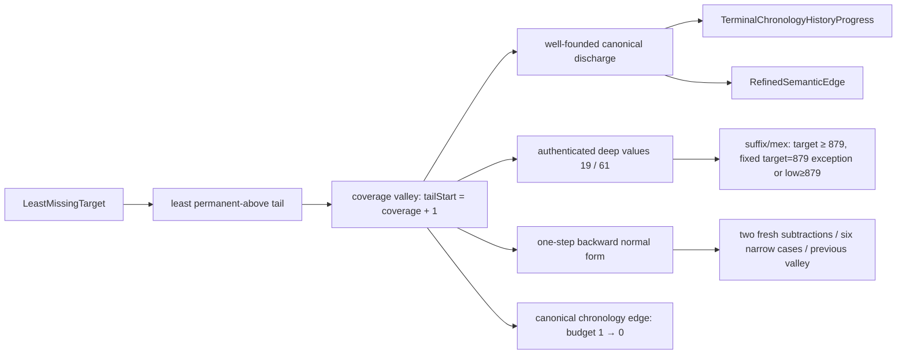
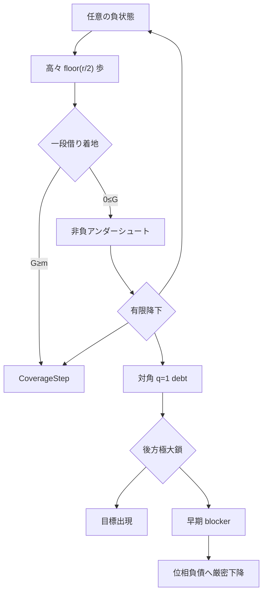

# 証明地図

> [!NOTE]
> 本書は定理依存と到達経路のatlasである。初期sectionには各時点の未証明義務を現在形で
> 保存しているため、現在の研究優先順位には使わない。current frontierは
> [`CURRENT_FRONTIER.md`](CURRENT_FRONTIER.md)、claim statusは
> [`EVIDENCE_REGISTRY.tsv`](EVIDENCE_REGISTRY.tsv)を正本とする。

本書で使う`potential`、`borrow`、`blocker`、`epoch`、`oracle`、`debt`などの意味と、
標準用語／研究固有用語の区別は[用語集](GLOSSARY.md)を参照。
ordinary normal constructorの生成箇所と精密化方針は
[normal provenance監査](NORMAL_PROVENANCE_AUDIT.md)にまとめる。
形式化全体の健全性監査（定義の正しさ・ギャップ地図・空虚性検査・過大主張）は
[健全性監査](SOUNDNESS_AUDIT.md)にまとめる。

## 全体依存関係



上図の`数列・履歴定義`から`refined非crossing domain`までは証明済みである。
ready crossingの局所stepは`TargetTailReturnHypothesis`まで縮約済みである。
この長期再帰命題とrefined oracleへのclocked domain統合以降が未証明である。

## 最小tail正準経路

2026-08-29深夜に、permanent-above tailの最小開始時刻を選ぶ新しい経路を
追加した。この経路ではexact replay固定点が消滅し、最小未出目標から
history progressまたはcertificate付きsemantic edgeへ直接進む。



| 新規領域 | 状態 | 内容 | 主モジュール |
|---|---|---|---|
| 最小tail discharge | 整礎閉包済み | `tailStart = coverage + 1`、exact replay除去、history/semantic二択 | `LeastTailDischarge` |
| canonical history edge | refined mountedまで接続済み | strict budget edge、fresh landing、即時upcrossing、cursor、元parent ready crossingをmounted outcomeへ搭載 | `LeastTailDischarge` |
| 深部認証trace | kernel認証済み | `a 99734 = 19`、`a 181653 = 61`、後者のsuffixから`a 181643 = 76`、clock 181653のmexは879 | `DeepNineteenTraceCertificate`, `DeepSixtyoneTraceCertificate`, `DeepSixtyoneMexCertificate`, `BalancedTraceSuffix`, `DeepSeventysixFromSixtyone` |
| 境界の有限例外消去 | 証明済み | 固定`(target,coverage,low)=(879,181653,61)` high枝、または`target ≥ 880 ∧ low ≥ 879`。固定証明書↔`target=879` | `LeastTailBoundaryElimination` |
| 境界後方力学 | 一段分類済み | 二連続fresh減算、6 narrow cases、先行valley/budget 2 | `LeastTailBoundaryBackward` |
| 後方valley鏖 | 正確なroomまで反復済み | room=`low+coverage-target`。非例外879段版はhigh／narrow／target≥1759。full-depth枝は既存`TerminalHistoryBudgetDrop`へ接続 | `LeastTailBackwardChain`, `LeastTailBoundaryElimination` |

この経路の未証明部分は、history progressと`RefinedSemanticEdge`を共通の
大域降下原理で消費すること、または後方valleyを反復可能に一般化することである。

## 状況一覧

| 領域 | 状態 | 内容 | 主モジュール |
|---|---|---|---|
| 数列定義 | 証明済み | 再帰、履歴、減算可能性 | `Basic`, `History` |
| 座標力学 | 証明済み | 通常・借用・全域遷移 | `Coordinates`, `CoordinateDynamics`, `MultiBorrow` |
| 実軌道上界 | 証明済み | `aₙ≤U(n)`、`2q≤n+1` | `OrbitBounds` |
| 多段借り | 解消済み | 実軌道では`b=0,1`のみ | `OrbitBounds` |
| 目標面 | 証明済み | `G=m`と目標方程式の接続 | `LandingSurfaces`, `PrestateCoverage` |
| 負領域 | 証明済み | 有限時間で一段借り | `Recovery`, `RecoveryBudget` |
| 高商障壁 | 証明済み | 高商失敗をblockerへ変換 | `RecoveryFrontier`, `OneBorrowFrontier` |
| 非負帯 | 証明済み | 負領域復帰・Coverage・レベル下降 | `Undershoot` |
| 大域値帰納 | 証明済み | `CoverageOracle`から全射性 | `Coverage` |
| 履歴探索帰納 | 証明済み | 三成分ランクと抽象オラクル | `HistoryBudget`, `HistoryFrontier` |
| 対角後方履歴 | 証明済み | 極大減算鎖と早期blocker | `Diagonal` |
| 位相探索 | 骨格証明済み | 四成分ランクと抽象オラクル | `PhaseSearch` |
| 負債局所解析 | semantic閉包済み | 同時成長は実在するが、frontier下降またはstrong debt self-exitで閉包 | `DebtInvariant`, `DebtSubtraction`, `DebtAddition`, `DebtStep`, `DebtBackward`, `DebtCrossing`, `AnchorBoundary`, `CrossingRecovery`, `CrossingGap`, `CrossingGrowth`, `CrossingHorizon`, `CrossingIteration`, `CrossingFrontier` |
| 負エポック位相接続 | ランク証明済み | 対角仮定なしで目標出現またはPhaseSearchProgress | `PhaseEpoch` |
| canonical開始 | 局所閉包済み | 全符号とlevel 0/1/2を分類し、強制成長も二段先のCoverageStepへ回収 | `CanonicalOracle`, `CanonicalLevelZero`, `CanonicalLevelOne`, `CanonicalLevelTwo`, `CanonicalComplete`, `CanonicalForcedGrowth`, `CanonicalGrowthRecovery` |
| 意味的探索domain | extended-history局所閉包済み | current normalとhorizon-ready historical normalは全分岐閉包。generic budget gapとearly representativeもcrossing recoveryへ接続 | `NormalProvenance`, `ExtendedHistoryNormal`, `ExtendedHistoryBudgetClosure`, `ExtendedHistoryComplete`, `EarlyRepresentativeComplete`, `DowncrossBudgetGap` |
| Coverage blocker | ready current/debt閉包済み | current親からのCoverageStepは未来初出ならorbit-ready、過去初出ならhorizon-ready strong debtへ送る | `CoverageDebtBridge`, `ReadyDebtInvariant`, `ReadyCurrentDebt` |
| historical回避 | refined閉包済み | parent-dropはfuture current／earlier ready debtへ分解。通常debtはtyped extended-history境界だけを使い、crossing frontierの二時計区間もhorizon-ready extended-historyへ収容 | `HistoricalDebtBridge`, `ReadyDebtRefined`, `CrossingFrontierRefined` |
| refined child | 非crossing閉包済み | orbit-ready normal、ready debt、extended-historyは生成分岐から直接refined stepを返す | `OrbitReadyDirectRefined`, `ReadyDebtRefined`, `ExtendedHistoryDirectRefined` |
| refined oracle境界 | crossingだけ未証明 | constructor監査とcanonical接続を完了し、残余を`CrossingRefinedStepHypothesis`ひとつへ縮約 | `RefinedOracleBoundary` |
| crossing rank境界 | 証明済み | 非crossing successorはstrict budget dropが必須。同一horizonのrefined successorはcrossingに限る | `CrossingRefinedBoundary` |
| crossing future downcross | 条件付き閉包済み | 保存horizon以後のdowncross endpointはfresh below-targetであり、budget下降からextended-historyへ退出 | `CrossingDowncrossRefined` |
| crossing horizon-below | 完全分類済み | 次のupcrossingが進捗するかstable-budget/anchor-growth残余。target 19に残余の実例 | `CrossingBelowRefined` |
| crossing above tail | 長期仮説まで縮約 | no future downcrossはpermanent above tailと同値。tail returnでready crossing局所totality | `CrossingTailRefined` |
| tail returnの強さ | 同値性証明済み | 最小未出目標はeventually strictly above。全targetのtail returnは全射性と同値 | `CrossingTailRefined` |
| permanent tail局所構造 | 証明済み | 高々二遷移のCoverage、zero-budget ready crossing、tail最小値直下のhistorical blockerを抽出 | `PermanentAboveTail` |
| zero-budget crossing境界 | 証明済み | refined子はcrossingに留まり、budget 0を保ってanchorを厳密下降 | `PermanentAboveTail` |
| tail potential監査 | 局所候補棄却 | 二連続forced additionだけではpotentialは増減両方向。実軌道例をkernel検証 | `PermanentAbovePotential` |
| historical tail反復 | 有限化済み | downcrossならbudget下降、なければtail minimum下降。強帰納で必ずfresh historical downcrossへ到達 | `PermanentAboveHistory` |
| historical cycle接続 | 残余まで分類 | anchor dropならrefined crossing子。任意crossing選択ではchild=parentのstationary residualが必ず構成可能 | `PermanentAboveHistory` |
| canonical upcrossing | 存在・一意性証明済み | 最初のfuture weak upcrossingを強帰納で構成。再選択は同時刻なのでearliest規則単独では停留 | `PermanentAboveCanonical` |
| dual history budget | 証明済み | `seenBelowCount = target - missingBelowCount`。過去のpositive-missing点へ戻るとstrict下降 | `PermanentAboveCanonical` |
| permanent-tail cycle rank | 骨格証明済み | anchor／one-way phase／seen budget／minimumの四成分rank。全historical内部stepを閉包 | `PermanentAboveCycleRank` |
| cycle discharge exit | 必要十分条件まで縮約 | dischargeからcrossingへ戻るrank edgeはstrict anchor dropと同値。growth residualは退出不能 | `PermanentAboveCycleRank` |
| typed discharge return | 証明済み | combined obstructionからhistorical downcross、最初のreturn upcrossing、旧crossing provenanceを一証明書へ統合 | `PermanentAboveCycleExit` |
| crossing-time cursor | 骨格証明済み | `(anchor, crossingTime, phase, seen, minimum)`の五成分well-founded rank。同anchorの早いreturnもstrict exit | `PermanentAboveCycleExit` |
| discharge kernel | 三残余まで分類 | 非進捗はstrict anchor growth、旧crossingのendpoint以前、同anchor・同時刻stationaryのみ | `PermanentAboveCycleExit` |
| canonical return rebase | no-goまで証明済み | return crossingを同horizonの親へ型付き再構成可能。tail/minimumを保存するが再生は必ずliteral stationary | `PermanentAboveCycleRebase` |
| canonical below corridor | 局所完全分類済み | fresh endpointからfirst return predecessorまで全値below。内部stepはbudget dropまたはtarget-bounded clock | `PermanentAboveCorridor` |
| all-forced corridor rank | 有限化済み | delayed corridorはinternal subtractionまたはall-forced。後者はreturn<target、加算trace、remaining-clock下降 | `PermanentAboveCorridorRank` |
| corridor suffix cursor | 有限化済み | later below startでも同returnがcanonical。legal endpoint移動はbudgetとreturn-distanceを同時下降 | `PermanentAboveCorridorSuffix` |
| legal return boundary | exact targetで排除済み | below sourceのsubtraction直後のforced upcrossはsource+1。return着地ならtargetを実現 | `PermanentAboveCorridorBoundary` |
| terminal crossing window | 有限算術へ縮約済み | all-forced suffixはendpoint<return<target、strict crossing、trace、gap/overshoot≤returnを保持 | `PermanentAboveCorridorWindow` |
| corridor terminal normalization | 二形へ縮約済み | suffix距離の強帰納でlegal endpoint列を消費。全dischargeはimmediate valleyまたはfinite crossing window | `PermanentAboveCorridorTerminal` |
| terminal crossing balance | 共通算術へ統一済み | 二形ともgap+overshoot=return+1。両差は正かつreturn以下。final fresh endpointも保持 | `PermanentAboveCorridorBalance` |
| terminal forced blocker | 二残余へ分類済み | final subtraction失敗はtarget<2(return+1)の数値帯、またはreturnより前の正のbelow-target履歴値 | `PermanentAboveCorridorBlocker` |
| blocker position | budget枝まで分類済み | historical blockerがfreshより後ならstrict missing-budget drop。fresh以前ならouter history。immediate枝は常に後者 | `PermanentAboveCorridorBlockerPosition` |
| master terminal residual | 四outer residualへ縮約済み | strict budget progressを分離。残るのはimmediate二形、finite clock band、finite outer blocker | `PermanentAboveCorridorResidual` |
| finite return candidates | 有限列挙・rank済み | band membership同値、候補数≤target、later returnでtarget-return下降。非clock residualは三形 | `PermanentAboveCorridorCandidates` |
| outer historical blocker | 数値rank edgeまで接続済み | 初出直前でmissing drop／seen gain。predecessor選択なら既存tail-cycle backtrack下降 | `PermanentAboveCorridorOuterHistory` |
| blocker generation boundary | 生成分類・no-go済み | legalならlarger predecessor、forcedならtarget-bounded。landingはbelowなのでnormal/debtへ直結不能 | `PermanentAboveCorridorBlockerGeneration` |
| blocker predecessor adapter | 三semantic outcomeへ分類済み | aboveでready/negativeならnormal、不成立ならclock/sign残余、belowならfirst provenanceとfuture returnを保持 | `PermanentAboveCorridorPredecessorAdapter` |
| blocker predecessor crossing | refined crossingへ接続済み | predecessorからfirst upcrossを選びreturn以下・parent horizon内を証明。時刻0も閉じ、残余はanchor非下降のみ | `PermanentAboveCorridorPredecessorCrossing` |
| blocker predecessor cursor | 二rank統合・kernel縮約済み | equal-anchor earlier-timeは五成分cursor下降。一般残余はgrowth/chronology、eligibleならgrowth/literal stationary | `PermanentAboveCorridorPredecessorCursor` |
| stationary restart rank | stationaryをstrict化済み | cycle固定のrestart cursorを追加。blocker初出直前へのseen dropがphase resetを上書きし、eligible非進捗はanchor growthのみ | `PermanentAboveCorridorRestartRank` |
| crossing anchor candidates | growthを有限rank化済み | 全anchorはList.range target。strict growthごとにtarget-anchorが下降しwell-founded。反復残務は次parent選択のみ | `PermanentAboveCorridorAnchorCandidates` |
| selected crossing install | semantic反復parentを構成済み | same horizonのtail/zero-budget/minimumを保存し、selected timeをoldCrossingTimeに固定した次dischargeを構成 | `PermanentAboveCorridorSelectedInstall` |
| installed chronology rank | mismatchをhistory下降化済み | selected timeより後のdowncross endpointはfresh below-target初出値。missing budgetがstrict下降しwell-founded | `PermanentAboveCorridorChronologyRank` |
| installed master rank | 反復kernelを一relationへ統合済み | missing budget、anchor gap、crossing time、restart seen、phase、local seen、minimumの七成分。anchor dropはglobal exit | `PermanentAboveCorridorMasterRank` |
| terminal installed step | discharge全枝を統合済み | history progress、finite return、immediate insufficient、normal/above/below-master historical stepのtotal outcome | `PermanentAboveCorridorInstalledStep` |
| above predecessor closure | clock/sign残余を除去済み | readyならorbit-ready total step、earlyならcomplete early representative step。targetまたはsemantic rank下降 | `PermanentAboveCorridorAboveClosure` |
| immediate valley closure | numeric残余をsemantic閉包済み | exact二歩reboundでsource値がpost値より1小さいCoverageStep。targetまたはglobal phase-rank下降 | `PermanentAboveCorridorImmediateClosure` |
| finite return selection | fresh選択を有限rank化済み | remaining candidate listからeraseごとにlength下降。laterならtarget-returnも下降。残余はliteral revisitのみ | `PermanentAboveCorridorReturnSelection` |
| finite window selection | endpoint込みで有限rank化済み | `(returnTime, terminalEndpoint)`を有限列挙し、eraseごとにlength下降。同clock別endpointの偽revisitを除去 | `PermanentAboveCorridorWindowSelection` |
| installed window snapshot | master prefix比較済み | history budget、parent anchor、old crossingを保存。二snapshotをforward／reverse master下降またはprefix一致へ全分類 | `PermanentAboveCorridorWindowSnapshot` |
| installed window selection | full snapshotを有限rank化済み | old crossing<horizonを保存し、固定horizonの`(window, anchor, crossing)`を有限列挙。残余はexact full-key revisit | `PermanentAboveCorridorInstalledWindowSelection` |
| exact revisit history | historical数値provenanceまで有限化済み | parent node一意性、down endpoint差のhistory下降、first<horizon、minimum≤upperTri horizon。残余は拡張key一致 | `PermanentAboveCorridorExactRevisit` |
| canonical tail minimum | start差を有限化・minimum時刻を一意化済み | start/tailStart<horizon。tailStart以後のminimum value相対first occurrenceは元witness以下に存在し一意 | `PermanentAboveCorridorCanonicalMinimum` |
| canonical terminal state step | total outcomeへstate統合済み | semantic/history枝を保持し、finite枝をfresh erase-length下降またはexact canonical revisitへ直接分類 | `PermanentAboveCorridorCanonicalStateStep` |
| exact replay boundary | list-only no-go・条件付き閉包済み | key全除去後も同certificateがexact revisitを構成。残務をtarget/history/phase/master resolver一命題へ限定 | `PermanentAboveCorridorReplayBoundary` |
| finite window closure | finite numeric枝を完全排除済み | last predecessor≤1からendpoint=1, return=2, target=4/5。`a₁₃₁=4`, `a₁₂₉=5`でmissing仮定に矛盾 | `PermanentAboveCorridorFiniteClosure` |
| terminal progress flattening | 四progress形へ完全統合済み | target occurrence、strict history、local-parent semantic phase、installed master。terminal residualなし | `PermanentAboveCorridorTerminalProgress` |
| terminal successor provenance | master反復sourceを接続済み | installed master枝にselected crossing、semantic install、child parent上のnext discharge `Nonempty`を同梱 | `PermanentAboveCorridorTerminalSuccessor` |
| discharge iteration rank | successor反復を三成分rankへ縮約済み | 共有horizon budget・anchor gap・old crossing cursorのlex。successorはstrict下降またはexact replay固定点 | `PermanentAboveCorridorSuccessorRank` |
| successor iteration closure | 反復constructorを整礎帰納で消去済み | 有限回のinstalled successor後、target・strict edge・descendant上のexact replayのみ残る | `PermanentAboveCorridorIterationClosure` |
| exact replay pinning | 固定点をnode-level cycleへ固定済み | replayではreturn=old crossing=selected crossing。installed node=parentで、successorは同parent同cursorへのself-map | `PermanentAboveCorridorReplayPinning` |
| replay corridor band | 固定点cursorをtarget未満帯へ有限化済み | clock+1<値<targetから全cursor<target。endpoint→crossingは全below corridor。kernel計算でclock≥3、target≥5 | `PermanentAboveCorridorReplayCorridor` |
| replay kernel floor | clock/targetを両側から挟撃済み | 実軌道step検証でclock 3,4,5を排除しclock≥6・target≥8。上側はtarget≤upperTri(clock+1) | `PermanentAboveCorridorReplayFloor` |
| missing-target interface | 三形interfaceへ確定済み | 反例内ではtarget枝が矛盾。permanent tailの全情報はhistory edge・semantic child・replay固定点。replay cursorはsourceで一意 | `PermanentAboveCorridorReplayInterface` |
| history landing anchor | history枝をfresh landing＋restart crossingへ強化済み | missing-drop不等式単独からbelow-target初出landingを逆算し、canonical first upcrossingを同梱 | `PermanentAboveCorridorHistoryLanding` |
| landing horizon bound | landingをparent history内へ束縛済み | below coverageと初出最小性からlanding<start、restart crossing+1≤start<horizon。installed node形状に適合 | `PermanentAboveCorridorLandingHorizon` |
| landing crossing mount | history枝をsemantic node搭載へ完了済み | in-horizon first upcrossingからready crossing nodeを構成。全interface枝がsemantic domainの実objectを渡す | `PermanentAboveCorridorLandingMount` |
| landing install | mounted nodeを新combined parentへ昇格済み | combined certificateが同horizonのmounted crossingへ全field transport。terminal解析はそこから再入可能。anchor二分法も同型 | `PermanentAboveCorridorLandingInstall` |
| mounted iteration closure | landing再入反復を整礎閉包済み | anchor drop→semantic、growth→gap強帰納で消去、equal→node不動。残余はsemantic・discharge replay・landing固定点の三形 | `PermanentAboveCorridorMountedIteration` |
| unified fixed point core | 二固定点を共通核へ統合済み | anchor同値・target跨ぎforced・node再生産の共通core。最終定理はsemanticまたはprovenance付き固定点の二形 | `PermanentAboveCorridorFixedPointCore` |
| unified core floor | blocker不要のkernel floorを統一済み | core+missingだけからclock≤5を全排除しclock≥6。上側はtarget≤upperTri(clock+1)。両固定点に適用 | `PermanentAboveCorridorFixedPointFloor` |
| replay kernel floor II | clock 6..17を条件付き排除済み | 深い欠損値19（初出t=99734）だけがclock 6/8で生存。18≤clock∨target=19、無条件でtarget≥19。次の壁は61（t=181653） | `PermanentAboveCorridorReplayFloorTwo` |
| fixed point shape | core形状APIを整備済み | parentはready-crossing形状に一意決定。同parent上の全coreは同値crossing、異clockなら同値再帰かつendpoint相違 | `PermanentAboveCorridorFixedPointShape` |
| fixed point corridor | 両固定点のbelow corridorを統一済み | first upcrossing一般all-below補題。landing固定点もlandingから再生産crossingまで全値target未満 | `PermanentAboveCorridorFixedPointCorridor` |
| core kernel floor II | 統合coreの床も18へ拡張済み | blocker不要の帯排除だけでclock 6..17を処理。例外はやはり19のみ。無条件でtarget≥19が両固定点に成立 | `PermanentAboveCorridorFixedPointFloorTwo` |
| least-missing summit | 最小未出目標へ全解析を接続済み | LeastMissingTargetからsemantic childまたは床付き固定点core。系として「semantic progressか19≤target」 | `PermanentAboveCorridorLeastMissingSummit` |
| nineteen boundary | 最初の未検証instanceを一値へ確定済み | 19未満は全出現がkernel検証済みなので`LeastMissingTarget 19 ↔ 19未出`。19出現なら固定点枝はtarget≥20 | `PermanentAboveCorridorNineteenBoundary` |
| orbit comb run | 圧縮検証の基盤閉形式を証明済み | 交互区間のlow rail（1周期-1）・high rail閉形式。CombStep/CombRunはdecidableで区間一括検証可能 | `OrbitComb` |
| comb witness構成 | stepのwitness化を完了済み | blocked理由・正値・freshnessの三条件からCombStepを構成。大域なのはfreshness一条件のみ | `OrbitCombWitness` |
| replay kernel floor III | 床をclock 32へ拡張済み | 例外リストは{19, 61}で閉じ`target=19∨target=61∨34≤target`。次の壁は76（t=181643） | `PermanentAboveCorridorReplayFloorThree` |
| comb value representation | run値集合の表現とfreshness輸送を証明済み | exit時のmembership＝事前履歴∨二rail。最終low rail未満のfresh値はrun全体でfreshのまま | `OrbitCombValues` |
| target-relative comb charging | interval構造まで証明済み | low isolation、terminal blocker単射、任意二combのfresh整数区間が値軸上で完全に順序づく | `TargetCandidateTransitions` |
| target high excursion | 第2gateを証明・限界確定 | signed step則、全prefixのstrict ledger corridor、legal-subtraction出口、sharp window。endpoint総和は既存ledgerの再表現 | `TargetHighCandidateExcursion` |
| target comb macro provenance | reset枝を二生成形へ縮約済み | 次intervalは旧blockerの下または新blockerが上。減算起源はentry超predecessor、加算起源は既存`EarlierSmaller`へ直結 | `TargetCombMacro` |
| nineteen replay identification | target 19のreplayを完全数値特定済み | blocker境界からclock≤16、消去でclock∈{6,8}。各々anchor/blocker/初出時刻まで一意（13/6/3と12/3/2） | `PermanentAboveCorridorNineteenReplay` |
| nineteen replay uniqueness | 19-replayを唯一cycleへ確定済み | downcross条件がclock 6を排除。clock=8・downTime=7・即時return・anchor 12・blocker 3/初出2の一意cycle | `PermanentAboveCorridorNineteenUnique` |
| nineteen minimum pins | 19-反例のtail最小値も21へ固定済み | minimum predecessorの初出≤7で19超は`a 7=20`のみ。初出=7・tail最小値=21。残る自由はtail時刻のみ | `PermanentAboveCorridorNineteenMinimum` |
| nineteen tail bounds | 19-反例のtail開始を131より後へ押し込み済み | `a 131 = 4`とstrictly_aboveの矛盾からtailStart>131、start>131、horizon>132。歴史はclock≤9、tailはkernel prefixの外 | `PermanentAboveCorridorNineteenTail` |
| nineteen revisit forcing | 19-反例が将来イベントを強制済み | tail最小値21はtailStart>131以後に達成される。19未出⟹21がt>131で再訪。検証済みprefixでは21はt=9の一度きり | `PermanentAboveCorridorNineteenRevisit` |
| nineteen elimination | **19-replayを完全排除済み** | 既出値は自分より大きい時刻で再訪不可（減算はfreshness、加算はovershoot）。21再訪の強制と矛盾。無条件18≤clock・target≥20 | `PermanentAboveCorridorNineteenElimination` |
| sixtyone elimination | **61-replayも完全排除済み** | tailStart>222。predecessor候補59分岐を帯値42件・非初出2件・再訪不可15件へ全消去。無条件32≤clock・target≥34 | `PermanentAboveCorridorSixtyoneElimination` |
| minimum predecessor shape | 排除機構を一般テンプレート化済み | 順序境界下でsub→add follow-upは常に矛盾。生存replayのpredecessor直後は即add or 二連subに制限 | `PermanentAboveCorridorMinimumShape` |
| predecessor follow-up witness | 二分法をwitness付きへ強化済み | predecessor値はclock超なので即addは必ず既出witness、二連subは初手がfresh landing。次エポックの攻撃点を明示 | `PermanentAboveCorridorMinimumFollowUp` |
| crossing record exclusion | replay crossingのrecord性を排除済み | downcross値がcrossing値を厳密に支配。record更新型のforced addition clockは帯検証なしで一括排除可能 | `PermanentAboveCorridorCrossingRecord` |
| replay kernel floor IV | 三種道具でdischarge replay枝の床をclock 112へ拡張済み | record排除・downcross前置界・再訪排除の反復で32..111を全消去。discharge replay枝について無条件112≤clock・114≤target（landing枝は据え置き）。次の壁は371（初出t=4825） | `PermanentAboveCorridorReplayFloorFour` |
| prefix successor coverage | clock列挙を一括coverage条件へ抽象化済み | later low witness以前に全larger-prefix successorが既出ならreplayは矛盾。clock 112は唯一の例外371へpinされ、first=108・downcross=109・target∈[153,261] | `PermanentAboveCorridorPrefixSuccessorCoverage`, `ReplayWitnessDescent`, `SemanticOracleRecursion`, `LandingRevisitTransport`, `ReplayDoubleSubtractDescent`, `RefinedSemanticOutcome`, `PreTailBudgetSeparation`, `RefinedSuccessorRank`, `RefinedIterationClosure`, `RefinedLandingOutcome`, `CrossingReadinessBridge`, `CrossingReadinessClosure`, `TrivialityProbe`, `PinnedConfigurationAttack`, `LandingFloorThirtytwo`, `RefinedReplayInterface`, `RefinedHistoryLanding`, `RefinedLandingHorizon`, `RefinedLandingMount`, `RefinedMountedIteration`, `RefinedFixedPointCore`, `PinnedForwardOrbit` |
| witness descent (blocked枝) | 一段で停止するno-goを確定済み | blocked枝は`(値, 初出)`のearlier-smaller辺をclock非依存に供給するが、`clock < 値`とblocked性がwitnessへ輸送されず整礎性が発火しない。残余義務を`regenerate`の二条件として明示し、それを仮定した一括排除定理へ縮約。副産物としてblocked枝で`target + 2 < a m` | `ReplayWitnessDescent` |
| semantic枝の情報量 | **無情報であることを確定済み（重大な構造的発見）** | 頂点定理のsemantic disjunctは`0 < target`から導出可能。`stepParent`が存在量化のみでlex順の親を捏造できるため。固定点解析側は無傷で、失われているのは枝のpayload | `SemanticOracleRecursion` |
| semantic枝の精密化 | **捏造不能な精密版を構成済み** | `PermanentTailRefinedSuccessorOutcome`。子は`OrbitReadyRefinedInvariant`所属、親は証明書のclockから決まる名前付きノードに固定。discharge証明書の四つのsemantic生成枝すべてで構成完了 | `RefinedSemanticOutcome` |
| 非捏造性の証明 | 三本の定理で形式化済み | anchor bumpはrefined domainを外れる（normal相で`anchorParent = localMeasure`が必要）／「どの親にも子がある」はzero-budget親で偽／crossing枝のanchor下降は実軌道のstrict crossing証明書を要する | `RefinedSemanticOutcome` |
| 精密版の伝播 | discharge段まで。残り10段は機械的 | 頂点までの10モジュールは9段が純粋な再包装、`MountedIteration`のみ新規生成だが`crossing_refined`で構成可能。新しい数学は不要 | 次エポック |
| 精密版の伝播（完了） | **全8段完了。頂点定理を差し替え済み** | `LeastMissingTarget.refinedSemanticEdge_or_flooredCore`。左枝はpermanent-tail証明書を保持する`RefinedSemanticEdge`、右枝は`32 ≤ clock ∧ 19 ≤ target`。写経が要ったのは段5のhorizon評価と段7の強帰納だけ | `RefinedFixedPointCore` |
| 新semantic枝の非自明性 | **捏造不能を証明済み** | `RefinedSemanticEdge.target_missing`：両コンストラクタがpermanent-tail証明書を保持するので`¬ ∃ t, a t = target`を単独で含む。`target = 1`で反証でき`0 < target`からは出ない | `RefinedFixedPointCore` |
| 忘却形の捏造可能性 | **捏造可能と確定済み** | `RefinedDomainEdge`はcanonical start自身がrefined nodeなので`0 < target`から作れる（`occurs_or_refinedDomainEdge_of_pos`）。伝播ペイロードは生成証明書を保持する形へ設計変更 | `RefinedSuccessorRank` |
| 頂点への実チェーン | 8段と確定済み | `terminalProgressOutcome`と`terminalSuccessorOutcome`は`Audit.lean`からしか参照されない袋小路。実チェーンはSuccessorRank→IterationClosure→ReplayInterface→HistoryLanding→LandingHorizon→LandingMount→MountedIteration→FixedPointCore | `RefinedIterationClosure` |
| landing前置界の所在 | 一次消失点を特定済み | 必要な最小情報は`downTime < parentTime`（`predecessorFirstTime`ではない）。`InstalledStep.lean`の`history_progress`で消える。3生成箇所すべてで供給可能 | `RefinedLandingOutcome` |
| prefix最大値バンド消去 | 新しい無条件カーネル道具 | 共有核レベルで`32 ≤ clock ∨ (clock=6 ∧ target=19) ∨ (clock=18 ∧ target=61) ∨ prefix above`。深部残留値19・61が時刻込みでピン留めされる | `RefinedLandingOutcome` |
| unready crossingの実在性 | **型としては実在／生成箇所はゼロ**と確定済み | target 12・node`⟨7, 7, .normal, 7⟩`が具体反例（`a 5 = 7 < 12 < 13 = a 6`）。よって残余は「非存在」ではなく「到達不能性」で閉じる。生成7箇所の全数調査で子は常にready | `CrossingReadinessBridge` |
| readiness橋 | ready crossing → ready refined childまで完成 | 生成箇所1〜5をready版で再証明。残るは`OrbitReadyDirectRefined`の結論を`RefinedNonCrossingInvariant`へ差し替える機械的修正のみ | `CrossingReadinessBridge` |
| tail return仮説の効力 | 単独targetでoccurrenceを生むようになった | `occurs_of_targetTailReturn`。従来は「認めても主残余が閉じない」とされていた。価格も明示（`readyCrossingReadyStep_iff_occurs`・`not_readyStep_pair`） | `CrossingReadinessBridge` |
| 忘却形の自明性（強形） | **`0 < target`から直接導出可能**と確定済み | `probe_refinedDomainEdge_of_pos`。実軌道の二状態を共通horizonへ載せるだけで作れる。`LeastMissingTarget`すら不要。`historyEdge_or_refinedEdge_or_installedEdge`は空文であり、`stuckCrossing_of_refinedEdge`の仮定は死んでいる | `TrivialityProbe` |
| debt相のanchor bump | **捏造が通る**（新しい手口） | `DebtInvariant.value_lt_anchor`はanchorを上げても保たれるので、debt相ではbumpがrefined domain内に留まる。非捏造性の防御はnormal相限定 | `TrivialityProbe` |
| `regenerate`仮定の空虚性 | **仮定は偽。定理は空虚に真** | `BlockedFirstOccurrence 13 6`が実軌道に存在（`a 6 = 13`が初出、欠損6は既出）。「残余義務を型で固定」という位置づけは成立しない | `TrivialityProbe` |
| history枝の情報量 | 定義強化により内容を持つようになった | 旧定義（単なるbudget drop）では`(1, 0)`で自由だったが、landing前置界作業が`TerminalHistoryCursor target (parentTime + 1)`を連言に加えたため閉じた。新定義は`parentTime + 1`未満にtarget超の軌道値を要求する | `PermanentAboveCorridorChronologyRank` |
| 頂点定理の床 | **無条件`32 ≤ clock`へ引き上げ済み** | landing枝は`TerminalHistoryCursor`で輸送した前置界により、replay枝は自前のkernel掃過により満たす。従来の`18 ≤ clock ∨ target = 19`から改善。semantic枝が空である事実は不変 | `LandingFloorThirtytwo` |
| 大域残余 | 仮定一本へ純化済み（ただし全射性と同値） | `0 < target ∧ TargetTailReturnHypothesis target ⟹ 出現`。refined再帰・horizon clock・crossing-recovery構成子は解消。ただし同仮定は出現と同値なので難しさは移動しただけ | `CrossingReadinessClosure` |
| pinned配置の列挙可能性 | **kernel列挙では落ちないと確定** | `target = a f - 1`より配置は`f`だけで決まる。四つの列挙可能条件を満たす候補は`f < 3×10⁶`で2438個と累積が増え続ける。各候補は出現witness一つで落ちるがwitness時刻に一様上界がない（実測で`first[target] - f`が3×10⁵超）。配置自体の居住性は予想と同じ深さで開いている | `PinnedConfigurationAttack` |
| pinned後方4パターン | **混合形2つを排除、89.4%を除去済み** | `(加算,減算)`189件は`a (f-2) = target`が強制され欠損と矛盾。`(減算,加算)`88件は鳩の巣の精密化で自滅。残るは`(減算,減算)`12件相当と`(加算,加算)`21件相当 | `PinnedBackwardStep`, `PinnedMiddleRow`, `PinnedRemainingRows`, `SubtractionLedger` |
| 減算台帳 | **厳密恒等式を形式化済み（同値の輪の外からの最初の注入）** | `a t + 2·subSum t = upperTri t`。パリティ（出現時刻のmod 4制限）・後方伝播・供給側カウンタの三帰結。パリティは第3行の窓を実際に1段締めた | `SubtractionLedger` |
| 最小tail ledger checkpoint | **低商・ledger corridor・canonical low座標を証明済み** | least missing targetの最小tail minimumで`q≤1`, `G≥-1`, `q=0 ∨ (q=1 ∧ r<target)`。一般positive earlier occurrenceには3-clock gapとsharp単一job`C=3` payment | `LeastTailLedgerMinimum`, `LeastTailLedgerProvenance` |
| 計数の上界側での初仕事 | `coveredBelowCount_two_above` | 値が`k`以上の時刻は1レベルも埋めないので、pre-tailに遊休時刻が2つあれば必要時刻数が2増える。それまで計数は`tailStart`の下界しか生まなかった | `PinnedMiddleRow` |
| tail最小値の初出 | 残り1点へ縮約済み | 遷移は「減算（fresh初出）」か「強制加算かつ`m = tailStart`」の無条件二分法。後者は`a (m-1) ≠ 1`で死ぬ。残る穴は`m + 1 < a m`のみで、pinned配置内では`target < tailStart`により閉じる | `PinnedConfigurationAttack` |
| semantic枝の消費者の値段 | 原理的下界を確定済み | semantic枝の閉包はtarget出現と同値。constructor局所の補題では閉じず、大域矛盾の一部でなければならない | `SemanticOracleRecursion` |
| refined domain昇格 | horizon readiness仮定つきで4 constructor完全 | canonical start／normal／debt／crossing recoveryの全枝を`OrbitReadyRefinedInvariant`へ昇格。readiness仮定は具体反例により除去不能 | `SemanticOracleRecursion` |
| 大域残余の三分解 | 残余を3命題へ縮約済み | semantic枝の型強化／`ReadyCrossingRefinedStepHypothesis`／unready crossing漏れ。第2はtail return仮説から従うが最小未出目標下では反証される | `SemanticOracleRecursion` |
| landing側の再訪排除 | **crossing clock非依存で移植済み** | `PermanentTailCombinedCertificate.minimum_revisit_absurd`はcrossing clockを一切参照せず、combined証明書だけから既出値の遅い再訪を禁じる。三種道具の第3はlanding側で完全に使える（ただしcutoff・witness時刻・witness値・successor一致の4条件は依然必要） | `LandingRevisitTransport` |
| landing側のrecord排除 | 条件付きで成立 | 共有核レベルの汎用形は無条件。landing分岐では`predecessorFirstTime < landingTime`のとき発火する | `LandingRevisitTransport` |
| landing側のdowncross前置界 | **存在しないことを確定済み** | `[landingTime, crossingTime]`は全区間target未満（`window_below`）なので、target超のpredecessor初出は窓の外の二択（landing前 or crossing後）にしか居られない。landing分岐はその二択を決める情報を持たない | `LandingRevisitTransport` |
| landing床（前置界を仮定） | 例外なし`32 ≤ clock`へ | 前置界を仮定すればcoverageエンジンがそのまま発火。統合outcomeは「semantic ∨ 32≤clock付きcore ∨ landing gap」の三択へ精密化 | `LandingRevisitTransport` |
| 二連減算枝の構造 | 完全に構造化済み | `f`・`f+1`・`f+2`は相異なるfresh初出で全てtail開始前。`a (f+2) + (2f+4) = a m`の厳密等式。実現値は`a m - 2`を`f`と`2f+2`だけ下回るのでblocked枝の分離は輸送されない | `ReplayDoubleSubtractDescent` |
| 二連減算枝の排除 | **原理的に不可能と確定** | 証明書が軌道に下界を課すのはtail開始以降のみ。この枝が語る時刻は全てtail開始前なので、pre-tail領域への下界を持つ新フィールドなしには矛盾が引けない | `ReplayDoubleSubtractDescent` |
| pre-tail計数枠組み | 新規インフラ`coveredBelowCount`を構成済み | `missingBelowCount`の厳密な補数。鳩の巣`coveredBelowCount k n ≤ n + 1`をMathlibなしで証明 | `PreTailBudgetSeparation` |
| pre-tail下界 | **無条件`target < tailStart`** | target未満の全値がtailStart前に埋まる必要があるので鳩の巣で従う。kernel計算ゼロ・条件なし。既存のtailStart下界（`222 <`等）はすべて`a 222 = 47`型の条件付きkernel計算だった | `PreTailBudgetSeparation` |
| `target + 2 < a m`の残余 | 単一配置へ釘付け済み | 破れるのは`a m = target + 2`・`a f = target + 1`・二連減算強制・`a(f+1) = target - f`・`a(f+2) = target - 2f - 2`・`2f + 2 < target`・`target < tailStart`の一配置のみ | `PreTailBudgetSeparation` |
| clock-target分離の強化 | discharge replay枝で2段強化済み | corridorデータ（downcross前置界→eligible→time_eq）経由で`f + 2 < target`、したがって`f + 3 < a f`・`f + 4 < a m` | `ReplayDoubleSubtractDescent` |
| 非負normal | 通常域閉包済み | `3≤potential<target`をsemantic rankへ接続し、残余をlevel 0/1/2に限定 | `NonnegativeSemantic` |
| 全域局所被覆 | 未証明 | provenance付きreachable normal domain上の機構適用 | 将来エポック |
| 全射性 | 未証明 | `∀m, ∃t, a t=m` | 最終目標 |

## 証明済みの縮約



## 現在の一点

canonical開始点からの最初の局所stepは全分岐で閉じた。level 1/2の強制加算直後は
値とanchorが増え、履歴予算も不変なので即時の`PhaseSearchProgress`にはならない。
しかし、もう一段先の候補が元のcanonical値より厳密に小さいため、合法減算ならfresh、
blockなら既出値として、どちらも`CoverageStep`へ変換できる。

残る境界はordinary normal constructorの強さである。現行`NormalSearchInvariant`は概念的に
次だけを保持する。

```text
history horizon
FirstAt a value firstTime
firstTime ≤ horizon
target ≤ value ≤ anchor
```

この証明書では`value = a horizon`も`target ≤ horizon+1`も従わない。実際、過去の初出値と
後のhorizonを組み合わせた反例を`NormalSemanticBoundary`で証明した。したがって、任意の
weak normal nodeに座標を選んで局所epoch定理を適用することはできない。

次のdomainには少なくとも以下をproof-carrying dataとして保持させる必要がある。

```text
node = ⟨time, anchor, normal, a time⟩
target ≤ time+1
target ≤ a time ≤ anchor
CoordinatesAt time q r
または、parent-drop／coverageから生成されたことを示すprovenance
```

`OrbitReadyNormalCertificate`は前者を実装し、負potentialの場合のsemantic stepまで接続済みである。
さらに`OrbitReadyNormalInvariant.phaseSemanticStep`は、負、高potential、非負undershoot、
level 0/1/2をすべて閉じ、current-state normalの局所totalityを与える。

`ProvenancedNormalInvariant`はcurrent nodeとrank edge付きhistorical nodeを分離する基礎APIを
与える。`TypedHistoricalNormalProvenance`はparent-drop、coverage anchor、downcross restart、
debt exit、crossing frontierの5種類を実装した。またcurrent親のCoverageStepは、candidateの
初出時刻で分けるとfuture currentまたはstrong debtへ送れるため、generic historical normalを
回避できる。

extended-history stepの当初の残余は次の二つであり、それぞれ独立な実例がある。

```text
representativeTime + 1 < target
missingBelowCount target historyHorizon
  < missingBelowCount target representativeTime
```

両方とも既存rankのまま閉じた。early representativeでは次遷移または既出の減算候補から
below-target実出現を得る。budget gapでは、countのstrict dropそのものから代表時刻では未出で
後のhorizonまでに出現したbelow-target値を抽出する。いずれもそこからfuture upcrossingを取り、
history horizonを拡張した`crossing_recovery` childへ移る。pre-crossing値はtarget未満なので、
旧representative anchorより厳密に小さく、四成分rankのanchorが下降する。

refined child domainは次を保持する。

```text
OrbitReady current
ReadyDebtInvariant
ExtendedHistoryNormalInvariant
CrossingSearchInvariant
```

orbit-ready normal、ready debt、extended-history normalについては、broad
`PhaseSemanticInvariant`を経由せず生成分岐から直接refined resultを構成した。crossing frontierの
二時計middle区間もready debt sourceのhorizon readinessを継承するextended-history childへ入る。
したがってconstructor監査で残るのは`CrossingSearchInvariant`自身だけである。

このcrossing証明書はpredecessor、forced addition、strict crossing、post-state coordinatesを持つが、
元のstrong debtにあったpost値の`FirstAt`、post値が旧anchor未満であること、target-ready horizonを
保持しない。既存debt-crossing closureを再利用する前に、このprovenance消失を修復する必要がある。

さらに`CrossingRefinedBoundary`は、crossing nodeのanchorがtarget未満、非crossing refined nodeの
anchorがtarget以上であることから、両者のrank edgeが必ずstrict history-budget dropを伴うと証明する。
同じhorizonのrefined successorはcrossingに留まる。このためsource provenanceの追加だけでは足りず、
新しいbelow-target履歴またはcrossing-to-crossingの下降を実際に構成する必要がある。

`ReadyCrossingSearchInvariant.refinedStep_of_futureDowncross`は、このうち保存horizon以後にdowncrossが
存在する枝を閉じる。downcross endpointはlegal subtractionによりfreshで、元crossingのpost-stateを
representativeとするextended-history childへstrict budget edgeで移れる。

horizonがbelow-targetである場合、次のweak upcrossingは必ず存在する。
`refinedStep_or_continuationGrowth_of_horizonBelow`は、それがbudgetまたはanchorを下げる枝と、
どちらも下げない`CrossingContinuationGrowthResidual`を完全に分ける。後者は
target 19、horizon 31、anchor 13→14の実軌道で実在する。ただしそのchild horizonは必ず
at-or-above targetで、その後のdowncrossは元の親に対するstrict budget edgeを作る。

`no_futureDowncross_iff_tail_atOrAbove`により、最後に残る枝は「以後ずっとtarget以上」
という真の長期軌道命題である。`refinedStep_of_tailDowncross`は、このtail returnを仮定すれば
ready crossingの両枝が共に閉じることを証明する。
ただしこの長期命題は局所的な残余ではない。最小未出目標を仮定すると、それ未満の値はすべて
ある有限history horizonで既出になるためfuture downcrossが不可能となり、軌道はeventually strictly above
targetになる。`all_targetTailReturn_iff_surjective`は、全targetのtail returnが元の全射性と同値であることを証明する。

`PermanentAboveTail`は、この同値性を仮定として使わず、仮想的な最小未出targetが強制する
tail内部をさらに解析する。tailの任意の状態は、合法減算なら直ちに、強制加算なら次の候補
`a n - 1`のfresh／既出分岐により、高々二遷移で`CoverageStep`を与える。tail最小値では
両遷移が強制加算となり、`a n - 1`はtail開始前に初出したhistorical blockerである。

同時に、below-target値はすべて既出なので`missingBelowCount=0`である。仮想反例からは実際に
tail内部のready crossingを構成でき、その将来downcrossは存在しない。zero-budget crossingから
非crossing refined子へは進めず、refined子があればbudget 0のcrossingに留まってpre-crossing
anchorを厳密に下げる。したがって次の未証明接続は、tail最小値が返すhistorical blockerを
このcrossing anchor下降へ変換する一歩である。

`PermanentAbovePotential`は、最小値で現れる二連続forced additionの座標候補を監査する。
実軌道の`2→7→13`ではpotentialが`2→-2`へ下がり、重なる`7→13→20`では`1→3`へ上がる。
よって二連続forced additionだけを根拠とするpotential単独ランクは使えず、履歴証明書との結合が必要である。

`PermanentAboveHistory`は、この履歴証明書を反復可能にした。直下値の初出時刻以後にdowncrossが
あれば、そのendpointはfreshで`missingBelowCount`を厳密に下げる。downcrossがなければ初出時刻から
新しいstrict-above tailを作れ、その最小値は旧最小値より厳密に小さい。自然数最小値に対する
強帰納により、後者だけを無限反復することはできず、必ず有限回でhistorical downcrossへ到達する。

そのdowncross後のupcrossingをcombined zero-budget crossingと同じhorizonへ置くと、anchor dropなら
正当なrefined crossing子になる。しかし親crossingをそのupcrossing自身として選べばchild=parentとなり、
同budget・同anchorで進捗しない`HistoricalCycleGrowthResidual`を必ず構成できる。
したがって任意のcrossing証明書を許す現行domainではhistorical cycle一回の再生はrankにならない。
次の未証明点は、earliest/latest/minimum-anchorなどのcanonical crossing provenance、または複数cycleを
同時に測る新しいwell-founded量でこの停留選択を排除することである。

`PermanentAboveCanonical`は最初のfuture weak upcrossingを、既知witness時刻を上界とする強帰納で
canonicalに構成し一意性を示す。しかし同じdowncross endpointから再選択すれば一意性により同時刻へ
戻るため、earliest規則だけではstationary residualを解消しない。同モジュールは
`seenBelowCount = target - missingBelowCount`を導入し、zero-budget tail horizonからpositive-missingな
historical first occurrenceへ戻る向きで厳密下降するdual budgetを証明する。

`PermanentAboveCycleRank`はこのdual budgetを統合する。rankは
`(anchor, phase, seenBelowCount, tailMinimum)`の辞書式順序で、phaseは
`crossing > backtrack > discharge`の一方向である。combined obstructionは同anchorのbacktrackへ入り、
renewed tailはseen/minimumを下げ、historical downcrossはdischargeへ入る。すべてstrict stepであり、
rankはwell-foundedである。dischargeからcrossingへ戻るstepはstrict anchor dropと同値なので、
stationary cycleは進捗として排除される。ただしanchor非減少のgrowth residualはexit obstructionとして残る。

`PermanentAboveCycleExit`はhistorical downcrossから最初のreturn upcrossingまでの全時刻・値provenanceを
`PermanentTailDischargeReturnCertificate`へまとめる。外側cursorを`(anchor, crossingTime)`へ精密化した
五成分cycle rankもwell-foundedである。これにより同anchorでもreturn時刻が早ければcycleを退出できる。
完全分類`cycleExit_or_kernelResidual`の非進捗側は、strict anchor growth、旧crossingがdowncross endpointより
前にあるchronology mismatch、anchorと時刻がともに同一のliteral stationaryの三constructorだけである。
同じendpointですでにcanonicalな旧crossingを再選択すると、最後のconstructorが実際に生じる。

`PermanentAboveCycleRebase`は、return crossing自体を次のzero-budget parentにする自然な修正を監査する。
旧horizon上でready crossingを再構成でき、同じpermanent tailとminimum certificateを持つcombined obstructionに
戻せる。しかし同じhistorical downcrossを再生したdischarge certificateでは、returnが旧crossingそのものであり、
anchor・時刻とも等しい`stationary` kernelになる。従ってcanonical rebaseは三残余を一つのstationary coreへ
正規化するが、progressを作らない。次のrankにはendpoint再訪の禁止または別のhistorical choiceが必要である。

`PermanentAboveCorridor`はstationary core内部の有限区間を抽出する。first weak upcrossingの最小性から、
fresh downcross endpointとreturn predecessorの間にある全状態がtarget未満である。returnが即時なら、downcrossの
合法減算と次のforced additionは`a (d+2) = a d + 1`という谷形を作る。遅延returnでは任意の内部transitionを
分類でき、legal subtractionはfirst occurrenceを作ってhistory budgetを厳密下降させる。forced additionは
次状態もbelowなので`time+1 < target`を強制する。従ってbudgetを下げない内部区間は有限なtarget-bounded clockに限られる。

`PermanentAboveCorridorRank`はbudget下降がない補集合を`AllForcedAdditionCorridor`として型付けする。
遅延runの最後の内部stepへclock boundを適用すると`returnTime < target`となり、gapもtarget-relativeに有限である。
値は`forcedClockSum`によるtelescoping式を満たし、run内で厳密増加する。`target - time`を使う
`CorridorClockProgress`はwell-foundedで全forward stepを受け入れる。任意の遅延corridorはinternal legal subtraction
とall-forced有限runへ完全分類される。ただしこのrankはreturn到達までを測るだけで、rebased stationary crossingへの
復帰を下降にはしない。

`PermanentAboveCorridorSuffix`はreturn crossingを固定したsuffixを導入する。first weak upcrossingは区間内の
later below startへ制限しても同時刻のままcanonicalである。内部legal subtractionのfresh endpointを新suffixに
すると、`missingBelowCount`と`returnTime - endpointTime`がともに厳密下降する。後者のcursorはwell-foundedで、
suffixはendpoint=return、later legal endpoint、all-forced target-bounded suffixへ完全分類される。
従って同じreturnに属するlegal endpointの消費は有限だが、return crossing自体は変わらない。

`PermanentAboveCorridorBoundary`はlegal endpoint列の終端を精密化する。below-target sourceでのlegal subtractionと
直後のforced additionは既存の二歩式によりsource値`+1`へ着地する。これがweak upcrossならendpointはtarget以上、
sourceはtarget未満なのでexact targetになる。従ってmissing-target provenanceの下ではlegal subtraction endpointが
return predecessorと一致できず、全legal childはreturnより厳密に前にある。後続legal endpointがなければ、残りは
all-forced suffixに限られる。

`PermanentAboveCorridorWindow`はterminal all-forced suffixを有限算術証明書へ変換する。final forced upcrossまで
`forcedClockSum` traceを延長し、target missingから`a return < target < a (return+1)`を得る。
nonempty suffixでは`return < target`であり、crossing前の`target - a return`とcrossing後の
`a (return+1) - target`はともにreturn clock以下で正である。従ってpost-legal terminal residualは
有限な`TerminalAllForcedCrossingWindow`へ縮約される。

`PermanentAboveCorridorTerminal`はsuffix cursorに対する強帰納を実行する。legal endpointがあればmissing-target
boundaryによりreturnより厳密に前のchildへ移り、cursorを下げる。なければall-forcedで停止する。
従って任意のdelayed historical corridorは有限回でterminal crossing windowへ到達し、全dischargeは型付きで
`ImmediateHistoricalValleyCertificate`または`TerminalAllForcedCrossingWindow`の二形へ正規化される。

`PermanentAboveCorridorBalance`は両terminal shapeに共通するstrict crossing算術を抽出する。forced final stepにより
target gapとovershootの和は`returnTime + 1`に等しい。両者が正なので各々`returnTime`以下であり、この上界は
all-forced枝だけでなくimmediate valleyにも成立する。共通interfaceは最終fresh endpointとcanonical returnも保持する。

`PermanentAboveCorridorBlocker`はfinal forced additionの理由を定義まで戻す。predecessor値がclock以下なら
crossing endpointは`2 * (return+1)`以下、従ってtargetもこれより小さい。正のsubtraction candidateがあるなら、
その値は既出であり、first occurrenceを`return`より厳密に前へ抽出できる。candidateはpredecessorおよびtargetより小さい。

`PermanentAboveCorridorBlockerPosition`はblocker first timeをnormalized fresh endpointと比較する。first timeが後なら
candidateのbelow-target性とfirst occurrenceから`missingBelowCount`が厳密下降する。前または同時ならblockerを
outer history側へ保持する。immediate valleyではfresh endpoint=returnであり、blocker first time<returnなので後者に限る。

`PermanentAboveCorridorResidual`は以上のcase splitを一つのmaster theoremへ集約する。finite insufficient枝は
`return < target < 2*(return+1)`のtarget-indexed finite clock bandを持つ。finite blockerがfreshより後ならstrict
budget progressとして分離される。従って真のouter residualはimmediate insufficient、immediate historical、
finite insufficient、finite outer blockerの四constructorだけである。

`PermanentAboveCorridorCandidates`はfinite clock bandを`List.range target`のfilterへ変換する。membershipは
`return < target ∧ target < 2*(return+1)`と同値で、list長はtarget以下である。候補上のlater return moveは
`target-return`を厳密に下げ、このrelationはwell-foundedである。finite candidate枝を分離すると残るnon-clock
outer residualはimmediate insufficient、immediate historical、finite outer blockerの三形になる。

`PermanentAboveCorridorOuterHistory`はpositive historical blockerのfirst timeが非零であることを使う。その直前時刻から
first timeへmissing budgetがstrict dropし、dual seen countがstrict gainする。従って時刻を逆向きにfirst-time predecessorへ
選べば既存`TailCycleProgress`のbacktrack edgeになる。またblockerがoriginal down endpointより後ならforward missing-budget
dropも得られる。未証明なのは、この数値predecessorを次の意味的historical search nodeとして選ぶprovenanceである。

`PermanentAboveCorridorBlockerGeneration`はblocker first occurrenceのinitial枝を排除し、actual transitionを完全分類する。
legal subtraction枝はlarger predecessorとそのearlier first occurrenceを保持する。forced addition枝はpredecessorとclockが
ともにtarget未満で、failure reasonも保持する。一方、landing candidate自体はtarget未満なので`NormalPhaseInvariantAt`と
`DebtInvariant`のtarget lower boundに矛盾し、両domainへ直接載らない。必要な最小追加物はbelow-target historical/crossing adapterである。

`PermanentAboveCorridorPredecessorAdapter`は両生成枝から共通predecessor証明書を取り出す。predecessorがtarget以上なら
その時刻は正で座標を持ち、clock readyかつnegative potentialのとき既存`NormalPhaseInvariantAt`へ入る。失敗時は
`firstTime < target`または非負potentialをliteralに返す。predecessorがtarget未満なら、earlier first occurrence、将来のcanonical
return crossing、および時刻0と正時刻座標の分離を保持する最小historical certificateに入る。

`PermanentAboveCorridorPredecessorCrossing`はbelow-target predecessor時刻からfirst weak upcrossingを再選択する。
このcrossingは既存discharge return以下なのでparent horizonより前にあり、target-missingによりstrictである。post-crossing
時刻は常に正なのでpredecessor時刻0も同じ座標構成に入り、ready crossingとしてrefined domainを保存する。旧parentと同じ
history horizonを使うため、rank下降はcrossing predecessor anchorのstrict dropと同値で、残余はanchor非下降だけである。

`PermanentAboveCorridorPredecessorCursor`は同じanchorのearlier crossing timeを既存`TailCrossingCursorProgress`へ接続し、
discharge-to-crossing edgeを五成分cycle rank上で下降させる。一般のcombined outcomeはphase下降、cursor下降、strict anchor
growth、equal-anchor chronology residualの四形である。旧crossingがoriginal down endpoint以後なら、新crossing≤canonical
return≤旧crossingなので最後のresidualは同一anchor・同一timeのliteral stationaryへ縮む。

`PermanentAboveCorridorRestartRank`は通常history clockとは別にcycle固定のrestart cursorを追加する。通常historyをphaseより
外側へ移すだけではbacktrackから実downcrossへ入る際の時刻前進でrankが壊れるためである。六成分rankでは既存anchor/time cursor
下降を保存し、stationary再開時だけblockerの`seenBelowCount(firstTime-1) < seenBelowCount(firstTime)`を使う。このstrict dropが
upward phase resetを上書きするので、eligible predecessor kernelの非進捗はstrict anchor growth一形だけになる。

`PermanentAboveCorridorAnchorCandidates`は最後のgrowth anchorがstrict crossing直前値なのでtarget未満であることを使う。
旧anchorも保存済みold crossingの直前値なのでtarget未満であり、両者は長さtargetの`List.range target`に属する。strict growthは
`target - newAnchor < target - oldAnchor`を与え、このremaining-gap relationはwell-foundedである。数値反復の無限性は除かれ、
残る境界はnew anchorを次cycle parentへinstallするsemantic selection provenanceだけである。

`PermanentAboveCorridorSelectedInstall`はselected nodeが旧parentと同じhorizonを持つことを使い、permanent tail、zero budget、
horizon strict-above、no-future-downcross、historical minimumをすべて移送してcombined parentを再構成する。既存combined型は
crossing timeをexistentialに隠すため、次dischargeは別途構成し、`oldCrossingTime=selected crossingTime`を型に保持する。
anchor-gap progressはinstalled parent間へ持ち上がる。次反復の残余はselected timeと次downcross endpointのchronologyだけである。

`PermanentAboveCorridorChronologyRank`はそのmismatchが`selectedTime < downTime+1`を意味し、next discharge endpointが
below-target値のfirst occurrenceであることを使う。従ってselected timeからendpointへ`missingBelowCount`がstrict下降し、
dual `seenBelowCount`がstrict増加する。このmissing-budget pullback relationはwell-foundedであり、installed iterationは
eligibleまたはstrict history progressの二形になる。chronology kernelは残らない。

`PermanentAboveCorridorMasterRank`は反復kernelを七成分rankへ統合する。順序はmissing history budget、remaining anchor gap、
crossing time、restart seen-budget、cycle phase、local seen-budget、minimumである。chronology mismatchは第一成分、strict
anchor growthは第二、equal-anchor earlier crossingは第三、stationary restartは第四成分を下げる。反対向きのstrict anchor
decreaseは反復ではなく既存global `PhaseSearchProgress`へのexitとして分離する。master relation自体はwell-foundedである。

`PermanentAboveCorridorInstalledStep`はterminal residual tree全体を上記pipelineへ接続する。fresh-after blockerとold-crossing
chronology mismatchはstrict history progress、finite insufficientはexplicit return candidate、immediate insufficientは数値証明書を
返す。eligible outer blockerはnormal-ready、above-target clock/sign residual、below-target master stepへ完全分解される。below
master stepはselected crossingとpermanent-tail installed parentを必ず再構成できるため、semantic反復データを失わない。

`PermanentAboveCorridorAboveClosure`はabove-target predecessorのclock/sign残余を除去する。predecessor時刻がtarget-readyなら
actual current nodeに`OrbitReadyNormalCertificate`を構成し、全potentialをtarget出現またはsemantic phase-rank childへ閉じる。
readyでなければold history horizon上の`EarlyRepresentativeCertificate`を構成し、そのcomplete theoremを使う。従って
historical blockerのcomplete outcomeはtarget、early/ready semantic step、below installed master stepの四形である。

`PermanentAboveCorridorImmediateClosure`はimmediate valleyのexact equation
`a(downTime+2)=a(downTime)+1`を利用する。source値はtargetより大きく、そのfirst occurrenceを取ればpost-valley値よりstrictに
小さいtarget-valid値になるため`CoverageStep target (a(downTime+2))`が得られる。canonical coverage adapterによりtarget出現または
global semantic phase-rank下降となり、immediate insufficientはnumeric residualではなくなる。

`PermanentAboveCorridorReturnSelection`はfinite return candidate listをremaining stateとして保持する。初期lengthはtarget以下で、
remaining candidateを選ぶと`List.erase`によりlengthがstrict下降し、このselection relationはwell-foundedである。さらにlater
candidateなら既存`target-return` rankも下降する。唯一のselection residualは、global candidate membershipを持つがremaining
listには無いliteral revisitであり、semantic再訪排除と有限fresh-selectionを分離する。

`PermanentAboveCorridorWindowSelection`はfinite branchで失われていたterminal endpointとall-forced window証明をdischarge-level
outcomeからselectionまで保存する。`endpoint < return < target`によりinterval key `(return, endpoint)`は明示的な二重rangeへ
有限列挙でき、fresh keyのeraseはremaining lengthをstrictに下げる。同じreturnでendpointだけ異なる枝は別keyになり、再訪残余は
同一window区間に限定される。有限keyに含まれないinstalled parent anchorとold crossing cursorの同一性が次のprovenance境界である。

`PermanentAboveCorridorWindowSnapshot`は各window occurrenceへhistory-budget cursor、parent anchor、old crossing timeを付与する。
二snapshotのmaster-rank prefixはcurrent下降、stored下降、三座標一致へ全分類され、visited情報だけでは反復方向を決められないことも
型として露出する。同時に`PermanentTailDischargeReturnCertificate`の全三構築経路へ、生成時に既知だった
`oldCrossingTime + 1 < parent.horizon`を保存した。

`PermanentAboveCorridorInstalledWindowSelection`はこの上界を使い、固定horizonでwindow key、target未満anchor、horizon未満old crossingを
一つの明示有限listへ直積化する。master prefixが逆向きでもfull keyがfreshならerase-length rankがstrict下降する。従って同一windowの
parent/cursor変化は有限回しか起こらず、selection residualは同じwindow・anchor・old crossing timeのexact revisitに限定される。

`PermanentAboveCorridorExactRevisit`はready crossingの`node_eq`からparentが
`(horizon, anchor, normal, anchor)`に一意であることを証明する。二dischargeのoriginal down endpointが異なれば、後側endpointの
first occurrenceにより片方向のstrict missing-budget下降が得られる。さらにdown endpointとhistorical first timeはいずれもparent
horizon未満であり、tail minimum値はtail開始値以下なので`a_le_upperTri`と単調性から`upperTri horizon`以下である。これらをfull keyへ
追加した有限selectionにより、残るのは全historical数値provenanceまで一致するexact revisitだけである。

`PermanentAboveCorridorCanonicalMinimum`はpermanent startとhistorical tailStartもparent horizon未満であることを使い、両cursorを
有限keyへ追加する。unboundedなminimum witness timeは列挙せず、shifted sequence `n ↦ a(tailStart+n)`のglobal first occurrenceから
`FirstAtOrAfter`を構成する。このcanonical timeは任意の供給witness以下で、同じtailStart/minimum valueなら一意である。従って
minimum-time選択依存は有限rankではなくcanonical identityで除去される。

`PermanentAboveCorridorCanonicalStateStep`は最終canonical selection stateをterminal constructor treeへthreadする。finite branchの
fresh selectionはeraseされたnext stateの存在とstrict length progressを返し、消費済みkeyならexact canonical revisitを返す。
それ以外のstrict history、immediate semantic closure、historical complete stepは情報を失わず同じtotal outcomeへ入る。これにより
visited rankは局所補助ではなくterminal反復に直接使える命題的step relationになった。

`PermanentAboveCorridorReplayBoundary`はvisited listの限界を形式化する。任意の有効finite certificateは、そのkeyをstateからfilterで
全除去した後にもexact revisit residualとterminal constructorを構成できる。従ってmembershipだけから矛盾は出ない。残る局所命題を
`TerminalExactCanonicalReplayResolver`として、target occurrence、strict history progress、semantic phase progress、installed master
progressの四結果へ限定した。このresolver仮定下ではraw replay constructorを持たないterminal total outcomeが得られる。

`PermanentAboveCorridorFiniteClosure`はこのresolverを算術的に無条件証明する。all-forced suffixの最終一歩とinsufficient boundから
`a(return-1)≤1`を得て、加算traceでfresh endpoint値も1以下に戻す。endpointは正時刻のfirst occurrenceなので`endpoint=1`、さらに
suffixが長ければ最初のclock 2だけで上界に反するため`return=2`である。strict crossingは実値`a 2=3`, `a 3=6`の間なのでtargetは
4または5に限るが、それぞれ`a 131`, `a 129`として出現する。従ってfinite certificateはFalseであり、terminal outcomeから数値枝が消える。

`PermanentAboveCorridorTerminalProgress`はfinite-free outcomeの内側constructorを全展開する。immediate branchはtargetまたはcanonical
coverage由来semantic edge、early/ready blockerは対応するhistorical/current predecessor parentからのsemantic edge、below blockerは
global phase exitまたはinstalled master edgeになる。結果はtarget、strict history、semantic phase、installed masterの四形だけである。
semantic constructorは比較元local parentを保持し、異なるrank contextを不正に同一視しない。

`PermanentAboveCorridorTerminalSuccessor`はinstalled master constructorをsemantic反復可能に強化する。selected crossing certificateから
`TerminalSelectedCrossingInstallCertificate`を構成し、その`exists_nextDischarge`を同じoutcomeへ保持する。next dischargeのparentは
definitionally selected crossing nodeであるため、master child上の次terminal analysisへproof provenanceを失わず進める。

`PermanentAboveCorridorSuccessorRank`は反復に実際に輸送される座標だけを取り出す。七成分master nodeの内側cursorはblocker first time
に依存し、successor dischargeへは持ち越せない。installationで固定されるのは共有horizon、installed crossing anchor、old crossing
cursorの三成分であり、これをdischarge-levelの`terminalDischargeIterationRank`とする。installed successorはanchor growthまたは
earlier equal-anchor crossingでこのrankを厳密に下げ、残る唯一の非進捗はanchorとcursorがともに一致するexact replayである。
replayではrankが文字通り不動になることも等式として保持する。

`PermanentAboveCorridorIterationClosure`はこのrankの整礎性で反復そのものを閉じる。三成分lexは`natTripleLex_wellFounded`により
well-foundedなので、strict successor edgeに沿った再帰でiteration constructorは消去できる。任意のdischargeは有限回の
installed successorの後、target出現、strict chronology history、local semantic phase、またはあるdescendant discharge上の
exact replay固定点のいずれかへ到達する。combined permanent-tail certificateからも初期dischargeを経て同じ四形が従う。

`PermanentAboveCorridorReplayPinning`はこの固定点を数値的に固定する。replayが保持するeligibilityとselection上界から
`returnTime = oldCrossingTime = crossingTime`が従い、dischargeはfresh downcross endpointからold crossingへ文字通り
閉じるcycleになる。crossing clockはcrossing値より厳密に小さく、blocker候補はexact subtraction defect
`a C - (C+1)`で初出はC未満、crossing自体はtargetをまたぐ明示的forced additionである。ready crossing nodeは
horizonとanchorで決まるため、installed nodeはparentそのものであり、successor dischargeは同じparent・同じold
crossing cursorへtransportされる。replayはrankだけでなくnode-levelのself-map固定点である。

`PermanentAboveCorridorReplayCorridor`は固定点全体を軌道の初期帯へ押し込む。`clock+1 < a clock < target`から
crossing clockはtarget未満であり、return・old crossing・downcross endpoint・blocker first time・fresh endpointの
全cursorがtarget未満に収まる。endpointからcrossingまでの区間は全値target未満のbelow corridorで、target以上の値が
現れれば中間weak upcrossingがfirst returnのcanonicalityに反する。さらに`a 0=0`, `a 1=1`, `a 2=3`のkernel計算により
crossing clockは3以上、従ってtargetは5以上でなければreplay固定点は存在できない。

`PermanentAboveCorridorReplayFloor`はこのkernel排除を実軌道stepの検証まで拡張する。replay crossingは実軌道の
イベントなので、clock 3は実際のstepが減算であること（`a 4 = 2 ≠ a 3 + 4`）、clock 4は値境界（`a 4 = 2`）、clock 5は
またぐtarget `8..13`がすべて時刻16までに実出現することと矛盾する。従ってclockは6以上、targetは8以上である。
上側は`target ≤ upperTri (clock+1)`の三角包絡で押さえられ、固定点の二parameterは両側から挟まれる。

`PermanentAboveCorridorReplayInterface`はmissing-target下の最終interfaceを確定する。仮想反例内では
target-occurrence枝が`target_missing`と矛盾するため、combined certificateが外側探索へ渡す情報は
strict history edge・semantic phase child・exact replay固定点の三形に限られる。さらにreplayの
crossing cursorとanchor値はdischargeのold crossingで一意に決まり、複数のreplay証明書が異なる
cycleを閉じることはない。

`PermanentAboveCorridorHistoryLanding`はhistory枝のcontinuation素材を回収する。missing-count strict dropは
抽象的不等式ではなく、parent cursorより後・child cursor以前に初出するbelow-target値の存在と同値である。
この逆算はdrop不等式単独から可能なので、上流のhistory progress生成箇所を書き換える必要がない。landingは
below-targetなのでcanonical first upcrossingがそこから再開でき、anchored interfaceの全枝はsemantic child・
replay固定点・fresh landing＋restart crossingのいずれかを外側再帰へ渡す。

`PermanentAboveCorridorLandingHorizon`はこのlandingをparent historyの内側へ束縛する。missing targetの反例では
target未満の全値がtail startまでに出現済みで、first occurrenceの最小性からlanding時刻はstartより前になる。
tailはstart以後厳密にaboveなので、landingとstartの間に弱上抜けが存在し、canonical restart crossingは
`crossing + 1 ≤ start < parent.horizon`を満たす。従ってlandingとその再開crossingはinstalled crossing node
`⟨parent.horizon, a c, .normal, a c⟩`の形状に必要な履歴内境界を、上流の書き換えなしで獲得した。

`PermanentAboveCorridorLandingMount`はこの境界付きlandingを実際のsemantic nodeへ搭載する。missing-target tail
ではupcross endpointがtargetと一致できないためstrict crossingになり、forced additionと正時刻coordinatesも
そのまま得られる。parent horizonのreadiness clockはnodeがhorizonを再利用するため輸送される。従って
in-horizon first upcrossingは常に`CrossingRecoveryInvariant`を経てready crossing nodeを構成でき、閉じた
terminal解析の全interface枝（landing crossing・semantic child・replay固定点）が外側探索のsemantic domainの
実objectを渡すようになった。

`PermanentAboveCorridorLandingInstall`はmounted nodeを新しいcombined parentへ昇格させる。combined certificateの
ready crossing以外の全fieldは共有horizonにのみ依存するため、同horizonのmounted crossingへそのままtransportする。
従ってterminal解析はmounted nodeから再入でき、landing枝はterminal leafではなく同じ解析の新しいparentである。
旧parentとの比較はinstalled successor反復と同じ二分法に従う：crossing anchorの厳密下降は即時のglobal phase
descentであり、そうでなければanchorは非下降で、次はこの再入反復をdischarge iteration rankと同じ三成分で
整列することである。

`PermanentAboveCorridorMountedIteration`はこの再入反復を整礎に閉じる。anchor dropのlanding crossingはready
crossingのままsemantic childとして返り、anchor growthはanchor gap（自然数）を厳密に下げるため強帰納で消去
できる。equal anchorではmounted nodeがparentと文字通り一致する。従ってmounted反復の最終結果はsemantic
phase child・exact discharge replay・node不動のlanding固定点の三形だけである。discharge側のiteration closure
と合わせ、permanent-tail解析全体が有限ステップで「semantic素材」「二種類のnode-level固定点」へ終端する。

`PermanentAboveCorridorFixedPointCore`は二つの固定点の共通数値核を`TailFixedPointCore`として抽出する。
どちらの固定点も、値がparent anchorと一致し、missing targetをまたぐ明示的forced additionであり、mounted node
がparentを文字通り再生産するcanonical crossing選択である。最終統合定理`unifiedOutcome`により、missing-target
permanent tailはsemantic phase childを渡すか、discharge replay／landing cycleいずれかのprovenanceを付けた
parent-node再生産固定点で終端する。今後の焦点はこの単一のcore構造を破る大域情報に完全に絞られた。

`PermanentAboveCorridorFixedPointFloor`はこのcoreに blocker 不要の kernel floor を与える。straddleとforced
additionは実軌道イベントなので、clock 3は実stepの減算、それ以外のclock 5以下はまたぐtargetの実出現と矛盾し、
両固定点で共通にclock 6以上が従う。上側は`target ≤ upperTri (clock+1)`で押さえられる。

`PermanentAboveCorridorReplayFloorTwo`は同じ三系統排除（実step・clock境界・target実出現）をclock 17まで進めた。
本質的な障害はただ一つ、値19の初出が時刻99734と深く、clock 6の帯`(13,20]`とclock 8の帯`(12,21]`の双方に
19が含まれることである。他のtargetはすべて時刻31以内に出現するため、`18 ≤ clock ∨ target = 19`と、無条件の
`19 ≤ target`が従う。次の壁はclock 18の帯`(43,62]`に含まれる61（初出t=181653）で、これら二つの深い遅延値は
kernel計算の射程外にある。従ってfloorのさらなる引き上げには非計算的論法が必要である。

`PermanentAboveCorridorFixedPointShape`はcoreの形状APIを与える。node再生産からparentは自anchor値の
ready-crossing形状に一意決定され、phaseはnormal、localMeasureはanchorに一致する。同一parent上の
全fixed-point coreは同じcrossing値を共有し、異なるclockの二coreは「同じbelow-target値が二度forced
additionでtargetをまたぐ」exact value recurrenceになり、endpointは必ず相違する。

`PermanentAboveCorridorFixedPointCorridor`はcanonical first upcrossingまでの全下性を一般補題化する。
途中にtarget以上の値があれば中間弱上抜けがfirst性に反するため、below-target開始点からfirst upcrossingまでの
軌道は常にtarget未満である。replay側で証明済みだったall-below corridorはこの特殊化であり、landing固定点も
fresh landingから再生産crossingまで同じbelow-target corridorを閉じ込める。

`PermanentAboveCorridorFixedPointFloorTwo`は統合coreの床もclock 18へ引き上げる。coreはblockerを持たないため
偶数clockもすべて帯排除で処理するが、結論はreplay側と完全に一致する：`18 ≤ clock ∨ target = 19`、そして
clock解析と独立に無条件の`19 ≤ target`。従って両固定点は同一の床を共有し、深い遅延値19と61だけがkernel
計算による排除の射程外に残る。

`PermanentAboveCorridorLeastMissingSummit`は全解析を最小未出目標から一本に合成する。LeastMissingTargetから
permanent tail・combined certificate・unified outcomeを経て、semantic phase childまたは床付き固定点core
（`18 ≤ clock ∨ target = 19`かつ`19 ≤ target`）が従う。固定点で終端する反例のtargetは無条件に19以上で
ある。ただしsemantic枝は`stepParent`が自由変数のため任意の正targetについて無条件に居住可能であり
（`semantic_or_flooredCore_of_pos`）、この二分岐は現時点ではtargetに対する制約を与えない。

`PermanentAboveCorridorNineteenBoundary`は床を守る最初の未検証instanceを一つの具体値に確定する。19未満の
全値の出現はkernel検証済みなので、`LeastMissingTarget 19`は「19が一度も出現しない」ことと同値である。
経験的には19は時刻99734で出現するがkernel計算の射程外にあり、この一値の出現検証だけが固定点枝の床を
20へ進める障害である。19の出現を仮定すれば、固定点で終端する最小未出目標は20以上になる。

`OrbitComb`は圧縮検証へ向けた最初の基盤である。forced additionと即時repaying legal subtractionの交互区間
（comb run）では、low railは1周期に1ずつ下降し、high railはlow railに現clockを足した値になる。この閉形式は
周期ごとの二遷移だけで区間全体の値を決定し、CombStep/CombRunはdecidableなので区間単位のkernel検証ができる。
実軌道の時刻23からの4周期combを検証例として同梱した。

`OrbitCombWitness`はcomb stepを状態再評価なしのwitnessから構成する。加算がforcedである理由（減算欠損の
非正値または既出witness）と入口正値は局所的で、大域条件はdecrement値のfreshness一つだけである。逆向きには、
comb run内部の各low-rail着地が実際にfreshであることも抽出できる。従ってcomb区間の圧縮検証に残る唯一の
大域義務は、値集合の表現定理によるfreshness供給である。

`PermanentAboveCorridorReplayFloorThree`は同じ三系統排除で床をclock 32まで進めた。clock 18と20の帯は
61（初出t=181653）だけを生存させ、21..31は減算またはclock境界で機械的に死ぬ。例外リストは{19, 61}で
閉じたまま`32 ≤ clock ∨ target = 19 ∨ target = 61`が成立し、targetは`19∨61∨34以上`に三分される。
clock 32の帯(46,79]は第三の深い遅延値76（初出t=181643）を含むため、そこが次の非計算的境界である。

`OrbitCombValues`はcomb runの値集合を表現定理として閉じる。run exitでのhistory membershipは、事前履歴と
上昇high rail・下降low railの直和に正確に分解される。両railは入口値だけで決まる算術帯に住むため、最終low
rail未満でrun入口にfreshな値はrun全体を通じてfreshのままである。これが圧縮検証に必要なfreshness輸送機構
であり、comb区間は床を守る深い遅延値を黙って消費できない。

`TargetCandidateTransitions`はcombを固定missing targetに相対化する。永久上側tailではtarget未満の
subtraction candidateは被覆済み履歴によりforced additionとなり、target omissionが次candidateを厳密な
high側へ押す。high-to-low subtractionから始まるfresh combの全low railはfirst occurrenceで、時間的に
別のepisodeのrailとは交わらない。historical terminal blocker `b`はfinal fresh landing `b+1`に対応するため、
同じ`b`が異なる完了時刻のcombを止めることはできない。raw blocker jobでは成立しなかった有限消費を、
最大episode単位で回復した最初のcausal charging補題である。

さらに時間順の二episodeについて、次entryが旧terminal blockerより下か、新terminal blockerが旧値より
上かのinterval-order二分法を得た。terminal blocker自身はcomb rail上で生成されずentryより前に初出する。
その初出がlegal subtractionなら生成元predecessorはfresh interval全体より上にあり、forced additionなら
predecessorはblockerより下へstrictに降りる。

`fresh_intervals_ordered`はこの二分法を任意二episodeの完全な値区間順序へ強化する。later intervalが
earlier blockerより下にあるか、earlier entry全体がlater blocker以下にある。これは経験的なright-record則
そのものではない。三つ以上のintervalのglobal insertion順にはactual blocker provenanceがなお必要である。

`TargetHighCandidateExcursion`はsigned excessの局所変化を加算`+n`、減算`-(n+2)`として記録し、maximal
high区間の全prefixをstrict ledger corridorへ置く。出口は必ずlegal subtractionで、直前余剰はclock幅未満である。
`TargetCombMacro`はこの出口をterminal blockerのfirst-transition provenanceへ接続する。endpoint総和だけは
`ledger_interval_balance`の望遠和なので新不変量ではなく、次の攻撃点はupward resetの生成枝に限定される。

## モジュール層

| 層 | モジュール |
|---|---|
| 基礎 | `Basic`, `History`, `Coordinates` |
| 局所遷移 | `CoordinateDynamics`, `MultiBorrow`, `OrbitBounds`, `OrbitComb`, `OrbitCombWitness`, `OrbitCombValues`, `TargetCandidateTransitions`, `TargetHighCandidateExcursion`, `TargetCombMacro` |
| 下降・blocker | `ActualDescent`, `Blocker`, `TargetDescent` |
| 目標面 | `Gate`, `Mechanisms`, `LandingSurfaces`, `PrestateCoverage` |
| 回復 | `NegativeRegion`, `Recovery`, `RecoveryBudget`, `RecoveryFrontier`, `RecoveryWindows` |
| エポック | `OneBorrowFrontier`, `NegativeEpoch`, `Undershoot` |
| 大域探索 | `Coverage`, `HistoryBudget`, `HistoryFrontier`, `Diagonal`, `PhaseSearch` |
| 負債局所解析 | `DebtInvariant`, `DebtSubtraction`, `DebtAddition`, `DebtStep`, `DebtBackward`, `DebtCrossing`, `AnchorBoundary`, `CrossingRecovery`, `CrossingGap`, `CrossingGrowth`, `CrossingHorizon`, `CrossingIteration`, `CrossingFrontier` |
| 位相統合 | `PhaseProgress`, `PhaseEpoch`, `PhaseSearchStart`, `NormalPhase`, `PhaseSemantic`, `NormalClosure`, `BoundaryAudit`, `NormalComplete`, `NormalSemanticBoundary`, `NormalProvenance`, `ExtendedHistoryNormal`, `TypedNormalProvenance`, `NonnegativeSemantic`, `OrbitReadyComplete`, `OrbitReadyAdapters`, `CoverageDebtBridge`, `DowncrossBudgetGap`, `EarlyRepresentative`, `EarlyRepresentativeClosure`, `EarlyForcedCandidateClosure`, `EarlyRepresentativeComplete`, `ExtendedHistoryBudgetClosure`, `ExtendedHistoryComplete`, `HistoricalDebtBridge`, `ReadyDebtInvariant`, `ReadyCurrentDebt`, `OrbitReadyRefinedStep`, `OrbitReadyDirectRefined`, `ReadyDebtRefined`, `CrossingFrontierRefined`, `ExtendedHistoryDirectRefined`, `RefinedOracleBoundary`, `CrossingRefinedBoundary`, `CrossingDowncrossRefined`, `CrossingBelowRefined`, `CrossingTailRefined`, `PermanentAboveTail`, `PermanentAbovePotential`, `PermanentAboveHistory`, `PermanentAboveCanonical`, `PermanentAboveCycleRank`, `PermanentAboveCycleExit`, `PermanentAboveCycleRebase`, `PermanentAboveCorridor`, `PermanentAboveCorridorRank`, `PermanentAboveCorridorSuffix`, `PermanentAboveCorridorBoundary`, `PermanentAboveCorridorWindow`, `PermanentAboveCorridorTerminal`, `PermanentAboveCorridorBalance`, `PermanentAboveCorridorBlocker`, `PermanentAboveCorridorBlockerPosition`, `PermanentAboveCorridorResidual`, `PermanentAboveCorridorCandidates`, `PermanentAboveCorridorOuterHistory`, `PermanentAboveCorridorBlockerGeneration`, `PermanentAboveCorridorPredecessorAdapter`, `PermanentAboveCorridorPredecessorCrossing`, `PermanentAboveCorridorPredecessorCursor`, `PermanentAboveCorridorRestartRank`, `PermanentAboveCorridorAnchorCandidates`, `PermanentAboveCorridorSelectedInstall`, `PermanentAboveCorridorChronologyRank`, `PermanentAboveCorridorMasterRank`, `PermanentAboveCorridorInstalledStep`, `PermanentAboveCorridorAboveClosure`, `PermanentAboveCorridorImmediateClosure`, `PermanentAboveCorridorReturnSelection`, `PermanentAboveCorridorWindowSelection`, `PermanentAboveCorridorWindowSnapshot`, `PermanentAboveCorridorInstalledWindowSelection`, `PermanentAboveCorridorExactRevisit`, `PermanentAboveCorridorCanonicalMinimum`, `PermanentAboveCorridorCanonicalStateStep`, `PermanentAboveCorridorReplayBoundary`, `PermanentAboveCorridorFiniteClosure`, `PermanentAboveCorridorTerminalProgress`, `PermanentAboveCorridorTerminalSuccessor`, `PermanentAboveCorridorSuccessorRank`, `PermanentAboveCorridorIterationClosure`, `PermanentAboveCorridorReplayPinning`, `PermanentAboveCorridorReplayCorridor`, `PermanentAboveCorridorReplayFloor`, `PermanentAboveCorridorReplayInterface`, `PermanentAboveCorridorHistoryLanding`, `PermanentAboveCorridorLandingHorizon`, `PermanentAboveCorridorLandingMount`, `PermanentAboveCorridorLandingInstall`, `PermanentAboveCorridorMountedIteration`, `PermanentAboveCorridorFixedPointCore`, `PermanentAboveCorridorFixedPointFloor`, `PermanentAboveCorridorReplayFloorTwo`, `PermanentAboveCorridorFixedPointShape`, `PermanentAboveCorridorFixedPointCorridor`, `PermanentAboveCorridorFixedPointFloorTwo`, `PermanentAboveCorridorLeastMissingSummit`, `PermanentAboveCorridorNineteenBoundary`, `PermanentAboveCorridorReplayFloorThree`, `PermanentAboveCorridorNineteenReplay`, `PermanentAboveCorridorNineteenUnique`, `PermanentAboveCorridorNineteenMinimum`, `PermanentAboveCorridorNineteenTail`, `PermanentAboveCorridorNineteenRevisit`, `PermanentAboveCorridorNineteenElimination`, `PermanentAboveCorridorSixtyoneElimination`, `PermanentAboveCorridorMinimumShape`, `PermanentAboveCorridorMinimumFollowUp`, `PermanentAboveCorridorCrossingRecord`, `PermanentAboveCorridorReplayFloorFour`, `PermanentAboveCorridorPrefixSuccessorCoverage` |
| 初期領域・canonical閉包 | `InitialRegion`, `CanonicalOracle`, `CanonicalLevelZero`, `CanonicalLevelOne`, `CanonicalLevelTwo`, `CanonicalComplete`, `CanonicalForcedGrowth`, `CanonicalGrowthRecovery` |
| 検証 | `Examples`, `Audit` |

## 証明と計算実験の境界

- `Recaman/`以下のみがLean証明本体である。
- `experiments/`のC++結果は仮説選択にのみ使用する。
- 計算実験の結果を証明の仮定として利用していない。
- 具体例の小規模計算はLeanカーネルの`decide`で検証する。

## 2026-09-01: low-to-terminal抽出とfinite-basin境界

`TargetCandidateTransitions`は、permanent missing-target tailの各low candidate landingがfreshであり、
low railの自然数下降から有限 maximal `FreshCombEpisode`を持ち、その終端が必ず
`HistoryTerminatedComb`になることを証明する。従ってlow側のmacro抽出は経験則ではなく全称定理になった。

`TargetCombTimeAncestry`と`TargetCombFiniteCeiling`はterminal blockerのfirst occurrenceを
pre-tail rootまたはtarget-above ancestryへ戻し、pre-tail値を`upperTri tailStart`で抑える。
`TargetCombSemanticMount`はterminal blocker normalをextended/refined/semantic domainへ搭載し、
later-entry-leftとceilingを越えたupward resetをstrict progressへ接続する。

finite basinでは`blockerNormalProgress_or_anchor_le_blocker`がexact residualを返す。後者を現行macro条件だけで
排除できないことは`finiteBasin_rightLadder_countermodel`が認証する。従って次の不足入力は
標準Recamán漸化式固有のclock/legality no-escapeであり、interval orderの追加強化ではない。

`EventualHighCandidateLedger`はeventual-high条件をweighted interval ledgerへ同値変形するが、これは新しい制約ではない。
`HighCandidateCausalReuse`はpositive forced candidateをearlier `FirstAt`へ写す一方、標準prefix上の
same-candidate reuse、nonfresh output、distinct-candidate output collisionも認証する。raw candidate課金は停止した。

`TargetLadderClock`はterminal final直後の二forced additionsとsingleton unit ladderの5-clock gapを証明するが、
gapとtriangular parityを満たす無限scheduleも認証する。`ForcedCandidateReuseBalance`は同一candidateの二利用間に
exact subtraction paymentを置くが、標準prefixの5重interval overlapを認証する。前者はvisited-sensitive
no-return、後者は独立なoverlap boundがない限り全域性へ進まない。

`TargetMacroSuccessor`は間に同target terminalを挟まない連続episodeと、その間のstrict-high excursionを型にする。
entry returnを仮定すると、旧entryがhigh word内でforced candidateとして再露出してterminal repaymentとのexact
reuse balanceを持つか、high word全体で旧entryをavoidするかにLeanで二分できる。両枝は現行ledgerでは排除不能で、
必要な新入力はcandidate値列のvisited-sensitive coverageである。entry returnが必要とするtriangular parity classは
`TargetMacroEntryReturnResidual.parity_compatible`で形式化したが、compatible枝のmass-gap強化は20Mで新規4例しかなく、
共通機構がないため証明候補には昇格させない。
parity-incompatible枝のno-return自体は`TargetMacroSuccessor.entry_ne_of_parity_incompatible`で閉じている。

`SeededHighCorridorNoGo`は任意有限長について、target 1を欠き、各high candidateが実際にhistory memberであるため
`Basic.step`が全てforced additionになるseeded corridorを構成する。seedのcanonical到達可能性は主張しないが、
局所符号、interval ledger、mod-2 parity、有限history legalityだけではuniform corridor boundが出ないことを分離する。

## 2026-09-01: canonical upward provenanceの計算境界

`experiments/target_upward_provenance_probe.cpp`は、標準prefixの同一target連続terminal episodeについて、
upward reset、right-record性、blockerのfirst-transition branch、birth candidate、terminal fresh interval、
first-time ancestryを監査する。2Bまでの28 upward resetはすべてright recordかつforced-addition originだったが、
terminal fresh intervalに属するblockerは0件である。これは計算観測であり、Lean定理ではない。

`experiments/seeded_right_record_search.cpp --walk-record-sub`は、自由seedから`Basic.step`を実行して、
right-record upward resetのblockerがlegal subtractionで初出する反例を返す。従って上のforced-addition origin則は
`HistoryTerminatedComb`、successor order、local legalityだけからは導けない。標準prefix固有の到達可能性separatorが
ない限り、この観測を証明インターフェースへ追加しない。

また、upward blockerの26/28、forced-addition birth candidateの19/28が対象epoch中に生成されるため、
candidate one-useだけでは有限資源への注入にならない。terminal fresh-certificate charging枝はここで停止し、
既存のLean証明境界を保つ。

## 2026-09-01: missing-tail residual kernel

`TargetTailResidualKernel`は、永久欠落tailの全first occurrenceをpre-tailとtail後に分ける。tail後は
`MissingPermanentAboveTail.coverageStep_at`で既に`CoverageStep`を持つため、有限prefix上の
`PreTailCoverageOracle`があればglobal `CoverageOracle`になり、target missingと矛盾する。

`FiniteRootTerminalEscape`は各above-target pre-tail rootに対し、それ未満のfresh terminal entryを要求する。
このescapeはrootからentryへの`CoverageStep`を直接与える。従って全root escapeは不可能であり、
`exists_finiteRootTerminalNoEscape`が、全future terminal entryを右側に保つ固定pre-tail rootを抽出する。

最後に`eventualHigh_or_unboundedRightTerminal`はlow candidateのbounded/unboundedでexactに分ける。仮想反例は

```text
eventual-high candidate corridor
or
fixed finite rootの右側を走るunbounded terminal stream
```

のどちらかである。この定理はsemantic closureやtarget-tail returnを使わず、全射性残余を二本へ縮約する。
前者にはcanonical high不変量、後者にはreset repaymentが必要であり、いずれも本moduleでは仮定していない。

## 2026-09-01: target-low stream semantic repair

Round 17のstatement auditにより、`UnboundedRightTerminalStream`は次の二成分を保持する形へ強化された。

```text
tail内の全terminal combに対するuniversal fixed-root no-escape
and
任意cutoffより後に開始するtarget-low terminal comb
```

どちらも`eventualHigh_or_unboundedRightTerminal`の構築過程ですでに得ていた情報であり、新仮定ではない。
旧型が保存していたlate final timeはlate startから従う。selected witnessだけのright-entry条件はuniversal
no-escapeから従うため冗長として除いた。

`UnboundedRightTerminalStream.exists_targetMacroSuccessor`は、既存terminal finalより後のtarget-low clockの
非空集合からleast startを選ぶ。そのstartで`candidateBelow_exists_historyTerminatedComb`を再適用し、間にlowが
あればleastnessに矛盾するため、全中間candidateをmissing-target dichotomyでstrict highへ上げる。
従ってB枝は任意のtarget-low terminalからconsecutive `TargetMacroSuccessor`を再開できる。

これは`PROVED-LEAN`のinterface/proof-engineering成果であり、repaymentは含まない。返済を有限鳩の巣へ落とす
fixed-history blocker preloadはseeded exact continuationで`REFUTED`となった。exact permanent-tail repaymentは
未反証だが、独立causal lemmaがないため研究枝は`STOPPED`である。詳細は
`RESET_REPAYMENT_AUDIT_2026-09-01.md`を参照。

## 2026-09-01 午後: sharp residual kernel（A/B両枝の並列精密化）

5系統並列スプリントで、residual kernelの両枝を6モジュールで精密化した。

**B枝（unbounded right-terminal stream）** — Round 16分解のGate 3〜5を完全Lean化した。
`TargetStreamBlockerUnbounded`は、no-escapeの右entry床を`entry_below_or_anchor_le_blocker`で
blocker床`root ≤ blocker`へ持ち上げ、`Classical.choose`による時系列chainと`same_blocker_finalTime_eq`の
one-use鳩の巣（`exists_blocker_gt_of_many`）で、blockerとentryが任意の天井を超えることを示す。
`TargetStreamUpwardResets`は、consecutive macro pairのblocker二択でblockerが厳密降下する枝を
strong inductionで停止させ、任意cutoffの後にupward reset（`blocker₁ < blocker₂`、あわせて
`a s₁ ≤ blocker₂`）が必ず起きることを示す。従ってB枝の残余は「無限個のupward resetがひとつも
返済されない」ことのexactな排除、すなわちreset repayment（`STOPPED`中の予想）だけになった。

**A枝（eventual-high candidate corridor）** — `EventualHighCorridorStructure`の中核は無条件定理
`no_perpetual_forcedAddition_ray`である: canonical軌道は永久にforced additionを続けられない。
ray値はpre-ray hull `upperTri M`を追い越し、ray内の隣接値は2以上離れるため、露出candidate
`a(n-1) - 1`がいずれfreshになり合法減算が発生する。これによりcorridorはclockを超える
fresh着地（`target + clock + 2 < 着地値`）を無限個強制する。`EventualHighCorridorSupply`は
corridor value law（全時刻で`target + clock + 1 < a n`）とforced additionの無限再発を示し、
pre-cutoff hullを超えるcandidateの供給者がcorridor内部の着地に限られること
（`corridor_forcedAddition_supplier`）を証明した。無限corridorは有限seedを除き自給自足系であり、
これは任意有限長のseeded corridor（`SeededHighCorridorNoGo`）が持たない構造である。

**無条件の恒久資産** — `NoDoubleAdditionRun`は、合法減算の直後にforced additionが2回続くと
次のcandidateが減算前の値そのもの（既訪問）へ戻るため3回目が強制されることを示す。
ゆえに長さちょうど2の加算runは存在しない。10億ステップのexact probe
（`experiments/corridor_structure_probe.cpp`: run長histogram 1:499935267, 2:0, 3:11957, 4:6012,
5:951, 6:13）の「長さ2が厳密に0件」という観測を無条件に説明する。

**受け渡しkernel** — `SharpResidualKernel`は両枝の精密化を`SharpCorridor`／`SharpResetStream`の
2つのProp構造体に束ね、`MissingPermanentAboveTail.sharpResidualKernel`が仮想反例を
どちらかのsharp証明書へ送る。以後の研究はこの2構造体だけを消費すればよい。

**Round 3b/4の追補** — `EventualHighCorridorBirth`は供給者を候補値の初出（birth）へ強化し、
birthステップを「取られた減算（＝より早い時計自身の候補の再露出）」か「加算出力」かに無条件二分した。
candidate ancestry chainの反復形式化が次の対象である。`EventualHighCorridorSecondMissing`は、
履歴リストが1時刻1値であることと窓`[0, cutoff + target + 2]`の計数、およびcorridor value lawによる
窓全体の凍結から、**A枝がtargetより上に第二の永久欠損値を強制する**ことを証明した
（`EventualHighCandidateTail.exists_second_missing`）。計数は証人の構成のみに使われ、
非自由な段は「将来の着地の排除」を与えるvalue lawそのものである。

**Round 5の追補（A枝capstone）** — `EventualHighCorridorDichotomy`は、candidate walkの
「発散」と「最小再訪候補`c > target`が床を張り任意に遅いuse clockでrigid eventを演じる」の
無条件二分を証明した（`candidate_diverges_or_recurrence` / `diverges_or_rigidEventStream`）。
A枝の残余はこれにより「発散残余`a m − m → ∞`の排除」と「rigid event streamの需要
`c + m ∈ 履歴`の供給injectivity」の二点へ正確に分かれた。

**Round 6の追補（発散枝の代償）** — `DivergentCandidateMissing`は、candidate床が下の値窓を
丸ごと凍結することから、**発散するcandidate walkは任意の限界を超える永久欠損値を残す**ことを
証明した（`divergent_candidates_missing_unbounded`）。A枝の最終形は
`missingUnbounded_or_rigidEventStream`：欠損値非有界か、再訪候補のrigid event streamかである。

**Round 7の追補（burst合成）** — `RecurringCandidateBurst`は、successor demandが2本目の
forced additionへ、長さ2加算run禁止則（`NoDoubleAdditionRun`）が3本目へ、それぞれ無償変換される
ことを示した。A枝の最終合成は`missingUnbounded_or_burstStream`：欠損値非有界か、需要`c+m`
1個あたり加算3連burst（`c+2m+2 → c+3m+4 → c+4m+7`）の無限streamかである。

**Round 8の追補（敵対的監査と修理）** — 新規12モジュールへのfree-conclusion監査で、
`corridor_infinitely_many_forcedAdditions`と`corridor_forcedAddition_candidate_seen`の
結論が無条件に真であることが判明した（前者は減算の時計条件のみで、後者は時計不成立時の
候補が`0 = a 0`になることから）。`UnconditionalStepRecurrence`が両者を誠実な名前で記録し、
回廊固有の内容（時計条件の成立＝純履歴ブロック）を`corridor_forcedAddition_clock_and_seen`で
復元した。canonical軌道の両ステップ種は無条件に無限再発する。他の頭書き定理
（value law・第二欠損値・rigid event・二分定理・発散代償・burst・upward reset群）は
すべて仮定が実効であることを、kernel認証済み反例（`a 99734 = 19`）等で確認した。

**Round 9の追補（use-gap意味監査）** — `RecurringCandidateBurst`の結論は
加算run長`>=3`であり`=3`ではない。`SeededUseGapCounterexample`は、
exact `Basic.step`でclock `120`と`141`に同じlow candidate 10を持ち、中間は全candidateが
clockよりstrict high、後端も3-addition burstを持つが`21^2 < 6*120`となるseeded反例を
kernel認証する。紙上反例族`m=q^2+2q`, word `A^(q+1)S^q`で`gap^2/m -> 4`。
従ってlocal `sqrt(6m)` use-gapは停止し、主予想は単一有限seedのglobal self-supplyに限定された。

**Round 10の追補（rigid需要のbirth分類）** — `RecurringCandidateDemandBirth`は各late useの
需要`c+m`について、corridor内部の初出時計`t+1`を保持したまま、legal subtraction birthと
addition birthへ分類する。cutoff境界を一つ越えたlate版では`t<m`かつaddition枝に
`2*(t+1)+target<c+m`を与える。これは真のhalf-clock contractionだが、subtraction枝は
`CanSubtract(t+1)`を返し、forced supplierの再適用に必要な`¬CanSubtract(t+1)`とは逆である。

**Round 11の追補（periodic有限核）** — `PeriodicCandidateNoGo`はbalanced整数sign wordの
recurrence-generated phase driftとactual cyclic rotationsを一致させ、全phase drift総和が
`-p²`であること、および非空periodに負drift phaseがあることをLean化した。三つのperiod sign-sum
caseから「lower floorを保つeventually-periodic walkは発散」を得る転送は`PROVED-PAPER`。
非周期的なdrift-and-reset self-supplyは未排除である。

**Round 12の追補（fixed-seed supply停止監査）** — `SupplyAncestryCounterexample`はcanonical
prefixで、42のforced reuseがlegal subtraction birthへ戻ることと、相異なるsubtraction-born
値151/135が同じparent 261へmergeすることをkernel認証した。従ってclosed supplier ancestryは
`REFUTED`、generic ancestryの単射課金も`REFUTED`。exact arbitrary-state replayでは一つの固定seed
fingerprint `14161494152507716643`がcandidate 20をclocks 94/286/862で内部供給したが、clock 1Mまで
4回目はない（`COMPUTED`）。addition contractionとsubtraction ledgerはstrict driftを作らず、
H-20260901-01/02の現proof branchは`STOPPED`。exact infinite no-go命題自体は`CONJECTURED`である。
