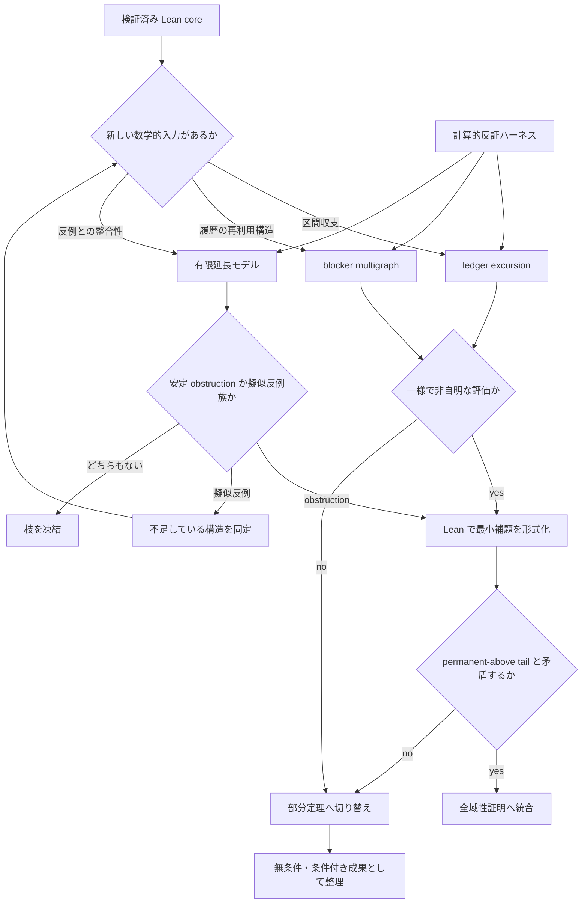

# Recamán 全域性研究ポートフォリオ

最終更新: 2026-08-30

> 同日の並列監査で、各枝の反例、縮約、有望度を更新した。
> 詳細は [PARALLEL_RESEARCH_2026-08-30.md](./PARALLEL_RESEARCH_2026-08-30.md) を参照。

## 最新の有望度

| 枝 | 直接証明 | 戦略価値 | 現在の判定 |
|---|---:|---:|---|
| low-quotient tail minimum + ledger | 15 | 85 | canonical high枝が空、直接枝停止 |
| tail interval Hall matching | 25 | 80 | 直接枝停止、部分定理候補へ移管 |
| arbitrary-history countermodel | 20 | 90 | 戦略フィルタとして常設 |
| `q ≥ 6 → G ≥ 0` | 15 | 80 | 独立枝停止、no-go例として保存 |
| generic blocker provenance | 20 | 70 | noncanonical部分定理として保存 |
| fixed blocker budget / reset injection | 5 | 80 | 棄却済み |

選抜後の二本スプリントまで完了し、ロードマップで定めた停止条件に到達した。canonical least-tailでは
high blocker枝が数値的に空であり、tail Hall条件も真なら非自明な線形成長定理を与えるが全域性矛盾には
届かない。従って全域性の直接攻略は凍結し、以後は形式化済み部分定理、経験的`TailHall₃`候補、
arbitrary-history/H6 no-go結果の整理を優先する。

## 目的

主目標は、標準 Recamán 数列

\[
a_0=0,\qquad
a_n=
\begin{cases}
a_{n-1}-n & (a_{n-1}>n\ \text{かつ未出})\\
a_{n-1}+n & (\text{それ以外})
\end{cases}
\]

がすべての自然数を通ることの証明または反証である。ただし、全域性だけを成功条件にすると、同値な難問を別名で再導入しやすい。そこで研究成果を次の四段階で評価する。

1. 全域性または非全域性の証明
2. 全域性を含意する、既知の同値変形ではない一様評価
3. 無条件の非自明な漸近定理・構造定理
4. 有望に見える戦略を厳密に棄却する反例・不可能性定理

## 既知の境界

次は新しい証明入力ではなく、停止済みまたは保守専用とする。

- `TargetTailReturn`、coverage time、tail start、return frequency の相互言い換え
- canonical history / mounted descent と canonical valley certificate
- 固定点 floor の列挙、prefix successor coverage、deep mex
- pinned configuration の cutoff 依存全列挙
- earlier-smaller `regenerate`
- subtraction parity だけを使う議論
- 型やラッパーを追加するだけの「進捗」

再開条件は、従来の残余命題を真に弱める一様な不等式、有限分類、または新しい単調量が先に得られた場合に限る。

## 探索枝

### A. ledger と tail excursion の重み付き評価

現在もっとも本証明に近い枝。既証明の

\[
a_n+2\,\mathrm{subSum}(n)=\mathrm{upperTri}(n)
\]

を、単なる恒等式ではなく区間評価にする。missing target を仮定した permanent-above tail 上で、tail minimum とその直前値の出現時刻を結ぶ区間を、増大する歩幅を持つ重み付き excursion として調べる。

候補成果:

- 区間の subtraction mass に、端点だけからは出ない上限・下限を与える
- tail minimum の制約から、許される符号列を一様に削る
- blocker と reset event を同じポテンシャルで償却する

継続ゲート:

- target と cutoff に依存しない区間不等式が一つ得られること
- その不等式が ledger identity と非負性だけの帰結ではないこと

停止条件:

- 二回の探索サイクルを通じ、得られる評価がすべて端点恒等式へ還元される
- 有限計算で候補不等式に反例が見つかる

### B. blocker multigraph と再利用の償却

forced addition の原因となる既出候補を blocker とし、時刻から blocker の最初または最後の出現へ重み付き辺を張る。単射は実データで偽なので、目標は blocker の再利用回数そのものではなく、再利用時の時間差・値差・介在する reset の総コストを抑えることである。

候補成果:

- 一頂点への総入射重みの一様評価
- blocker 再利用のたびに消費される単調な資源
- positive forced addition と nonpositive reset の区間別収支

継続ゲート:

- 多重辺を許しても成立する償却不等式を、小さい範囲と holdout 範囲の双方で確認できること

停止条件:

- 重みを変えても高再利用 blocker が無制限に収支を破る
- 評価に「その値が後で再訪する」という全域性同値の仮定が混入する

### C. 有界反例モデルと有限延長問題

証明だけでなく、missing target と整合する長い仮想 tail を構成できるかを調べる。正確な履歴制約を持つ有限延長問題と、制約を弱めた抽象モデルを分離する。

候補成果:

- 永久に target より上にいる tail の有限制約モデル
- 最小 UNSAT core からの局所補題抽出
- 弱いモデルでは無限反例が作れるが、実数列では破れる、という差分の同定

継続ゲート:

- horizon を伸ばして安定する obstruction pattern、またはパラメトリックな擬似反例族が得られること

停止条件:

- prefix を再生するだけで、一般化可能な obstruction も反例族も得られない
- 状態表現が履歴全体と同サイズになり、圧縮された数学的情報を持たない

### D. 計算的予想発見と反証ハーネス

計算は証明の代用ではなく、候補補題を早く殺す装置として使う。符号列、subtraction mass、blocker 再利用、run length、tail minimum 周辺の excursion を一度に記録し、発見区間と holdout 区間を分ける。

必須指標:

- `subSum(n) / upperTri(n)` と誤差項
- addition/subtraction run length と局所偏り
- blocker の重み付き再利用分布
- coverage 後の再訪までの距離と、その直前の reset 構造
- normalized height と局所 extrema

運用規則:

- 予想は先に固定し、指数的に離した holdout で検査する
- 反例が出た予想は修理を一回まで許し、二回目で停止する
- データ依存定数を含む命題は Lean 化しない

### E. 無条件の部分定理

全域性が直ちに動かない場合にも、同値変形ではない漸近成果を狙う。候補はあくまで研究課題であり、現時点の主張ではない。

- subtraction count / mass の上下密度
- `a_n` の二次上界より真に強い成長評価
- 訪問済み集合の密度または区間充填率
- tail minimum の無限回更新、あるいは更新間隔の評価
- blocker multiplicity 仮定の下での条件付き全域性

継続ゲート:

- statement が全域性と同値でなく、ledger identity の直系の系でもないこと
- 仮定付きなら、仮定が実データで独立に検証可能であること

### F. Recamán 型 variant を使う比較実験

有限記憶版、blocker multiplicity 有界版、選択規則を少し変えた版を小さな理論実験室として使う。目的は variant 自体の網羅ではなく、どの構造が tail return に十分かを切り分けることである。

継続ゲート:

- variant の定理が、標準数列について検証可能な一つの欠落補題へ翻訳できること

停止条件:

- 標準数列への transfer condition が元の全域性と同値になる
- variant 固有の技巧だけが増える

### G. 反証可能性を残す

全域性を前提に研究計画を固定しない。直接「欠けた値」を天文学的探索で探すのではなく、missing target が強制する符号列、ledger 収支、blocker graph の構造が長期的に整合するかを問う。整合する抽象反例モデルが得られれば、現在の不変量だけでは証明不能だという有用な否定結果になる。

## 優先順位と資源配分

当面の推奨配分は次の通り。

| 枝 | 配分 | 役割 | 次の判定材料 |
|---|---:|---|---|
| A. ledger excursion | 30% | 直接証明 | 新しい一様区間不等式 |
| B. blocker multigraph | 20% | 直接証明 | 多重再利用を許す償却則 |
| C. 有限延長 / 反例モデル | 20% | 証明と反証の分岐 | 安定 obstruction または擬似反例族 |
| D. 計算的反証 | 15% | 仮説選別 | holdout を通る候補補題 |
| E. 部分定理 | 10% | 成果の多様化 | 非同値な漸近 statement |
| F. variant | 5% | 構造分離 | 標準列へ移せる欠落補題 |

Lean での新規実装は原則として A–F のゲート通過後に行う。既存コードの soundness と build 維持は別枠の小さな固定費とし、証明探索の成果には数えない。

## 研究サイクル

### Sprint 0: 再現可能な観測基盤

- 現在の Python スパイクを高速で再現可能な probe に置き換える
- 指標、発見区間、holdout 区間、反例ログ形式を固定する
- A–C で使う共通語彙を紙上で定義する

完了条件: 同じ prefix から ledger、blocker、excursion の統計が一回で再生成できる。

### Sprint 1: 三本の短い理論スパイク

- A: endpoint 間の ledger 差分を tail-minimum 制約と結合する
- B: blocker 辺の重み候補を三種類以内に絞る
- C: 弱いモデルと正確な有限延長モデルの差を一例で示す

各スパイクの完了条件は、「真らしい説明」ではなく、証明可能な補題、具体的反例、または停止判断のいずれか一つである。

### Sprint 2: 選抜

- A–C を継続ゲートで採点する
- 上位二枝だけを次周期へ進める
- 落ちた枝は、再開条件を一文で残して凍結する

### Sprint 3: 数学から Lean への移送

- 紙上証明を、既存定理に依存しない最小 statement にする
- 小さい有限版ではなく、target/cutoff-independent な定理を先に置く
- `#print axioms` と全体 audit を通す

### Sprint 4: 全域性へ接続、または成果を切り出す

- 一様評価が得られた場合は permanent-above tail との矛盾へ接続する
- 届かない場合は部分定理、不可能性結果、計算データを独立成果としてまとめる
- 同値変形しか残らない場合は、全域性の直接攻略を一旦停止する

## 意思決定フロー

## 次の一手

次の一手は直接証明の続行ではなく、成果の切り出しである。

1. `LeastTailLedgerMinimum`と`LeastTailLedgerProvenance`を、canonical/noncanonicalの適用範囲が
   混同されない形で保守する。canonical witnessは
   `a_t<t+target`かつ`q=0 ∨ (q=1 ∧ r<target)`で、high blocker枝には入らない。
2. 経験的候補`TailHall₃`を独立部分定理として記録する。positive blocker jobをall-familyで数え、
   `p≥7`なら需要をsubtraction容量`k+3`で払えるという命題は500万項までsharpに成立した。
   真なら`liminf a_n/n≤3`が従うが、permanent-above tailとは矛盾しない。
3. `TailHall₃`に短い局所charging proofが見つかる場合だけ部分定理として再開する。canonical historyを
   大規模に再生する必要があるなら投資せず凍結する。
4. H6の全21本抽象suffixと自由履歴Hall反例を、新しい大域候補がcausal provenanceを本当に使うかの
   regressionとして残す。

全域性の直接攻略を再開する条件は、linear height、positive subtraction density、permanent-above性を
同時に矛盾させる新しい外部入力、またはold blocker/nonpositive resetを一様に排除する独立定理が先に
得られることである。
