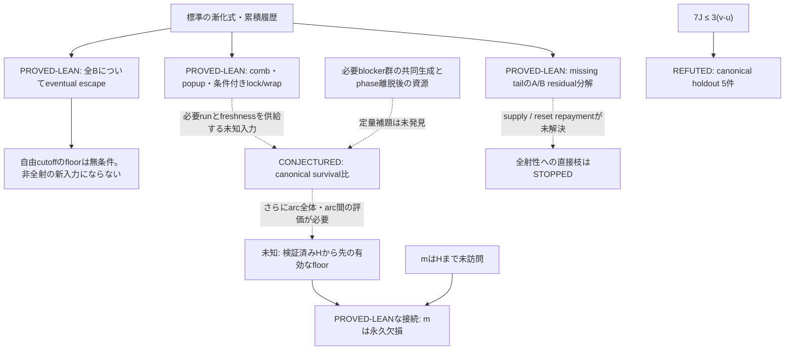

# 証明を進めるための戦略地図 — 2026-09-06

> この地図は作成時点の記録。#70・#71は完了し、現在の判断は[2026-09-07地図](STRATEGY_MAP_2026-09-07.md)に更新した。

**次は「任意の有限prefixを含む反例族のLean化」と「canonical反例におけるphase離脱の原因分類」に絞る。**
全射・非全射のどちらにも、現時点で最後まで通る証明戦略はない。今回、非全射性への十分条件の
量化子を修正し、局所survivalの証明に不足する履歴条件を具体的な反例で切り分けた。

詳細な論証は[戦略監査](STRATEGY_AUDIT_2026-09-06.md)、再現手順と出力は
[実験記録](data/strategy_2026-09-06/README.md)、現在状態の正本は[frontier](CURRENT_FRONTIER.md)。
GitHubの[戦略tracker #72](https://github.com/hirokidaichi/recaman-lean-research/issues/72)から次の作業へ進める。

## 今回確定したこと

| 問い | 結果 | 証明戦略への影響 |
|---|---|---|
| 任意のBを、いつか以降は常に超えるか | `PROVED-LEAN` E-052。無条件で成立 | 自由cutoffのfloorを新しい非全射性の入力として追わない |
| 未訪問prefixと自由なeventual floorを合成できるか | `PROVED-LEAN` E-053。4はclock4まで未訪問だが131で出現 | prefixとfuture exclusionのcutoffを同じHに固定する |
| density・parity・一回使用でsurvival比を閉じられるか | `PROVED-LEAN` E-054。exact seeded反例59→1 | 使用回数の評価だけでは不足 |
| 既知の有限prefixをseedに足せば直るか | `PROVED-PAPER` E-056。任意有限Fを含む反例族 | 必要なblocker群の共同生成を拘束する入力が必要 |
| preloadなしの軌道でもsurvival比は破れるか | `COMPUTED` E-055。20,001軌道・2,677,448適用区間で違反0 | 紙上の補題を探す動機。一般定理の証拠にはしない |
| prelanding長Jは着地下降を `7J/3` 以上強制するか | `REFUTED` E-057。canonical holdoutに5反例 | phaseを跨ぐ一律の重み下界を停止 |

E-054/E-056はcanonical軌道の反例ではない。E-057はcanonicalだが、元のsurvival比より
強い候補の反例である。この三者を混同すると、再び誤った停止・継続判断になる。

## 依存関係と未証明部分

実線は証明済みの接続または反証結果、破線は未証明の入力を表す。survival比を証明しても、
非全射性までには、arcへの入口、複数comb、arcを跨ぐ更新、Hを跨ぐarcの扱いが残る。
これらを一つの「floorが従う」という矢印に圧縮しない。

## 優先する二つの作業

### 1. 証明を完成させる作業：[任意finite-prefix反例族 #70](https://github.com/hirokidaichi/recaman-lean-research/issues/70)

- **問い**：任意有限Fを含むexact seedでsurvival比を破る紙上族をLeanで認証できるか。
- **入力**：E-056の明示seedと符号語 `SS(AS)^J S A^D S^D`。紙上証明は完成している。
- **最小の難所**：下降時の `A_(D-k)-k²` が、同じ帯のpreloaded `A_(D-k)-1`、
  prelanding rail、Fのすべてからfreshであること。
- **受入条件**：任意Fの量化子を保持し、seed bounds、parity、actual step、no-wrap、二つの着地、
  比のstrict violationを形式化。Auditへ登録し `./scripts/check.sh` を通す。
- **停止条件**：紙上のfreshnessに欠落が見つかったらその箇所を反例付きで記録する。
  finite examplesやwrapperだけを完成として提出しない。
- **効果**：survivalの正の証明ではないが、不可能な履歴弱化を恒久的に除外する証明資産になる。

### 2. 次の正の補題を見定める作業：[高level blocker群の共同生成 #71](https://github.com/hirokidaichi/recaman-lean-research/issues/71)

- **問い**：`c=11685598221` の一歯combで、J本のrailがあるのにweighted dropが小さくなるのはなぜか。
- **固定対象**：`J=276986,v=4318940415`、最初の後続着地は `e=11685741477,u=4318376915`。
  `3(v-u)-7J=-248402`。初期level-5/4 phaseは31,057対でlowerFreshへ離脱する。
  この例は元のsurvival閾値から遠いため、分類から得た入力が閾値付近に使えるかを別に判断する。
- **今回済んだこと**：全phase境界、addition費用563,500、run railの下端より2小さいfresh return、
  境界candidate7個のfirst birthを照合した。古い値と直前の生成値が混在する。
- **受入条件**：`W={3c+v+5−3i : 0≤i≤31057}` 全体のfirst birthと未消費railとの関係を
  初回60分で分類する。既存telescopingからは出ない、一つの独立した未知edgeを特定する。
- **停止条件**：結果が `v-u=addition weightの総和` という既知恒等式だけなら停止。
  係数調整、単なる再利用回数、任意finite prefix membershipだけの修理も停止。
- **次段階のgate**：未知edgeが具体的な不等式になった場合にだけ新カードを凍結し、小例と
  seeded familyに反証を試みる。未反証であるだけでLean定義を追加しない。

「共同生成が本質」は現時点では研究上の見立てである。preload-freeの有限対照群だけでは
全初期値に対する定理も、canonical以外を排除する必要性も確定しない。

## 今は進めない作業

| 枝 | 停止理由 | 再開に必要なもの |
|---|---|---|
| 自由Nのeventual floor、rising floor単独 | 無条件のescapeや全射モデルと両立 | 同じ検証済みHからの有効な排除評価 |
| `7J≤3(v-u)` の全phase版 | 未使用holdoutにcanonical反例 | 異なる独立入力。定数の調整では再開しない |
| one-use / multiplicity≤2だけのsurvival証明 | 一回使用のseeded反例 | 資源集合の量と重みを共同生成に結びつける評価 |
| fixed prefixを追加するだけの修理 | 任意Fを含む反例族 | F以降に全seed要素をactualに生成できることへの拘束 |
| A枝ancestry・B枝reset repaymentの再包装 | 既存portfolioの停止gate | 未確認の大域不等式を一つ減らせる独立補題 |
| 原因仮説なしの計算horizon拡大 | 有限の未反証を増やしても証明入力は増えない | 境界と判定を先に凍結した新しい反証可能命題 |

## 作業の渡し方

一回の作業は上のどちらか一つに限定する。提案→小例・弱履歴の反証→紙上依存列→Lean→意味監査の順を守る。
新しい証明を優先するなら1、canonical survivalの突破口を優先するなら2から開始する。
2で新入力が得られなければ、正のsurvival攻略をいったん停止する判断も成果とする。

| issue | 用途 |
|---|---|
| [#72 戦略tracker](https://github.com/hirokidaichi/recaman-lean-research/issues/72) | 二作業の判断をまとめ、次の地図を更新する |
| [#70 任意F反例族のLean化](https://github.com/hirokidaichi/recaman-lean-research/issues/70) | 紙上証明を形式化する |
| [#71 高level blocker群の共同生成](https://github.com/hirokidaichi/recaman-lean-research/issues/71) | 次の正の補題の見立てを作る |

作成時点ではissueはGitHubへ作成済み、成果物は未commit・未pushだった。2026-09-07にmainへ反映し、後続作業を完了した。
