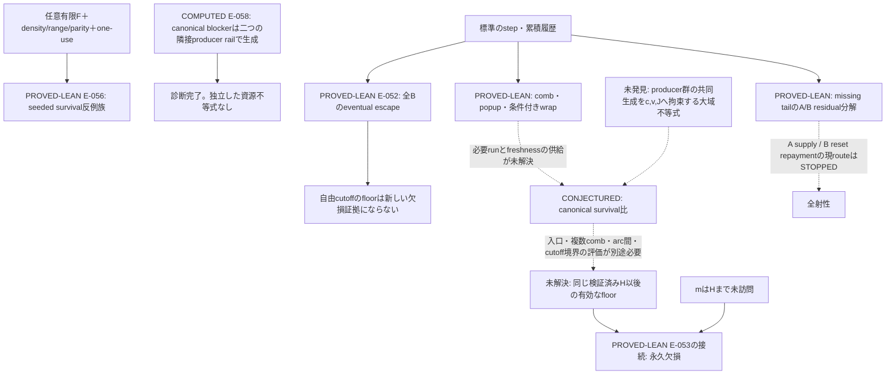

# 証明戦略地図 — 2026-09-07

最新の優先順位は[5パターンの並列調査](PARALLEL_APPROACH_TRIAGE_2026-09-07.md)で更新した。
④固定blockの候補は、各加算phaseが要求する有限lag恒等式の全period不可能性へ縮約できた
（E-065はPROVED-PAPER、E-067/E-070はCONJECTURED）。ここを次の一問にする。
①②③⑤の試した限定classには反例が出たが、方式全体の否定ではない。
固定周期性を排除できても永久欠損への接続は別途必要で、下のsurvival停止判断は変わらない。

**#70の一般反例族をLeanで証明し、#71の共同birthを分類した。正のsurvival証明を支える新しい大域不等式は見つからず、その探索枝は停止する。**
全射性・非全射性はともに未解決。今回完成したのは、survival比に不足する履歴条件を限定する一般定理と、固定したcanonical反例の原因監査である。

現在状態は[frontier](CURRENT_FRONTIER.md)、証拠は[registry](EVIDENCE_REGISTRY.tsv)。
前の[2026-09-06地図](STRATEGY_MAP_2026-09-06.md)の二作業を、下のように判定した。

| issue / 問い | 結果 | 次の判断 |
|---|---|---|
| #70：任意の有限Fを含むsurvival反例族を形式化できるか | `PROVED-LEAN` E-056。任意F・実step・seed bounds/parity・次着地とwrap・一回使用を同時に証明 | 完了。fixed prefix inclusionによる修理は再開しない |
| #71：高level blocker全体はどのように共同生成されたか | `COMPUTED` E-058。31,058値を二つのproducer runに完全分類。全first birthをscalar/acceleratedで一致確認 | 診断完了。新しい資源不等式は0件、正の証明枝は`STOPPED` E-059 |
| #72：二つの結果から次の戦略地図を更新する | この地図とfrontier / proof mapを更新 | bounded tracker完了。大域予想の解決を意味しない |
| #61：認証済みdeep traceで既存のclock112残余を閉じられるか | `PROVED-LEAN` E-060。完全なreplayのclock112を排除し、clock≥113・target≥115 | 既存証明の統合を完了。floor列挙や大域枝は再開しない |

## #61の有限残余の解消

clock112の完全なreplayは、371の初出時刻4825以後にtarget以下の値が現れることを禁じる。
既存のkernel認証`a 99734 = 19`とtarget≥114を結合すれば、その禁制に矛盾する。
新しいhistory仮定やtrace生成を必要とせず、clock≥113・target≥115までLeanで確認した。
これは全clockのreplay排除やcanonical survivalを解く一様機構ではない。
[#61仮説カード](HYPOTHESIS_CARD_2026-09-07_CLOCK112_CLOSURE.md)に意味監査と再現手順を保存した。

## 証明済みの範囲と残る接続

実線は証明済みの接続または確定した診断。破線は未証明の依存。
E-056は任意seed上の反例であり、canonical survivalの反例ではない。
E-057はcanonicalの強い候補7J≤3(v−u)の反例であり、元のsurvival比を反証していない。

## #71から分かったこと

W_i=39375735083−3iのうち、i=0…25030の25,031値は同じarc 40のq=3減算run、
i=25031…31057の6,027値はarc 39のq=5加算runで初めて生まれた。
二つのrailは隣接し、次の候補は結合railの下端を2だけ下回ってfreshになる。
生成runの値域を組み合わせればこの例のphase離脱は説明できる。

ただし、二つのrunの存在・長さ・配置をsurvival閾値へ結びつける量的制約は証明していない。
この例は16v−7hPrev=38864647022という大きな余裕があり、閾値近傍の証明入力の検査例にもなっていない。
N=31058、K=40566に対するJ+2=5N+3Kやv−u=9N+7K+16は既知のphase費用の足し合わせである。
その恒等式の定数を調整しても、必要な大域入力は増えない。
詳細は[共同birth監査](JOINT_BIRTH_AUDIT_2026-09-07.md)。

## 次の証明候補の受入gate

現時点では、大域戦略を再開させる新しい正の補題を特定していない。
「共同生成を調べる」をそのまま再度issue化せず、再開候補には次の四点を要求する。

1. 全量化子と対象となるactual producer群を明示した、反証可能な不等式である。
2. E-056の一般seeded familyを排除する理由を、固定prefix追加やdensity/range/parity以外で説明できる。
3. 既存の費用恒等式や一回使用からは出ない独立入力であり、survival比までの依存列を一段減らす。
4. 小例・境界・弱historyモデルで反証を試み、必要なら未使用範囲を事前に固定する。

このgateを満たす候補がない間は、正のsurvival攻略、原因なしのhorizon拡大、同値なwrapper追加を停止する。
A枝のfixed-seed supplyとB枝のreset repaymentも、既存portfolioの再開gateを維持する。

## 検証と引き継ぎ

- #70：8モジュール、11主要宣言追加。`./scripts/check.sh`で264 library modules、1,217宣言の公理監査がPASS。
- #71：31,058値のfirst birthを全件独立照合。20,000時計のplain/accel小例、加速開始点変更、697,233行のconsumer traceも検査。
- [#70仮説カード](HYPOTHESIS_CARD_2026-09-07_ISSUE70_FORMALIZATION.md)、[#71仮説カード](HYPOTHESIS_CARD_2026-09-07_JOINT_BIRTH_DIAGNOSTIC.md)、[再現記録](data/issues_2026-09-07/README.md)にsource hash・コマンド・失敗した弱化・残る不確実性を保存。

今回の次の判断は「この枝を停止し、独立した共同生成の不等式が提案された時だけ再開する」である。
