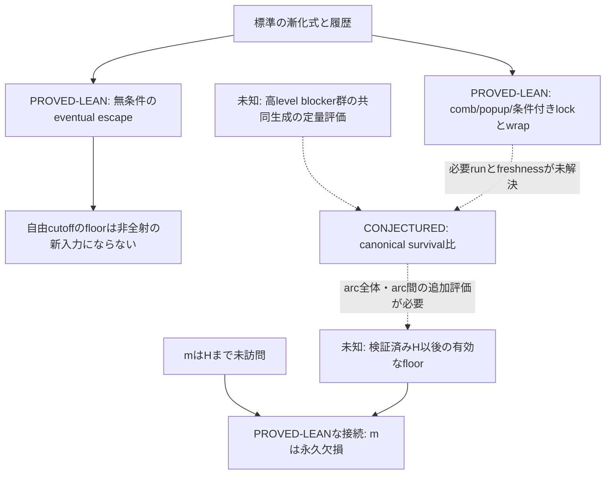

## 結論

次の証明作業は #70（任意finite-prefix反例族のLean化）、次の戦略探索は #71（canonicalの高level blocker群の共同生成評価）に絞る。

2026-09-06の研究監査で、非全射性の十分条件に混入していた自由cutoffを修正し、survival比の証明に不足する履歴条件を反例から切り分けた。**全射性・非全射性はともに未解決**で、現時点で最後まで通る直接証明ルートはない。

これは既存tracker #9 のclosureを宣言するものではない。既存の大域再帰・oracle issueを、同じ命題の再包装だけで再開しないための現在の戦略地図である。

## このラウンドの成果と証拠

| 問い | 結果 | 判断 |
|---|---|---|
| `∀B, ∃N, ∀n≥N, B<a(n)` | PROVED-LEAN E-052。再訪clock≤値から無条件に従う | 非全射性への新入力として追わない |
| prefix holeと自由Nのfloorを合成できるか | PROVED-LEAN E-053。4はclock4まで未訪問だが131で出現 | 同じ検証済みcutoff Hから先の排除が必要 |
| rising floorだけで欠損が出るか | PROVED-LEAN E-053。全射なb(n)=nにもf(n)=n/2というrising floorがある | floorの下に実際の未訪問値があることが別に必要 |
| density・range・parity・blocker一回使用だけでsurvival比が出るか | PROVED-LEAN E-054。seed32値の59→1反例、944<945 | 使用回数だけの評価を停止 |
| 既知finite prefixを追加すればseeded反例を排除できるか | PROVED-PAPER E-056。任意有限Fを含む明示反例族 | 全必要blockerの共同生成を拘束する必要がある |
| preload-free軌道でもsurvival比が破れるか | COMPUTED E-055。20,001軌道・各2M、2,677,448適用区間で違反0 | 一般命題はCONJECTUREDのまま |
| 強い候補 `7J≤3(v-u)` がsurvival比を供給するか | REFUTED E-057。canonical 20B、discovery1221件は違反0、holdout3228件に5反例 | 係数修正なしでSTOPPED |

新しいLeanモジュールは `EventualEscape` と `SeededSurvivalCounterexample`。具体seedはcanonical反例ではない。weighted-drop反例はcanonicalだが、元のsurvival比の反例ではない。

## 依存関係

survival比が証明できても、入口評価、複数comb、arc間の更新、Hを跨ぐarcの扱いが残る。「survival比→非全射」という未証明の接続を一本の既知矢印にしない。

全射性側には既存のsharp A/B residual分解があるが、A枝のfixed-seed infinite supply、B枝のreset repaymentの現proof routeはSTOPPED。独立のglobal invariantなしには再開しない。

## 実行する二つのissue

- [ ] #70 — 紙上で完了した任意F反例族をLeanで認証する。最小の難所は全historyに対するfreshness。初回90分でその補題を判定する。
- [ ] #71 — 最初のcanonical weighted-drop反例に固定し、level4→5のblocker集合31,058値の共同生成を分類する。初回60分。独立した未知edgeが得られなければSTOPPED。

**証明を一つ完成させるなら #70 を先に、canonical survivalの突破口を探すなら #71 を先に進める。** 両者は独立であり、未検証仮定を共有しない。

## 再開しない枝

- 自由cutoffのeventual floorを非全射の十分条件とする推論。
- 全phaseの `7J≤3(v-u)` の定数調整。
- blocker一回使用、多重度≤2、density/parity、任意固定finite prefix inclusionだけのsurvival証明。
- 既存のcoverage/oracle/future-returnと同値なwrapperの追加。
- 原因仮説と凍結した判定基準がない計算horizon拡大。

## 検証・引き継ぎ

Base revision: `8a4314d7f65c728d5c6fe6584e1469de4e08332d`。
`./scripts/check.sh` で全Lean build、公理監査、import契約、evidence registryを検証。主要宣言1,206件は許可された `{propext, Classical.choice, Quot.sound}` の範囲内。

作業ツリーの成果物:

- `docs/STRATEGY_MAP_2026-09-06.md`: 判断に使う戦略地図
- `docs/STRATEGY_AUDIT_2026-09-06.md`: 紙上証明、反例、限界
- `docs/data/strategy_2026-09-06/`: exact outputs、source hashes、再現手順
- H-20260906-03〜08: 仮説カードと停止判断

新規成果物は本issue作成時点では未push。二つの子issueは必要な式・数値・受入条件を本文に含む。

このtrackerの完了条件は全射性の証明ではない。二つの有界作業を判定し、得た独立補題または停止理由から次の戦略地図を一回更新すること。
